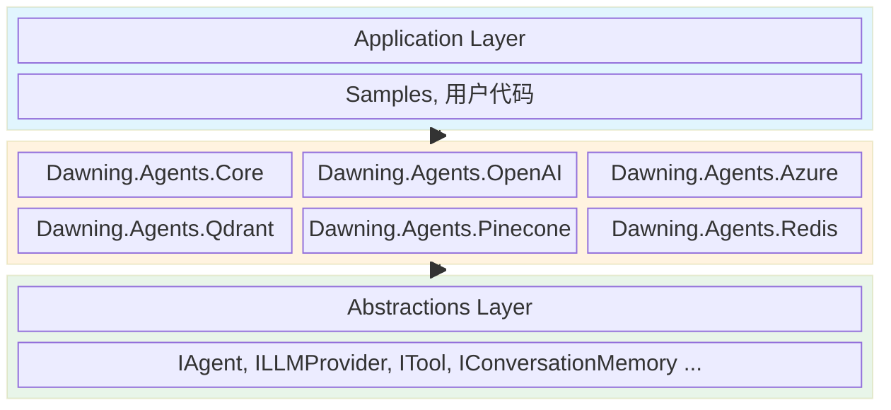
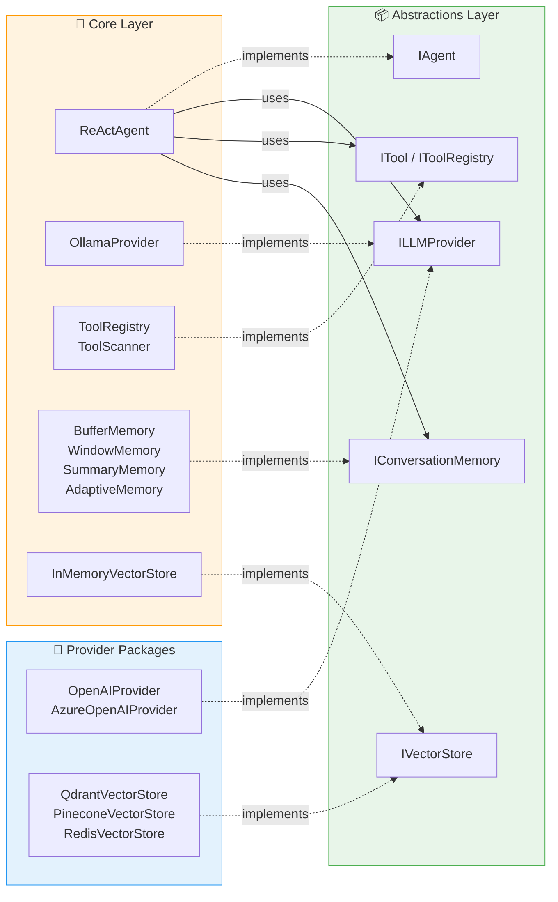
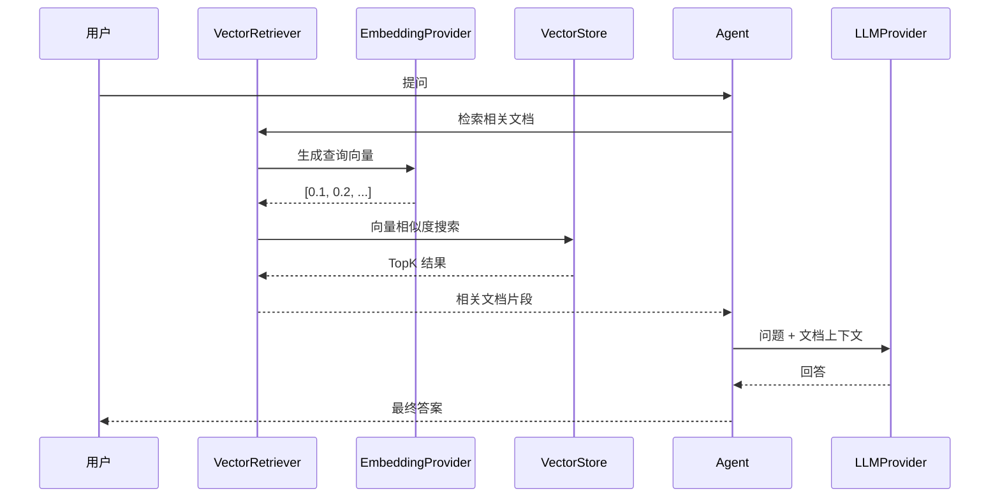
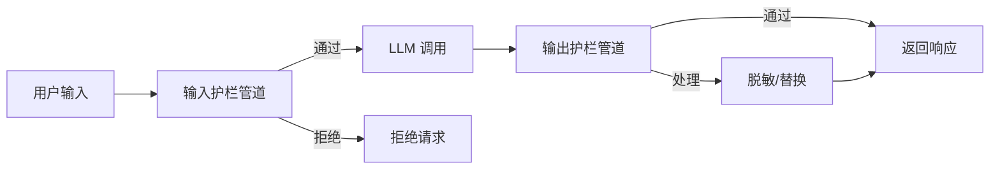
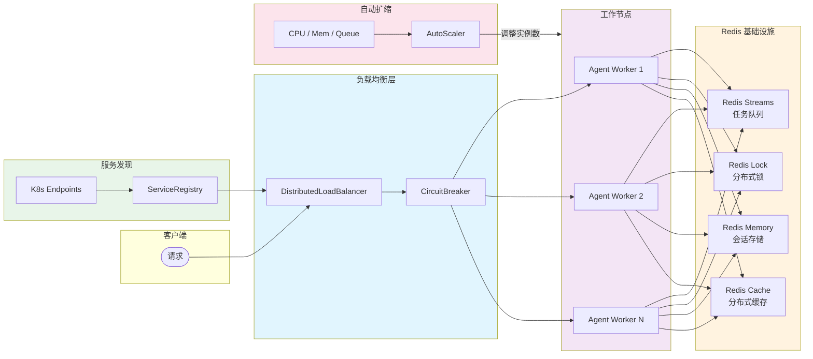
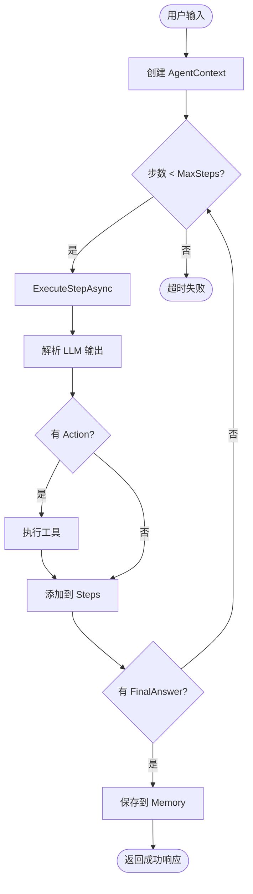
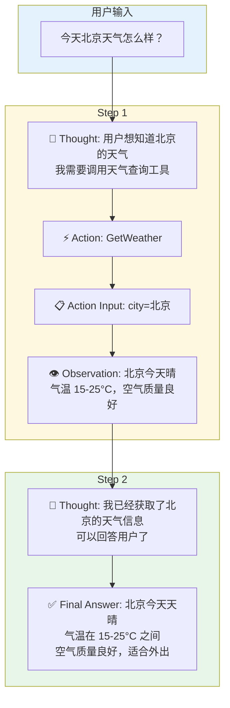
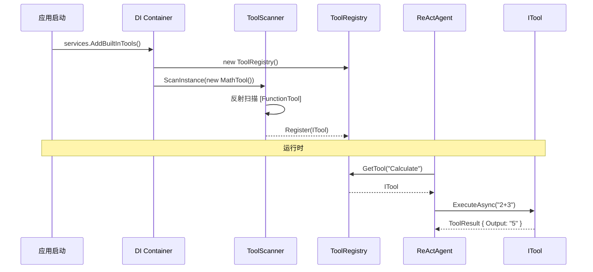
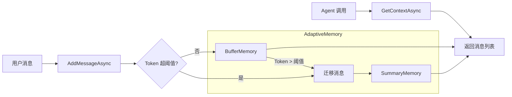
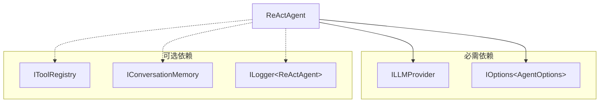

# 🏗️ Dawning.Agents 源码架构解读

> 深入理解框架设计原理、核心流程和实现细节

---

## 目录

1. [整体架构设计](#整体架构设计)
2. [项目结构](#项目结构)
3. [核心模块解读](#核心模块解读)
   - [Agent 模块](#agent-模块)
   - [LLM Provider 模块](#llm-provider-模块)
   - [Tools 工具系统](#tools-工具系统)
   - [Memory 记忆系统](#memory-记忆系统)
   - [RAG 检索增强](#rag-检索增强)
   - [Orchestration 编排系统](#orchestration-编排系统)
4. [关键流程分析](#关键流程分析)
   - [Agent 执行循环](#agent-执行循环)
   - [ReAct 推理流程](#react-推理流程)
   - [Tool 注册与调用](#tool-注册与调用)
   - [Memory 上下文管理](#memory-上下文管理)
5. [依赖注入设计](#依赖注入设计)
6. [扩展机制](#扩展机制)
7. [设计模式应用](#设计模式应用)

---

## 整体架构设计

### 架构原则

Dawning.Agents 遵循以下核心设计原则：

| 原则 | 说明 | 体现 |
|------|------|------|
| **极简 API** | 一行完成核心功能注册 | `services.AddLLMProvider(configuration)` |
| **纯 DI** | 所有服务通过依赖注入 | 不提供静态工厂或 `new` 实例 |
| **接口分离** | Abstractions 零依赖 | 接口与实现分开打包 |
| **配置驱动** | 通过配置切换行为 | `IConfiguration` + `IOptions<T>` |
| **企业基础设施** | 生产级支持 | `IHttpClientFactory`, `ILogger<T>`, `CancellationToken` |

### 分层架构



> **层次说明**：Application 依赖 Core Implementation，Core Implementation 依赖 Abstractions

### 模块依赖关系



**依赖方向**：
- 实线箭头 `→` 表示**使用**（运行时依赖）
- 虚线箭头 `⇢` 表示**实现**（接口实现）
- 所有实现都依赖 Abstractions 层的接口

---

## 项目结构

```
dawning-agents/
├── benchmarks/                             # ⚡ 性能基准测试
│   └── Dawning.Agents.Benchmarks/
│
├── deploy/                                 # 🚀 部署配置
│   ├── docker/
│   ├── k8s/
│   └── observability/
│
├── docs/                                   # 📖 文档
│   ├── architecture/                       # 架构文档
│   ├── articles/                           # 功能指南
│   ├── guides/                             # 实战教程
│   └── readings/                           # 学习资料
│
├── samples/                                # 📚 示例项目
│   ├── Dawning.Agents.Samples.Common/      # 公共基类
│   ├── Dawning.Agents.Samples.Enterprise/
│   ├── Dawning.Agents.Samples.GettingStarted/
│   ├── Dawning.Agents.Samples.Memory/
│   └── Dawning.Agents.Samples.RAG/
│
├── src/
│   │
│   ├── Dawning.Agents.Abstractions/         # 📦 接口层（零依赖）
│   │   ├── Agent/                           # Agent 核心
│   │   │   ├── AgentContext.cs             # 执行上下文
│   │   │   ├── AgentOptions.cs             # 配置选项
│   │   │   ├── AgentResponse.cs            # 执行结果
│   │   │   ├── AgentStep.cs                # 单步记录
│   │   │   └── IAgent.cs                   # Agent 接口
│   │   ├── Cache/                          # 缓存
│   │   │   └── ISemanticCache.cs           # 语义缓存接口
│   │   ├── Communication/                  # 通信
│   │   │   ├── AgentMessage.cs             # Agent 消息
│   │   │   ├── IMessageBus.cs              # 消息总线接口
│   │   │   └── ISharedState.cs             # 共享状态接口
│   │   ├── Configuration/                  # 配置
│   │   │   ├── ConfigurationModels.cs      # 配置模型
│   │   │   ├── IConfigurationChangeNotifier.cs # 配置变更通知
│   │   │   └── ISecretsManager.cs          # 密钥管理接口
│   │   ├── Diagnostics/                    # 诊断
│   │   │   ├── IDiagnosticsProvider.cs     # 诊断提供者接口
│   │   │   └── IPerformanceProfiler.cs     # 性能分析接口
│   │   ├── Discovery/                      # 服务发现
│   │   │   └── IServiceRegistry.cs         # 服务注册接口
│   │   ├── Distributed/                    # 分布式
│   │   │   ├── DistributedOptions.cs       # 分布式配置
│   │   │   ├── IDistributedAgentQueue.cs   # 分布式队列接口
│   │   │   ├── IDistributedLock.cs         # 分布式锁接口
│   │   │   └── IDistributedMemory.cs       # 分布式记忆接口
│   │   ├── Evaluation/                     # 评估框架
│   │   │   ├── EvaluationOptions.cs        # 评估配置
│   │   │   └── IAgentEvaluator.cs          # 评估器接口
│   │   ├── Handoff/                        # 任务转交
│   │   │   ├── HandoffOptions.cs           # 转交配置
│   │   │   ├── HandoffRequest.cs           # 转交请求
│   │   │   ├── HandoffResult.cs            # 转交结果
│   │   │   └── IHandoffHandler.cs          # 转交处理器接口
│   │   ├── HumanLoop/                      # 人机协作
│   │   │   ├── ApprovalResult.cs           # 审批结果
│   │   │   ├── ConfirmationRequest.cs      # 确认请求
│   │   │   ├── ConfirmationResponse.cs     # 确认响应
│   │   │   ├── EscalationRequest.cs        # 升级请求
│   │   │   ├── HumanLoopOptions.cs         # 人机协作配置
│   │   │   └── IHumanInteractionHandler.cs # 人机交互接口
│   │   ├── LLM/                            # LLM 提供者
│   │   │   ├── ChatCompletionOptions.cs    # 请求选项
│   │   │   ├── ChatCompletionResponse.cs   # 响应结果
│   │   │   ├── ChatMessage.cs              # 聊天消息
│   │   │   ├── ILLMProvider.cs             # LLM 接口
│   │   │   ├── IModelRouter.cs             # 模型路由接口
│   │   │   ├── LLMOptions.cs               # LLM 配置
│   │   │   └── LLMProviderType.cs          # 提供者枚举
│   │   ├── Logging/                        # 日志
│   │   │   ├── AgentLogContext.cs          # Agent 日志上下文
│   │   │   ├── ILogLevelController.cs      # 日志级别控制接口
│   │   │   └── LoggingOptions.cs           # 日志配置
│   │   ├── Memory/                         # 记忆系统
│   │   │   ├── ConversationMessage.cs      # 对话消息
│   │   │   ├── IConversationMemory.cs      # 对话记忆接口
│   │   │   ├── ITokenCounter.cs            # Token 计数器
│   │   │   └── MemoryOptions.cs            # 记忆配置
│   │   ├── Multimodal/                     # 多模态
│   │   │   ├── ContentItem.cs              # 内容项
│   │   │   ├── IAudioProvider.cs           # 音频接口
│   │   │   └── IVisionProvider.cs          # 视觉接口
│   │   ├── Observability/                  # 可观测性
│   │   │   ├── HealthModels.cs             # 健康检查模型
│   │   │   ├── MetricsModels.cs            # 指标模型
│   │   │   ├── TelemetryConfig.cs          # 遥测配置
│   │   │   └── TracingModels.cs            # 追踪模型
│   │   ├── Orchestration/                  # 编排系统
│   │   │   ├── IOrchestrator.cs            # 编排器接口
│   │   │   ├── OrchestrationContext.cs     # 编排上下文
│   │   │   ├── OrchestrationResult.cs      # 编排结果
│   │   │   └── OrchestratorOptions.cs      # 编排配置
│   │   ├── Prompts/                        # 提示词
│   │   │   └── IPromptTemplate.cs          # 提示词模板接口
│   │   ├── RAG/                            # 检索增强
│   │   │   ├── IEmbeddingProvider.cs       # 嵌入向量接口
│   │   │   ├── IRetriever.cs               # 检索器接口
│   │   │   ├── IVectorStore.cs             # 向量存储接口
│   │   │   └── RAGOptions.cs               # RAG 配置
│   │   ├── Resilience/                     # 弹性
│   │   │   ├── IResilienceProvider.cs      # 弹性提供者接口
│   │   │   └── ResilienceOptions.cs        # 弹性配置
│   │   ├── Safety/                         # 安全护栏
│   │   │   ├── GuardrailResult.cs          # 护栏结果
│   │   │   ├── IAuditLogger.cs             # 审计日志
│   │   │   ├── IGuardrail.cs               # 护栏接口
│   │   │   ├── IRateLimiter.cs             # 速率限制
│   │   │   └── SafetyOptions.cs            # 安全配置
│   │   ├── Scaling/                        # 扩展
│   │   │   ├── IScalingComponents.cs       # 扩展组件接口
│   │   │   └── ScalingModels.cs            # 扩展模型
│   │   ├── Telemetry/                      # 遥测
│   │   │   ├── ITokenUsageTracker.cs       # Token 用量追踪接口
│   │   │   └── TokenUsageRecord.cs         # Token 用量记录
│   │   ├── Tools/                          # 工具系统
│   │   │   ├── FunctionToolAttribute.cs    # 工具特性
│   │   │   ├── ITool.cs                    # 工具接口
│   │   │   ├── IToolApprovalHandler.cs     # 审批处理器
│   │   │   ├── IToolRegistry.cs            # 工具注册表
│   │   │   ├── IToolSelector.cs            # 工具选择器
│   │   │   ├── IToolSet.cs                 # 工具集
│   │   │   ├── IVirtualTool.cs             # 虚拟工具
│   │   │   └── PackageManagerOptions.cs    # 包管理配置
│   │   └── Workflow/                       # 工作流
│   │       ├── IWorkflow.cs                # 工作流接口
│   │       ├── WorkflowDefinition.cs       # 工作流定义
│   │       └── WorkflowNodeConfigs.cs      # 节点配置
│   │
│   ├── Dawning.Agents.Azure/               # 🔷 Azure OpenAI 提供者
│   │   ├── AzureOpenAIEmbeddingProvider.cs # Azure 嵌入
│   │   ├── AzureOpenAIProvider.cs          # Azure LLM
│   │   └── AzureOpenAIServiceCollectionExtensions.cs
│   │
│   ├── Dawning.Agents.Chroma/              # 🎨 Chroma 向量存储
│   │   ├── ChromaOptions.cs
│   │   ├── ChromaServiceCollectionExtensions.cs
│   │   └── ChromaVectorStore.cs
│   │
│   ├── Dawning.Agents.Core/                # 🔧 核心实现
│   │   ├── Agent/
│   │   │   ├── AgentBase.cs                # Agent 基类（模板方法）
│   │   │   ├── AgentServiceCollectionExtensions.cs
│   │   │   └── ReActAgent.cs               # ReAct 实现
│   │   ├── Cache/
│   │   │   ├── SemanticCache.cs            # 语义缓存
│   │   │   └── SemanticCacheServiceCollectionExtensions.cs
│   │   ├── Communication/                  # 通信
│   │   │   ├── CommunicationServiceCollectionExtensions.cs
│   │   │   ├── InMemoryMessageBus.cs       # 内存消息总线
│   │   │   └── InMemorySharedState.cs      # 内存共享状态
│   │   ├── Configuration/                  # 配置
│   │   │   ├── ConfigurationChangeNotifier.cs # 配置变更通知
│   │   │   ├── EnvironmentConfigurationExtensions.cs
│   │   │   ├── HotReloadServiceCollectionExtensions.cs
│   │   │   └── SecretsManager.cs           # 密钥管理
│   │   ├── Diagnostics/                    # 诊断
│   │   │   ├── DiagnosticsProvider.cs      # 诊断提供者
│   │   │   ├── DiagnosticsServiceCollectionExtensions.cs
│   │   │   └── PerformanceProfiler.cs      # 性能分析器
│   │   ├── Discovery/                      # 服务发现
│   │   │   ├── DiscoveryServiceCollectionExtensions.cs
│   │   │   ├── InMemoryServiceRegistry.cs  # 内存服务注册
│   │   │   └── KubernetesServiceRegistry.cs # K8s 服务注册
│   │   ├── Evaluation/
│   │   │   ├── ABTestRunner.cs             # A/B 测试
│   │   │   ├── DefaultAgentEvaluator.cs    # 默认评估器
│   │   │   └── EvaluationServiceCollectionExtensions.cs
│   │   ├── Handoff/                        # 任务转交
│   │   │   ├── HandoffHandler.cs           # 转交处理器
│   │   │   └── HandoffServiceCollectionExtensions.cs
│   │   ├── Health/                         # 健康检查
│   │   │   ├── AgentHealthCheck.cs         # Agent 健康检查
│   │   │   ├── HealthServiceCollectionExtensions.cs
│   │   │   ├── LLMProviderHealthCheck.cs   # LLM 健康检查
│   │   │   └── RedisHealthCheck.cs         # Redis 健康检查
│   │   ├── HumanLoop/
│   │   │   ├── AgentEscalationException.cs # 升级异常
│   │   │   ├── ApprovalWorkflow.cs         # 审批工作流
│   │   │   ├── AsyncCallbackHandler.cs     # 异步回调
│   │   │   ├── AutoApprovalHandler.cs      # 自动审批
│   │   │   ├── HumanInLoopAgent.cs         # 人机协作 Agent
│   │   │   └── HumanLoopServiceCollectionExtensions.cs
│   │   ├── LLM/
│   │   │   ├── HotReloadableLLMProvider.cs # 热重载支持
│   │   │   ├── LLMServiceCollectionExtensions.cs
│   │   │   └── OllamaProvider.cs           # Ollama 本地模型
│   │   ├── Logging/                        # 日志
│   │   │   ├── AgentContextEnricher.cs     # 日志上下文扩充
│   │   │   ├── LoggingServiceCollectionExtensions.cs
│   │   │   ├── LogLevelController.cs       # 日志级别控制
│   │   │   └── SpanIdEnricher.cs           # Span ID 扩充
│   │   ├── Memory/
│   │   │   ├── AdaptiveMemory.cs           # 自动降级
│   │   │   ├── BufferMemory.cs             # 完整存储
│   │   │   ├── MemoryServiceCollectionExtensions.cs
│   │   │   ├── SimpleTokenCounter.cs       # Token 计数
│   │   │   ├── SummaryMemory.cs            # 摘要压缩
│   │   │   ├── VectorMemory.cs             # 向量检索
│   │   │   └── WindowMemory.cs             # 滑动窗口
│   │   ├── ModelManagement/                # 模型管理与路由
│   │   │   ├── CostOptimizedRouter.cs      # 成本优化路由
│   │   │   ├── LatencyOptimizedRouter.cs   # 延迟优化路由
│   │   │   ├── LoadBalancedRouter.cs       # 负载均衡路由
│   │   │   ├── ModelRouterBase.cs          # 路由器基类
│   │   │   ├── ModelRouterServiceCollectionExtensions.cs
│   │   │   └── RoutingLLMProvider.cs       # 路由 LLM 提供者
│   │   ├── Multimodal/                     # 多模态
│   │   │   ├── MultimodalServiceCollectionExtensions.cs
│   │   │   ├── OpenAITTSProvider.cs        # OpenAI TTS
│   │   │   ├── OpenAIVisionProvider.cs     # OpenAI Vision
│   │   │   └── OpenAIWhisperProvider.cs    # OpenAI Whisper
│   │   ├── Observability/                  # 可观测性
│   │   │   ├── AgentHealthCheck.cs         # Agent 健康检查
│   │   │   ├── AgentInstrumentation.cs     # Agent 埋点
│   │   │   ├── AgentLogger.cs              # Agent 日志
│   │   │   ├── AgentTelemetry.cs           # Agent 遥测
│   │   │   ├── DistributedTracer.cs        # 分布式追踪
│   │   │   ├── LogContext.cs               # 日志上下文
│   │   │   ├── MetricsCollector.cs         # 指标收集器
│   │   │   ├── ObservabilityServiceCollectionExtensions.cs
│   │   │   ├── ObservableAgent.cs          # 可观测 Agent
│   │   │   └── OpenTelemetryExtensions.cs  # OpenTelemetry 扩展
│   │   ├── Orchestration/
│   │   │   ├── OrchestrationServiceCollectionExtensions.cs
│   │   │   ├── OrchestratorBase.cs         # 编排器基类
│   │   │   ├── ParallelOrchestrator.cs     # 并行执行
│   │   │   └── SequentialOrchestrator.cs   # 顺序执行
│   │   ├── Prompts/                        # 提示词
│   │   │   ├── AgentPrompts.cs             # Agent 提示词模板
│   │   │   └── PromptTemplate.cs           # 提示词模板实现
│   │   ├── RAG/
│   │   │   ├── DocumentChunker.cs          # 文档分块
│   │   │   ├── InMemoryVectorStore.cs      # 内存向量存储
│   │   │   ├── KnowledgeBase.cs            # 知识库
│   │   │   ├── OllamaEmbeddingProvider.cs  # Ollama 嵌入
│   │   │   ├── RAGServiceCollectionExtensions.cs
│   │   │   ├── SimpleEmbeddingProvider.cs  # 简单嵌入
│   │   │   └── VectorRetriever.cs          # 向量检索器
│   │   ├── Resilience/                     # 弹性
│   │   │   ├── PollyResilienceProvider.cs  # Polly 弹性提供者
│   │   │   ├── ResilienceServiceCollectionExtensions.cs
│   │   │   └── ResilientLLMProvider.cs     # 弹性 LLM 提供者
│   │   ├── Safety/
│   │   │   ├── AuditLogger.cs              # 审计日志
│   │   │   ├── ContentFilterGuardrail.cs   # 内容过滤
│   │   │   ├── ContentModerator.cs         # 内容审核
│   │   │   ├── GuardrailPipeline.cs        # 护栏管道
│   │   │   ├── MaxLengthGuardrail.cs       # 长度限制
│   │   │   ├── RateLimiter.cs              # 速率限制
│   │   │   ├── SafeAgent.cs                # 安全 Agent 包装
│   │   │   ├── SafetyServiceCollectionExtensions.cs
│   │   │   └── SensitiveDataGuardrail.cs   # 敏感数据检测
│   │   ├── Scaling/                        # 扩展
│   │   │   ├── AgentAutoScaler.cs          # 自动扩缩容
│   │   │   ├── AgentLoadBalancer.cs        # 负载均衡
│   │   │   ├── AgentRequestQueue.cs        # 请求队列
│   │   │   ├── AgentWorkerPool.cs          # 工作池
│   │   │   ├── CircuitBreaker.cs           # 熔断器
│   │   │   ├── DistributedLoadBalancer.cs  # 分布式负载均衡
│   │   │   └── ScalingServiceCollectionExtensions.cs
│   │   ├── Telemetry/                      # 遥测
│   │   │   ├── InMemoryTokenUsageTracker.cs # 内存 Token 追踪
│   │   │   ├── TokenTrackingLLMProvider.cs # Token 追踪 LLM
│   │   │   └── TokenTrackingServiceCollectionExtensions.cs
│   │   ├── Tools/
│   │   │   ├── BuiltIn/                    # 内置工具（64+ 方法）
│   │   │   │   ├── BuiltInToolExtensions.cs
│   │   │   │   ├── CSharpierTool.cs        # 代码格式化
│   │   │   │   ├── DateTimeTool.cs         # 日期时间（4 方法）
│   │   │   │   ├── FileSystemTool.cs       # 文件操作（13 方法）
│   │   │   │   ├── GitTool.cs              # Git 操作（18 方法）
│   │   │   │   ├── HttpTool.cs             # HTTP 请求（6 方法）
│   │   │   │   ├── JsonTool.cs             # JSON 处理（4 方法）
│   │   │   │   ├── MathTool.cs             # 数学计算（8 方法）
│   │   │   │   ├── PackageManagerTool.cs   # 包管理（19 方法）
│   │   │   │   ├── ProcessTool.cs          # 进程管理（6 方法）
│   │   │   │   └── UtilityTool.cs          # 实用工具（5 方法）
│   │   │   ├── DefaultToolApprovalHandler.cs
│   │   │   ├── DefaultToolSelector.cs      # 工具选择器
│   │   │   ├── MethodTool.cs               # 方法包装器
│   │   │   ├── ToolRegistry.cs             # 工具注册表
│   │   │   ├── ToolScanner.cs              # 工具扫描器
│   │   │   ├── ToolServiceCollectionExtensions.cs
│   │   │   ├── ToolSet.cs                  # 工具集实现
│   │   │   └── VirtualTool.cs              # 虚拟工具实现
│   │   ├── Validation/                     # 验证
│   │   │   ├── AgentOptionsValidator.cs    # Agent 配置验证
│   │   │   ├── HumanLoopOptionsValidator.cs
│   │   │   ├── LLMOptionsValidator.cs      # LLM 配置验证
│   │   │   ├── LoggingOptionsValidator.cs
│   │   │   ├── MemoryOptionsValidator.cs   # Memory 配置验证
│   │   │   ├── OrchestratorOptionsValidator.cs
│   │   │   ├── RAGOptionsValidator.cs      # RAG 配置验证
│   │   │   ├── ResilienceOptionsValidator.cs
│   │   │   ├── SafetyOptionsValidator.cs   # Safety 配置验证
│   │   │   └── ValidationServiceCollectionExtensions.cs
│   │   └── Workflow/                       # 工作流
│   │       ├── WorkflowBuilder.cs          # 工作流构建器
│   │       ├── WorkflowEngine.cs           # 工作流引擎
│   │       ├── WorkflowSerializer.cs       # 工作流序列化
│   │       └── WorkflowServiceCollectionExtensions.cs
│   │
│   ├── Dawning.Agents.MCP/                 # 🔌 MCP 协议支持
│   │   ├── Client/                         # MCP 客户端
│   │   │   ├── MCPClient.cs                # MCP 客户端实现
│   │   │   ├── MCPClientOptions.cs         # 客户端配置
│   │   │   └── MCPToolProxy.cs             # 工具代理
│   │   ├── MCPServiceCollectionExtensions.cs
│   │   ├── Protocol/                       # 协议定义
│   │   │   ├── MCPCapabilities.cs          # 能力声明
│   │   │   ├── MCPMessage.cs               # 消息格式
│   │   │   ├── MCPPrompt.cs                # 提示词协议
│   │   │   ├── MCPResource.cs              # 资源协议
│   │   │   └── MCPToolDefinition.cs        # 工具定义
│   │   ├── Providers/                      # 资源提供者
│   │   │   └── FileSystemResourceProvider.cs # 文件系统资源
│   │   ├── Server/                         # MCP 服务端
│   │   │   ├── IMCPProviders.cs            # 提供者接口
│   │   │   ├── MCPServer.cs                # MCP 服务端实现
│   │   │   └── MCPServerOptions.cs         # 服务端配置
│   │   └── Transport/                      # 传输层
│   │       ├── IMCPTransport.cs            # 传输接口
│   │       └── StdioTransport.cs           # 标准输入输出传输
│   │
│   ├── Dawning.Agents.OpenAI/              # 🔵 OpenAI 提供者
│   │   ├── OpenAIEmbeddingProvider.cs      # OpenAI 嵌入
│   │   ├── OpenAIProvider.cs               # OpenAI LLM
│   │   └── OpenAIServiceCollectionExtensions.cs
│   │
│   ├── Dawning.Agents.Pinecone/            # 🌲 Pinecone 向量存储
│   │   ├── PineconeOptions.cs
│   │   ├── PineconeServiceCollectionExtensions.cs
│   │   └── PineconeVectorStore.cs
│   │
│   ├── Dawning.Agents.Qdrant/              # 🟣 Qdrant 向量存储
│   │   ├── QdrantOptions.cs
│   │   ├── QdrantServiceCollectionExtensions.cs
│   │   └── QdrantVectorStore.cs
│   │
│   ├── Dawning.Agents.Redis/               # 🔴 Redis 扩展
│   │   ├── Cache/                          # Redis 缓存
│   │   │   └── RedisDistributedCache.cs    # 分布式缓存实现
│   │   ├── Lock/                           # 分布式锁
│   │   │   └── RedisDistributedLock.cs     # Redis 分布式锁
│   │   ├── Memory/                         # Redis 记忆
│   │   │   └── RedisMemoryStore.cs         # Redis 记忆存储
│   │   ├── Queue/                          # 消息队列
│   │   │   └── RedisAgentQueue.cs          # Redis Agent 队列
│   │   └── RedisServiceCollectionExtensions.cs
│   │
│   └── Dawning.Agents.Weaviate/            # 🔶 Weaviate 向量存储
│       ├── WeaviateOptions.cs
│       ├── WeaviateServiceCollectionExtensions.cs
│       └── WeaviateVectorStore.cs
│
└── tests/                                  # 🧪 单元测试（1906 个）
    └── Dawning.Agents.Tests/
        ├── Agent/                          # Agent 测试
        │   ├── AgentModelsTests.cs
        │   ├── AgentServiceCollectionExtensionsTests.cs
        │   └── ReActAgentTests.cs
        ├── Cache/                          # 缓存测试
        │   ├── SemanticCacheServiceCollectionExtensionsTests.cs
        │   └── SemanticCacheTests.cs
        ├── Chroma/                         # Chroma 测试
        │   └── ChromaVectorStoreTests.cs
        ├── Communication/                  # 通信测试
        │   ├── AgentMessageTests.cs
        │   ├── CommunicationServiceCollectionExtensionsTests.cs
        │   ├── InMemoryMessageBusTests.cs
        │   └── InMemorySharedStateTests.cs
        ├── Configuration/                  # 配置测试
        │   ├── ConfigurationChangeNotifierTests.cs
        │   ├── ConfigurationModelsTests.cs
        │   ├── EnvironmentConfigurationExtensionsTests.cs
        │   ├── HotReloadServiceCollectionExtensionsTests.cs
        │   └── SecretsManagerTests.cs
        ├── Diagnostics/                    # 诊断测试
        │   └── DiagnosticsTests.cs
        ├── Discovery/                      # 服务发现测试
        │   └── InMemoryServiceRegistryTests.cs
        ├── Evaluation/                     # 评估测试
        │   └── EvaluationTests.cs
        ├── Handoff/                        # 转交测试
        │   ├── HandoffHandlerTests.cs
        │   ├── HandoffOptionsTests.cs
        │   ├── HandoffRequestTests.cs
        │   └── HandoffServiceCollectionExtensionsTests.cs
        ├── Health/                         # 健康检查测试
        │   └── HealthCheckTests.cs
        ├── HumanLoop/                      # 人机协作测试
        │   ├── AgentEscalationExceptionTests.cs
        │   ├── ApprovalModelsTests.cs
        │   ├── ApprovalWorkflowTests.cs
        │   ├── AsyncCallbackHandlerTests.cs
        │   ├── AutoApprovalHandlerTests.cs
        │   ├── ConfirmationModelsTests.cs
        │   ├── EscalationModelsTests.cs
        │   ├── HumanInLoopAgentTests.cs
        │   └── HumanLoopServiceCollectionExtensionsTests.cs
        ├── LLM/                            # LLM 测试
        │   ├── ChatModelsTests.cs
        │   ├── HotReloadableLLMProviderTests.cs
        │   ├── LLMServiceCollectionExtensionsTests.cs
        │   ├── ModelRouterTests.cs
        │   └── ProviderTests.cs
        ├── Logging/                        # 日志测试
        │   ├── AgentContextEnricherTests.cs
        │   ├── AgentLogContextTests.cs
        │   ├── LoggingOptionsTests.cs
        │   └── LoggingServiceCollectionExtensionsTests.cs
        ├── MCP/                            # MCP 测试
        │   ├── FileSystemResourceProviderTests.cs
        │   ├── MCPClientTests.cs
        │   ├── MCPProtocolTests.cs
        │   └── MCPServerOptionsTests.cs
        ├── Memory/                         # 记忆测试
        │   ├── AdaptiveMemoryTests.cs
        │   ├── BufferMemoryTests.cs
        │   ├── MemoryServiceCollectionExtensionsTests.cs
        │   ├── SimpleTokenCounterTests.cs
        │   ├── SummaryMemoryTests.cs
        │   ├── VectorMemoryTests.cs
        │   └── WindowMemoryTests.cs
        ├── Multimodal/                     # 多模态测试
        │   ├── AudioTests.cs
        │   └── MultimodalTests.cs
        ├── Observability/                  # 可观测性测试
        │   ├── AgentHealthCheckTests.cs
        │   ├── AgentInstrumentationTests.cs
        │   ├── AgentTelemetryTests.cs
        │   ├── DistributedTracerTests.cs
        │   ├── HealthModelsTests.cs
        │   ├── LogContextTests.cs
        │   ├── MetricsCollectorTests.cs
        │   ├── MetricsModelsTests.cs
        │   ├── ObservabilityServiceCollectionExtensionsTests.cs
        │   ├── ObservableAgentTests.cs
        │   ├── TelemetryConfigTests.cs
        │   └── TracingModelsTests.cs
        ├── Orchestration/                  # 编排测试
        │   ├── OrchestrationResultTests.cs
        │   ├── OrchestrationServiceCollectionExtensionsTests.cs
        │   ├── OrchestratorOptionsTests.cs
        │   ├── ParallelOrchestratorTests.cs
        │   └── SequentialOrchestratorTests.cs
        ├── Prompts/                        # 提示词测试
        │   ├── AgentPromptsTests.cs
        │   └── PromptTemplateTests.cs
        ├── RAG/                            # RAG 测试
        │   ├── AzureOpenAIEmbeddingProviderTests.cs
        │   ├── DocumentChunkerTests.cs
        │   ├── EmbeddingProviderDITests.cs
        │   ├── InMemoryVectorStoreTests.cs
        │   ├── KnowledgeBaseTests.cs
        │   ├── OllamaEmbeddingProviderTests.cs
        │   ├── OpenAIEmbeddingProviderTests.cs
        │   ├── PineconeVectorStoreTests.cs
        │   ├── QdrantVectorStoreTests.cs
        │   ├── RAGOptionsTests.cs
        │   ├── RAGServiceCollectionExtensionsTests.cs
        │   ├── SimpleEmbeddingProviderTests.cs
        │   └── VectorRetrieverTests.cs
        ├── Redis/                          # Redis 测试
        │   ├── DistributedOptionsTests.cs
        │   ├── RedisDistributedCacheTests.cs
        │   └── RedisDistributedLockTests.cs
        ├── Resilience/                     # 弹性测试
        │   ├── PollyResilienceProviderTests.cs
        │   ├── ResilienceServiceCollectionExtensionsTests.cs
        │   └── ResilientLLMProviderTests.cs
        ├── Safety/                         # 安全测试
        │   ├── AuditLoggerTests.cs
        │   ├── ContentFilterGuardrailTests.cs
        │   ├── ContentModeratorTests.cs
        │   ├── GuardrailPipelineTests.cs
        │   ├── GuardrailResultTests.cs
        │   ├── MaxLengthGuardrailTests.cs
        │   ├── RateLimiterTests.cs
        │   ├── SafeAgentTests.cs
        │   ├── SafetyServiceCollectionExtensionsTests.cs
        │   └── SensitiveDataGuardrailTests.cs
        ├── Scaling/                        # 扩展测试
        │   ├── AgentAutoScalerTests.cs
        │   ├── AgentLoadBalancerTests.cs
        │   ├── AgentRequestQueueTests.cs
        │   ├── AgentWorkerPoolTests.cs
        │   ├── CircuitBreakerTests.cs
        │   ├── DistributedLoadBalancerTests.cs
        │   ├── ScalingComponentsInterfaceTests.cs
        │   ├── ScalingModelsTests.cs
        │   └── ScalingServiceCollectionExtensionsTests.cs
        ├── Telemetry/                      # 遥测测试
        │   ├── InMemoryTokenUsageTrackerTests.cs
        │   ├── TokenTrackingLLMProviderTests.cs
        │   ├── TokenTrackingServiceCollectionExtensionsTests.cs
        │   └── TokenUsageRecordTests.cs
        ├── Tools/                          # 工具测试
        │   ├── BuiltIn/
        │   │   ├── BuiltInToolExtensionsTests.cs
        │   │   └── CSharpierToolTests.cs
        │   ├── BuiltInToolTests.cs
        │   ├── DateTimeToolTests.cs
        │   ├── DefaultToolApprovalHandlerTests.cs
        │   ├── DefaultToolSelectorTests.cs
        │   ├── JsonToolTests.cs
        │   ├── MathToolTests.cs
        │   ├── MethodToolTests.cs
        │   ├── PackageManagerToolTests.cs
        │   ├── ToolApprovalHandlerTests.cs
        │   ├── ToolScannerTests.cs
        │   ├── ToolSelectorTests.cs
        │   ├── ToolServiceCollectionExtensionsTests.cs
        │   ├── ToolSetTests.cs
        │   ├── UtilityToolTests.cs
        │   └── VirtualToolTests.cs
        ├── Validation/                     # 验证测试
        │   ├── AgentOptionsValidatorTests.cs
        │   ├── LLMOptionsValidatorTests.cs
        │   ├── OptionsValidatorTests.cs
        │   ├── ResilienceOptionsValidatorTests.cs
        │   └── ValidationServiceCollectionExtensionsTests.cs
        ├── Weaviate/                       # Weaviate 测试
        │   └── WeaviateVectorStoreTests.cs
        └── Workflow/                       # 工作流测试
            └── WorkflowTests.cs
```

---

## 核心模块解读

### Agent 模块

#### IAgent 接口

```csharp
// Dawning.Agents.Abstractions/Agent/IAgent.cs
public interface IAgent
{
    string Name { get; }
    string Instructions { get; }
    Task<AgentResponse> RunAsync(string input, CancellationToken ct = default);
    Task<AgentResponse> RunAsync(AgentContext context, CancellationToken ct = default);
}
```

**设计要点**：
- `Name`: Agent 标识符，用于日志和调试
- `Instructions`: 系统提示词，定义 Agent 的行为和能力
- 两个 `RunAsync` 重载：简化版和上下文版

#### AgentBase 基类

```csharp
// Dawning.Agents.Core/Agent/AgentBase.cs
public abstract class AgentBase : IAgent
{
    protected readonly ILLMProvider LLMProvider;    // LLM 调用
    protected readonly IConversationMemory? Memory; // 可选记忆
    protected readonly ILogger Logger;              // 日志
    protected readonly AgentOptions Options;        // 配置
    
    // 核心执行循环 - 模板方法模式
    public async Task<AgentResponse> RunAsync(AgentContext context, CancellationToken ct)
    {
        while (context.Steps.Count < context.MaxSteps)
        {
            // 1. 执行单步（子类实现）
            var step = await ExecuteStepAsync(context, stepNumber, ct);
            context.Steps.Add(step);
            
            // 2. 检查是否完成（子类实现）
            var finalAnswer = ExtractFinalAnswer(step);
            if (finalAnswer != null)
            {
                await SaveToMemoryAsync(context.UserInput, finalAnswer, ct);
                return AgentResponse.Successful(finalAnswer, context.Steps, elapsed);
            }
        }
        return AgentResponse.Failed("Exceeded maximum steps", ...);
    }
    
    // 模板方法 - 由子类实现
    protected abstract Task<AgentStep> ExecuteStepAsync(...);
    protected abstract string? ExtractFinalAnswer(AgentStep step);
}
```

**设计模式**：模板方法模式（Template Method）
- 基类定义算法骨架（执行循环）
- 子类实现具体步骤（`ExecuteStepAsync`、`ExtractFinalAnswer`）

#### ReActAgent 实现

```csharp
// Dawning.Agents.Core/Agent/ReActAgent.cs
public partial class ReActAgent : AgentBase
{
    private readonly IToolRegistry? _toolRegistry;
    
    // 正则表达式（编译时生成）
    [GeneratedRegex(@"Thought:\s*(.+?)(?=Action:|Final Answer:|$)")]
    private static partial Regex ThoughtRegex();
    
    [GeneratedRegex(@"Action:\s*(.+?)(?=Action Input:|$)")]
    private static partial Regex ActionRegex();
    
    [GeneratedRegex(@"Final Answer:\s*(.+?)$")]
    private static partial Regex FinalAnswerRegex();
    
    protected override async Task<AgentStep> ExecuteStepAsync(...)
    {
        // 1. 构建提示词
        var prompt = BuildPrompt(context);
        
        // 2. 调用 LLM
        var response = await LLMProvider.ChatAsync(messages, options, ct);
        
        // 3. 解析输出（Thought, Action, ActionInput）
        var thought = ExtractMatch(ThoughtRegex(), response.Content);
        var action = ExtractMatch(ActionRegex(), response.Content);
        var actionInput = ExtractMatch(ActionInputRegex(), response.Content);
        
        // 4. 执行工具获取 Observation
        string? observation = null;
        if (!string.IsNullOrEmpty(action))
        {
            observation = await ExecuteActionAsync(action, actionInput, ct);
        }
        
        return new AgentStep { Thought, Action, ActionInput, Observation };
    }
}
```

**ReAct 模式**：Reasoning + Acting 交替进行

```
用户输入 → LLM 思考(Thought) → 选择动作(Action) → 执行工具(ActionInput)
                    ↑                                      ↓
                    └──────── 观察结果(Observation) ←───────┘
                    
直到输出 Final Answer
```

---

### LLM Provider 模块

#### ILLMProvider 接口

```csharp
// Dawning.Agents.Abstractions/LLM/ILLMProvider.cs
public interface ILLMProvider
{
    string Name { get; }
    
    // 同步完成
    Task<ChatCompletionResponse> ChatAsync(
        IEnumerable<ChatMessage> messages,
        ChatCompletionOptions? options = null,
        CancellationToken ct = default);
    
    // 流式输出
    IAsyncEnumerable<string> ChatStreamAsync(
        IEnumerable<ChatMessage> messages,
        ChatCompletionOptions? options = null,
        CancellationToken ct = default);
}
```

#### OllamaProvider 实现

```csharp
// Dawning.Agents.Core/LLM/OllamaProvider.cs
public class OllamaProvider : ILLMProvider
{
    private readonly HttpClient _httpClient;  // 由 IHttpClientFactory 创建
    private readonly string _model;
    
    public async Task<ChatCompletionResponse> ChatAsync(...)
    {
        var request = BuildRequest(messages, options, stream: false);
        var response = await _httpClient.PostAsync("/api/chat", content, ct);
        var result = await response.Content.ReadFromJsonAsync<OllamaChatResponse>();
        
        return new ChatCompletionResponse
        {
            Content = result.Message.Content,
            PromptTokens = result.PromptEvalCount,
            CompletionTokens = result.EvalCount,
        };
    }
    
    // 流式响应使用 yield return
    public async IAsyncEnumerable<string> ChatStreamAsync(...)
    {
        var response = await _httpClient.SendAsync(request, HttpCompletionOption.ResponseHeadersRead, ct);
        await using var stream = await response.Content.ReadAsStreamAsync(ct);
        
        while ((line = await reader.ReadLineAsync(ct)) != null)
        {
            var chunk = JsonSerializer.Deserialize<OllamaChatResponse>(line);
            yield return chunk.Message.Content;
        }
    }
}
```

**关键设计**：
- 使用 `IHttpClientFactory` 管理 HttpClient 生命周期
- 流式响应使用 `IAsyncEnumerable<string>` + `yield return`
- 内部类型（`OllamaChatRequest`、`OllamaChatResponse`）封装 API 细节

#### Provider 工厂注册

```csharp
// Dawning.Agents.Core/LLM/LLMServiceCollectionExtensions.cs
public static IServiceCollection AddLLMProvider(this IServiceCollection services, IConfiguration config)
{
    // 1. 绑定配置
    services.Configure<LLMOptions>(config.GetSection("LLM"));
    
    // 2. 注册 HttpClient
    services.AddHttpClient("Ollama", (sp, client) => {
        client.BaseAddress = new Uri(options.Endpoint);
        client.Timeout = TimeSpan.FromMinutes(5);
    });
    
    // 3. 根据配置类型创建对应 Provider
    services.TryAddSingleton<ILLMProvider>(sp => {
        var options = sp.GetRequiredService<IOptions<LLMOptions>>().Value;
        return options.ProviderType switch
        {
            LLMProviderType.Ollama => CreateOllamaProvider(sp, options),
            LLMProviderType.OpenAI => CreateOpenAIProvider(options),
            LLMProviderType.AzureOpenAI => CreateAzureOpenAIProvider(options),
        };
    });
}
```

---

### Tools 工具系统

#### ITool 接口

```csharp
// Dawning.Agents.Abstractions/Tools/ITool.cs
public interface ITool
{
    string Name { get; }                    // 工具名称（唯一标识）
    string Description { get; }             // 描述（供 LLM 理解）
    string ParametersSchema { get; }        // JSON Schema（参数格式）
    bool RequiresConfirmation { get; }      // 是否需要确认
    ToolRiskLevel RiskLevel { get; }        // 风险等级
    string? Category { get; }               // 分类
    
    Task<ToolResult> ExecuteAsync(string input, CancellationToken ct = default);
}
```

#### FunctionToolAttribute 特性

```csharp
// Dawning.Agents.Abstractions/Tools/FunctionToolAttribute.cs
[AttributeUsage(AttributeTargets.Method)]
public sealed class FunctionToolAttribute : Attribute
{
    public string Description { get; }
    public string? Name { get; set; }
    public bool RequiresConfirmation { get; set; } = false;
    public ToolRiskLevel RiskLevel { get; set; } = ToolRiskLevel.Low;
    public string? Category { get; set; }
}

// 使用示例
public class MathTool
{
    [FunctionTool("计算两个数的和")]
    public string Add(double a, double b) => (a + b).ToString();
    
    [FunctionTool("执行危险操作", RequiresConfirmation = true, RiskLevel = ToolRiskLevel.High)]
    public string DangerousOperation(string input) { ... }
}
```

#### ToolRegistry 实现

```csharp
// Dawning.Agents.Core/Tools/ToolRegistry.cs
public sealed class ToolRegistry : IToolRegistry
{
    // 线程安全的并发字典
    private readonly ConcurrentDictionary<string, ITool> _tools = new(StringComparer.OrdinalIgnoreCase);
    
    // 缓存优化
    private volatile IReadOnlyList<ITool>? _cachedAllTools;
    
    public void Register(ITool tool)
    {
        _tools[tool.Name] = tool;
        InvalidateCache();  // 使缓存失效
    }
    
    public ITool? GetTool(string name) => _tools.GetValueOrDefault(name);
    
    public IReadOnlyList<ITool> GetAllTools()
    {
        // 懒加载缓存
        return _cachedAllTools ??= _tools.Values.ToList().AsReadOnly();
    }
    
    // 从类型扫描注册
    public void RegisterToolsFromType<T>() where T : class, new()
    {
        var scanner = new ToolScanner();
        foreach (var tool in scanner.ScanInstance(new T()))
        {
            Register(tool);
        }
    }
}
```

#### ToolScanner 扫描器

```csharp
// Dawning.Agents.Core/Tools/ToolScanner.cs
public class ToolScanner
{
    public IEnumerable<ITool> ScanInstance(object instance)
    {
        var type = instance.GetType();
        
        foreach (var method in type.GetMethods(BindingFlags.Public | BindingFlags.Instance))
        {
            var attr = method.GetCustomAttribute<FunctionToolAttribute>();
            if (attr == null) continue;
            
            // 生成 JSON Schema
            var schema = GenerateParameterSchema(method);
            
            // 包装为 ITool
            yield return new FunctionToolWrapper(
                name: attr.Name ?? method.Name,
                description: attr.Description,
                schema: schema,
                method: method,
                instance: instance,
                riskLevel: attr.RiskLevel,
                requiresConfirmation: attr.RequiresConfirmation,
                category: attr.Category
            );
        }
    }
}
```

---

### Memory 记忆系统

#### 五种 Memory 策略对比

| 策略 | 实现类 | 算法 | 适用场景 |
|------|--------|------|----------|
| **Buffer** | `BufferMemory` | 存储所有消息 | 短对话（<10 轮） |
| **Window** | `WindowMemory` | 滑动窗口，只保留最近 N 条 | 中等对话 |
| **Summary** | `SummaryMemory` | LLM 摘要压缩旧消息 | 长对话（>20 轮） |
| **Adaptive** | `AdaptiveMemory` | 初始 Buffer，超阈值自动降级到 Summary | 生产环境（推荐） |
| **Vector** | `VectorMemory` | 向量检索 + 滑动窗口 | RAG 场景 |

#### BufferMemory 实现

```csharp
// Dawning.Agents.Core/Memory/BufferMemory.cs
public class BufferMemory : IConversationMemory
{
    private readonly List<ConversationMessage> _messages = [];
    private readonly Lock _lock = new();
    
    public async Task AddMessageAsync(ConversationMessage message, CancellationToken ct = default)
    {
        lock (_lock)
        {
            // 计算 Token 数
            if (message.TokenCount == null)
            {
                var tokenCount = _tokenCounter.CountTokens(message.Content);
                message = message with { TokenCount = tokenCount };
            }
            _messages.Add(message);
        }
    }
    
    public Task<IReadOnlyList<ChatMessage>> GetContextAsync(int? maxTokens = null, CancellationToken ct = default)
    {
        lock (_lock)
        {
            return Task.FromResult<IReadOnlyList<ChatMessage>>(
                _messages.Select(m => new ChatMessage(m.Role, m.Content)).ToList()
            );
        }
    }
}
```

#### SummaryMemory 实现

```csharp
// Dawning.Agents.Core/Memory/SummaryMemory.cs
public class SummaryMemory : IConversationMemory
{
    private readonly List<ConversationMessage> _recentMessages = [];
    private string _summary = string.Empty;
    private readonly ILLMProvider _llm;
    private readonly int _maxRecentMessages;    // 保留的最近消息数
    private readonly int _summaryThreshold;     // 触发摘要的阈值
    
    public async Task AddMessageAsync(ConversationMessage message, CancellationToken ct)
    {
        _recentMessages.Add(message);
        
        // 超过阈值时触发摘要
        if (_recentMessages.Count >= _summaryThreshold)
        {
            var toSummarize = _recentMessages.Count - _maxRecentMessages;
            var messagesToSummarize = _recentMessages.Take(toSummarize).ToList();
            _recentMessages.RemoveRange(0, toSummarize);
            
            await SummarizeMessagesAsync(messagesToSummarize, ct);
        }
    }
    
    private async Task SummarizeMessagesAsync(List<ConversationMessage> messages, CancellationToken ct)
    {
        var prompt = $"""
            请总结以下对话，保留关键信息：
            {(string.IsNullOrEmpty(_summary) ? "" : $"之前的摘要：\n{_summary}\n")}
            新消息：
            {conversationText}
            """;
        
        var response = await _llm.ChatAsync([new("user", prompt)], options, ct);
        _summary = response.Content;
    }
    
    public Task<IReadOnlyList<ChatMessage>> GetContextAsync(...)
    {
        var result = new List<ChatMessage>();
        
        // 摘要作为 system 消息
        if (!string.IsNullOrEmpty(_summary))
        {
            result.Add(new("system", $"之前对话的摘要：{_summary}"));
        }
        
        // 加上最近消息
        result.AddRange(_recentMessages.Select(m => new ChatMessage(m.Role, m.Content)));
        return Task.FromResult<IReadOnlyList<ChatMessage>>(result);
    }
}
```

**为什么 Summary 短对话时比 Buffer 更多 Token？**

```
8 条短消息 → Buffer: 76 tokens（原文）
           → Summary: 114 tokens（摘要 + 最近 4 条）

原因：摘要需要更多字来描述上下文，短对话时反而更长
价值：100+ 条消息时，Summary 显著节省 token（4000+ → 300）
```

#### AdaptiveMemory 实现

```csharp
// Dawning.Agents.Core/Memory/AdaptiveMemory.cs
public class AdaptiveMemory : IConversationMemory
{
    private readonly BufferMemory _bufferMemory;
    private readonly SummaryMemory _summaryMemory;
    private readonly int _downgradeThreshold;
    
    private IConversationMemory _currentMemory;
    public bool HasDowngraded => _currentMemory == _summaryMemory;
    
    public async Task AddMessageAsync(ConversationMessage message, CancellationToken ct)
    {
        await _currentMemory.AddMessageAsync(message, ct);
        
        // 检查是否需要降级
        if (!HasDowngraded)
        {
            var tokens = await _currentMemory.GetTokenCountAsync(ct);
            if (tokens > _downgradeThreshold)
            {
                await MigrateToSummaryMemoryAsync(ct);
            }
        }
    }
    
    private async Task MigrateToSummaryMemoryAsync(CancellationToken ct)
    {
        // 迁移所有消息到 SummaryMemory
        var messages = await _bufferMemory.GetMessagesAsync(ct);
        foreach (var msg in messages)
        {
            await _summaryMemory.AddMessageAsync(msg, ct);
        }
        
        _currentMemory = _summaryMemory;
        await _bufferMemory.ClearAsync(ct);
    }
}
```

---

### RAG 检索增强

#### 核心接口

```csharp
// IEmbeddingProvider - 生成向量
public interface IEmbeddingProvider
{
    Task<float[]> EmbedAsync(string text, CancellationToken ct = default);
    Task<IReadOnlyList<float[]>> EmbedBatchAsync(IReadOnlyList<string> texts, CancellationToken ct = default);
    int Dimensions { get; }
}

// IVectorStore - 存储和检索向量
public interface IVectorStore
{
    Task AddAsync(DocumentChunk chunk, CancellationToken ct = default);
    Task<IReadOnlyList<SearchResult>> SearchAsync(float[] query, int topK = 5, CancellationToken ct = default);
}

// IRetriever - 高层检索器
public interface IRetriever
{
    Task<IReadOnlyList<SearchResult>> RetrieveAsync(string query, int topK = 5, CancellationToken ct = default);
}
```

#### RAG 流程



---

### Orchestration 编排系统

#### IOrchestrator 接口

```csharp
public interface IOrchestrator
{
    string Name { get; }
    IReadOnlyList<IAgent> Agents { get; }
    Task<OrchestrationResult> RunAsync(string input, CancellationToken ct = default);
}
```

#### 编排模式

**1. SequentialOrchestrator（顺序执行）**
```csharp
protected override async Task<OrchestrationResult> ExecuteOrchestratedAsync(...)
{
    var currentInput = context.UserInput;
    
    foreach (var agent in _agents)
    {
        var record = await ExecuteAgentAsync(agent, currentInput, order++, ct);
        context.ExecutionHistory.Add(record);
        
        if (!record.Response.Success) return Failed(...);
        
        // 上一个 Agent 的输出作为下一个的输入
        currentInput = record.Response.FinalAnswer;
    }
    
    return Successful(currentInput, context.ExecutionHistory, elapsed);
}
```

**2. ParallelOrchestrator（并行执行）**
```csharp
protected override async Task<OrchestrationResult> ExecuteOrchestratedAsync(...)
{
    // 并行执行所有 Agent
    var tasks = _agents.Select(async (agent, i) => 
        await ExecuteAgentAsync(agent, context.UserInput, i, ct)
    );
    
    var records = await Task.WhenAll(tasks);
    
    // 聚合结果
    var combinedAnswer = string.Join("\n\n", 
        records.Select(r => $"[{r.AgentName}]\n{r.Response.FinalAnswer}"));
    
    return Successful(combinedAnswer, records.ToList(), elapsed);
}
```

---

### Safety 安全护栏

#### IGuardrail 接口

```csharp
// Dawning.Agents.Abstractions/Safety/IGuardrail.cs
public interface IGuardrail
{
    string Name { get; }
    string Description { get; }
    bool IsEnabled { get; }
    Task<GuardrailResult> CheckAsync(string content, CancellationToken ct = default);
}

// 输入护栏 - LLM 调用前检查
public interface IInputGuardrail : IGuardrail { }

// 输出护栏 - LLM 响应后检查
public interface IOutputGuardrail : IGuardrail { }

// 护栏管道 - 管理多个护栏
public interface IGuardrailPipeline
{
    IReadOnlyList<IInputGuardrail> InputGuardrails { get; }
    IReadOnlyList<IOutputGuardrail> OutputGuardrails { get; }
    Task<GuardrailResult> CheckInputAsync(string input, CancellationToken ct = default);
    Task<GuardrailResult> CheckOutputAsync(string output, CancellationToken ct = default);
}
```

#### 内置护栏类型

| 护栏 | 实现类 | 说明 |
|------|--------|------|
| **内容过滤** | `ContentFilterGuardrail` | 检测敏感词、不当内容 |
| **敏感数据检测** | `SensitiveDataGuardrail` | 检测 PII（身份证、手机号等） |
| **长度限制** | `MaxLengthGuardrail` | 限制输入/输出长度 |
| **速率限制** | `RateLimiter` | 限制请求频率 |
| **内容审核** | `ContentModerator` | 调用外部审核 API |

#### GuardrailPipeline 实现

```csharp
// Dawning.Agents.Core/Safety/GuardrailPipeline.cs
public sealed class GuardrailPipeline : IGuardrailPipeline
{
    // 使用 ImmutableList 确保线程安全
    private ImmutableList<IInputGuardrail> _inputGuardrails = ImmutableList<IInputGuardrail>.Empty;
    private ImmutableList<IOutputGuardrail> _outputGuardrails = ImmutableList<IOutputGuardrail>.Empty;
    
    public async Task<GuardrailResult> CheckInputAsync(string input, CancellationToken ct)
    {
        var currentContent = input;
        var allIssues = new List<GuardrailIssue>();
        
        foreach (var guardrail in _inputGuardrails)
        {
            if (!guardrail.IsEnabled) continue;
            
            var result = await guardrail.CheckAsync(currentContent, ct);
            
            if (!result.Passed)
            {
                return result;  // 任一护栏失败则立即返回
            }
            
            // 收集问题，使用处理后的内容继续
            allIssues.AddRange(result.Issues);
            if (!string.IsNullOrEmpty(result.ProcessedContent))
            {
                currentContent = result.ProcessedContent;
            }
        }
        
        return GuardrailResult.Pass(currentContent, allIssues);
    }
}
```

#### 护栏使用流程



---

### HumanLoop 人机协作

#### IHumanInteractionHandler 接口

```csharp
// Dawning.Agents.Abstractions/HumanLoop/IHumanInteractionHandler.cs
public interface IHumanInteractionHandler
{
    // 请求人工确认（是/否决策）
    Task<ConfirmationResponse> RequestConfirmationAsync(
        ConfirmationRequest request,
        CancellationToken ct = default);
    
    // 请求人工输入
    Task<string> RequestInputAsync(
        string prompt,
        string? defaultValue = null,
        CancellationToken ct = default);
    
    // 通知人类（无需响应）
    Task NotifyAsync(
        string message,
        NotificationLevel level = NotificationLevel.Info,
        CancellationToken ct = default);
    
    // 升级到人工处理
    Task<EscalationResult> EscalateAsync(
        EscalationRequest request,
        CancellationToken ct = default);
}
```

#### 实现类型

| 实现 | 说明 | 适用场景 |
|------|------|----------|
| `AutoApprovalHandler` | 自动批准所有请求 | 开发/测试环境 |
| `AsyncCallbackHandler` | 异步回调通知 | 后台任务 |
| `ApprovalWorkflow` | 完整审批工作流 | 生产环境 |
| `HumanInLoopAgent` | 包装 Agent 添加人机协作 | 高风险操作 |

#### HumanInLoopAgent 实现

```csharp
// Dawning.Agents.Core/HumanLoop/HumanInLoopAgent.cs
public class HumanInLoopAgent : IAgent
{
    private readonly IAgent _innerAgent;
    private readonly IHumanInteractionHandler _humanHandler;
    private readonly HumanLoopOptions _options;
    
    public async Task<AgentResponse> RunAsync(AgentContext context, CancellationToken ct)
    {
        // 执行前确认（可选）
        if (_options.RequireConfirmationBeforeRun)
        {
            var confirmed = await _humanHandler.RequestConfirmationAsync(
                new ConfirmationRequest
                {
                    Title = "执行确认",
                    Message = $"是否执行任务：{context.UserInput}?",
                },
                ct
            );
            
            if (!confirmed.Confirmed)
            {
                return AgentResponse.Cancelled("用户取消执行");
            }
        }
        
        // 执行 Agent
        var response = await _innerAgent.RunAsync(context, ct);
        
        // 执行后审批（可选）
        if (_options.RequireApprovalAfterRun && response.Success)
        {
            var approval = await _humanHandler.RequestConfirmationAsync(
                new ConfirmationRequest
                {
                    Title = "结果审批",
                    Message = $"请审批执行结果：\n{response.FinalAnswer}",
                },
                ct
            );
            
            if (!approval.Confirmed)
            {
                return AgentResponse.Rejected("结果被拒绝", approval.Reason);
            }
        }
        
        return response;
    }
}
```

---

### Resilience 弹性

#### IResilienceProvider 接口

```csharp
// Dawning.Agents.Abstractions/Resilience/IResilienceProvider.cs
public interface IResilienceProvider
{
    Task<T> ExecuteAsync<T>(
        Func<CancellationToken, Task<T>> operation,
        CancellationToken ct = default);
    
    Task ExecuteAsync(
        Func<CancellationToken, Task> operation,
        CancellationToken ct = default);
}
```

#### PollyResilienceProvider 实现

```csharp
// Dawning.Agents.Core/Resilience/PollyResilienceProvider.cs
public class PollyResilienceProvider : IResilienceProvider
{
    private readonly ResiliencePipeline _pipeline;
    
    public PollyResilienceProvider(IOptions<ResilienceOptions> options)
    {
        var opts = options.Value;
        
        _pipeline = new ResiliencePipelineBuilder()
            // 重试策略
            .AddRetry(new RetryStrategyOptions
            {
                MaxRetryAttempts = opts.MaxRetryAttempts,
                Delay = TimeSpan.FromMilliseconds(opts.RetryDelayMs),
                BackoffType = DelayBackoffType.Exponential,
                ShouldHandle = new PredicateBuilder()
                    .Handle<HttpRequestException>()
                    .Handle<TimeoutException>()
            })
            // 断路器
            .AddCircuitBreaker(new CircuitBreakerStrategyOptions
            {
                FailureRatio = opts.CircuitBreakerFailureRatio,
                SamplingDuration = TimeSpan.FromSeconds(opts.CircuitBreakerSamplingSeconds),
                MinimumThroughput = opts.CircuitBreakerMinimumThroughput,
                BreakDuration = TimeSpan.FromSeconds(opts.CircuitBreakerBreakDurationSeconds),
            })
            // 超时
            .AddTimeout(TimeSpan.FromSeconds(opts.TimeoutSeconds))
            .Build();
    }
    
    public async Task<T> ExecuteAsync<T>(Func<CancellationToken, Task<T>> operation, CancellationToken ct)
    {
        return await _pipeline.ExecuteAsync(operation, ct);
    }
}
```

#### ResilientLLMProvider 装饰器

```csharp
// Dawning.Agents.Core/Resilience/ResilientLLMProvider.cs
public class ResilientLLMProvider : ILLMProvider
{
    private readonly ILLMProvider _innerProvider;
    private readonly IResilienceProvider _resilience;
    
    public async Task<ChatCompletionResponse> ChatAsync(
        IEnumerable<ChatMessage> messages,
        ChatCompletionOptions? options = null,
        CancellationToken ct = default)
    {
        return await _resilience.ExecuteAsync(
            async ct => await _innerProvider.ChatAsync(messages, options, ct),
            ct
        );
    }
}
```

---

### ModelManagement 模型路由

#### IModelRouter 接口

```csharp
// Dawning.Agents.Abstractions/LLM/IModelRouter.cs
public interface IModelRouter
{
    string Name { get; }
    
    // 选择最佳模型提供者
    Task<ILLMProvider> SelectProviderAsync(
        ModelRoutingContext context,
        CancellationToken ct = default);
    
    // 获取所有可用的提供者
    IReadOnlyList<ILLMProvider> GetAvailableProviders();
    
    // 报告调用结果（更新统计信息）
    void ReportResult(ILLMProvider provider, ModelCallResult result);
}
```

#### 路由策略

| 路由器 | 实现类 | 选择策略 |
|--------|--------|----------|
| **成本优化** | `CostOptimizedRouter` | 选择最便宜的可用模型 |
| **延迟优化** | `LatencyOptimizedRouter` | 选择响应最快的模型 |
| **负载均衡** | `LoadBalancedRouter` | 轮询/加权分配请求 |

#### CostOptimizedRouter 实现

```csharp
// Dawning.Agents.Core/ModelManagement/CostOptimizedRouter.cs
public class CostOptimizedRouter : ModelRouterBase
{
    private readonly ConcurrentDictionary<string, ModelStats> _stats = new();
    
    public override Task<ILLMProvider> SelectProviderAsync(
        ModelRoutingContext context,
        CancellationToken ct)
    {
        var available = GetAvailableProviders()
            .Where(p => !context.ExcludedProviders.Contains(p.Name))
            .ToList();
        
        if (available.Count == 0)
            throw new InvalidOperationException("No available providers");
        
        // 按估算成本排序
        var selected = available
            .OrderBy(p => EstimateCost(p, context))
            .First();
        
        return Task.FromResult(selected);
    }
    
    private decimal EstimateCost(ILLMProvider provider, ModelRoutingContext context)
    {
        var pricing = GetPricing(provider.Name);
        return (context.EstimatedInputTokens * pricing.InputTokenPrice / 1000m) +
               (context.EstimatedOutputTokens * pricing.OutputTokenPrice / 1000m);
    }
}
```

---

### Communication 通信

#### IMessageBus 接口

```csharp
// Dawning.Agents.Abstractions/Communication/IMessageBus.cs
public interface IMessageBus
{
    // 点对点发送
    Task SendAsync(AgentMessage message, CancellationToken ct = default);
    
    // 广播消息
    Task BroadcastAsync(AgentMessage message, CancellationToken ct = default);
    
    // 订阅消息
    IDisposable Subscribe(string agentId, Action<AgentMessage> handler);
    
    // 发布/订阅主题
    IDisposable Subscribe(string agentId, string topic, Action<EventMessage> handler);
    Task PublishAsync(string topic, EventMessage message, CancellationToken ct = default);
    
    // 请求/响应
    Task<ResponseMessage> RequestAsync(TaskMessage request, TimeSpan timeout, CancellationToken ct = default);
}
```

#### ISharedState 接口

```csharp
// Dawning.Agents.Abstractions/Communication/ISharedState.cs
public interface ISharedState
{
    Task<T?> GetAsync<T>(string key, CancellationToken ct = default);
    Task SetAsync<T>(string key, T value, TimeSpan? ttl = null, CancellationToken ct = default);
    Task<bool> DeleteAsync(string key, CancellationToken ct = default);
    Task<bool> ExistsAsync(string key, CancellationToken ct = default);
}
```

#### InMemoryMessageBus 实现

```csharp
// Dawning.Agents.Core/Communication/InMemoryMessageBus.cs
public class InMemoryMessageBus : IMessageBus
{
    private readonly ConcurrentDictionary<string, List<Action<AgentMessage>>> _subscriptions = new();
    private readonly ConcurrentDictionary<string, List<(string AgentId, Action<EventMessage>)>> _topicSubscriptions = new();
    private readonly ConcurrentDictionary<string, TaskCompletionSource<ResponseMessage>> _pendingRequests = new();
    
    public async Task SendAsync(AgentMessage message, CancellationToken ct)
    {
        if (string.IsNullOrEmpty(message.ReceiverId))
            throw new ArgumentException("ReceiverId is required for point-to-point");
        
        if (_subscriptions.TryGetValue(message.ReceiverId, out var handlers))
        {
            foreach (var handler in handlers)
            {
                handler(message);
            }
        }
    }
    
    public async Task<ResponseMessage> RequestAsync(TaskMessage request, TimeSpan timeout, CancellationToken ct)
    {
        var tcs = new TaskCompletionSource<ResponseMessage>();
        _pendingRequests[request.RequestId] = tcs;
        
        await SendAsync(request.ToAgentMessage(), ct);
        
        using var cts = CancellationTokenSource.CreateLinkedTokenSource(ct);
        cts.CancelAfter(timeout);
        
        return await tcs.Task.WaitAsync(cts.Token);
    }
}
```

---

### Workflow 工作流

#### IWorkflow 接口

```csharp
// Dawning.Agents.Abstractions/Workflow/IWorkflow.cs
public interface IWorkflow
{
    string Id { get; }
    string Name { get; }
    IReadOnlyList<IWorkflowNode> Nodes { get; }
    string StartNodeId { get; }
    
    Task<WorkflowResult> ExecuteAsync(WorkflowContext context, CancellationToken ct = default);
}

public interface IWorkflowNode
{
    string Id { get; }
    string Name { get; }
    WorkflowNodeType Type { get; }
    string? NextNodeId { get; }
    
    Task<NodeExecutionResult> ExecuteAsync(WorkflowContext context, CancellationToken ct = default);
}
```

#### 节点类型

| 类型 | 说明 |
|------|------|
| `Agent` | 调用 Agent 执行任务 |
| `Tool` | 直接调用工具 |
| `Condition` | 条件分支 |
| `Loop` | 循环执行 |
| `Parallel` | 并行执行多个分支 |
| `SubWorkflow` | 嵌套子工作流 |
| `HumanApproval` | 人工审批节点 |
| `Delay` | 延迟节点 |

#### WorkflowEngine 实现

```csharp
// Dawning.Agents.Core/Workflow/WorkflowEngine.cs
public class WorkflowEngine
{
    public async Task<WorkflowResult> ExecuteAsync(IWorkflow workflow, string input, CancellationToken ct)
    {
        var context = new WorkflowContext { Input = input };
        var currentNodeId = workflow.StartNodeId;
        
        while (currentNodeId != null)
        {
            var node = workflow.Nodes.FirstOrDefault(n => n.Id == currentNodeId);
            if (node == null) break;
            
            // 执行节点
            var result = await node.ExecuteAsync(context, ct);
            context.NodeResults[node.Id] = result;
            context.ExecutionHistory.Add(new WorkflowExecutionStep
            {
                NodeId = node.Id,
                NodeName = node.Name,
                NodeType = node.Type,
                Success = result.Success,
            });
            
            if (!result.Success)
            {
                return WorkflowResult.Failed(workflow.Id, result.Error, context);
            }
            
            // 确定下一个节点
            currentNodeId = result.NextNodeId ?? node.NextNodeId;
        }
        
        return WorkflowResult.Succeeded(workflow.Id, context);
    }
}
```

#### 工作流 DSL 示例

```csharp
var workflow = new WorkflowBuilder("order-processing")
    .AddNode(new AgentNode("analyze", analyzeAgent))
    .AddNode(new ConditionNode("check-risk", 
        condition: ctx => ctx.GetState<int>("riskScore") > 80,
        trueNodeId: "human-review",
        falseNodeId: "auto-approve"))
    .AddNode(new HumanApprovalNode("human-review", humanHandler))
    .AddNode(new AgentNode("auto-approve", approvalAgent))
    .AddNode(new ToolNode("send-notification", notificationTool))
    .SetStartNode("analyze")
    .Build();
```

### Distributed 分布式基础设施

分布式模块定义了跨节点协作所需的核心抽象——分布式锁、分布式记忆、分布式队列，由 Redis 包提供生产级实现。

#### 核心接口

```
Abstractions/Distributed/
├── IDistributedLock.cs           → 分布式锁 + 锁工厂
├── IDistributedMemory.cs         → 跨节点会话记忆
├── IDistributedAgentQueue.cs     → 分布式任务队列
└── DistributedOptions.cs         → 配置选项集合

Redis/
├── Lock/RedisDistributedLock.cs  → Redis SET NX EX 实现
├── Memory/RedisMemoryStore.cs    → Redis List 会话存储
├── Queue/RedisAgentQueue.cs      → Redis Streams 队列
└── Cache/RedisDistributedCache.cs → Redis 分布式缓存
```

#### 分布式锁 (`IDistributedLock` + `IDistributedLockFactory`)

```csharp
public interface IDistributedLock : IAsyncDisposable
{
    string Resource { get; }
    string LockId { get; }
    bool IsAcquired { get; }
    DateTime? ExpiresAt { get; }

    Task<bool> TryAcquireAsync(TimeSpan timeout, CancellationToken ct = default);
    Task ReleaseAsync(CancellationToken ct = default);
    Task<bool> ExtendAsync(TimeSpan extension, CancellationToken ct = default);
}

public interface IDistributedLockFactory
{
    IDistributedLock CreateLock(string resource, TimeSpan expiry);

    Task<T> ExecuteWithLockAsync<T>(
        string resource,
        TimeSpan expiry,
        Func<CancellationToken, Task<T>> action,
        CancellationToken ct = default);
}
```

**Redis 实现要点：**

- 使用 `SET key value NX EX` 原子获取锁
- Lua 脚本释放 —— 仅释放自己持有的锁（比较 LockId）
- Lua 脚本续期 —— `PEXPIRE` 原子延长过期时间
- 支持自动续期定时器（`RenewalInterval` 默认 0.5 即过期时间一半时续期）
- 获取失败时按 `RetryInterval` 轮询重试直到超时

#### 分布式记忆 (`IDistributedMemory`)

```csharp
public interface IDistributedMemory : IConversationMemory
{
    string SessionId { get; }

    Task<bool> TryLockSessionAsync(TimeSpan timeout, CancellationToken ct = default);
    Task UnlockSessionAsync(CancellationToken ct = default);
    Task SetExpiryAsync(TimeSpan expiry, CancellationToken ct = default);
    Task RefreshExpiryAsync(CancellationToken ct = default);
    Task<bool> ExistsAsync(CancellationToken ct = default);
}
```

**Redis 实现要点：**

- 消息存储：Redis List (`RPUSH` 追加、`LRANGE` 读取、`LTRIM` 窗口裁剪)
- 会话锁：独立 key `{session}:lock`，防止多节点同时写入
- 滑动过期：每次添加消息自动刷新 TTL
- Token 上限：从最新消息向前回溯，累计不超过 `maxTokens`
- 工厂模式：`RedisMemoryStoreFactory.Create(sessionId)` 按会话创建实例

#### 分布式队列 (`IDistributedAgentQueue`)

```csharp
public interface IDistributedAgentQueue : IAgentRequestQueue
{
    Task<string> EnqueueWithIdAsync(
        AgentWorkItem item, TimeSpan? delay = null, CancellationToken ct = default);
    Task AcknowledgeAsync(string messageId, CancellationToken ct = default);
    Task RequeueAsync(string messageId, TimeSpan? delay = null, CancellationToken ct = default);
    Task MoveToDeadLetterAsync(string messageId, string reason, CancellationToken ct = default);
    Task<long> GetPendingCountAsync(CancellationToken ct = default);
    Task<long> GetDeadLetterCountAsync(CancellationToken ct = default);

    string ConsumerGroup { get; }
    string ConsumerName { get; }
}
```

**Redis 实现要点：**

- 基于 **Redis Streams** —— `XADD` 入队、`XREADGROUP` 消费者组消费
- 延迟队列：Sorted Set（score = 执行时间戳），到期后移入主 Stream
- 死信队列：独立 Redis List，`MoveToDeadLetterAsync` 记录失败原因
- 消费者组：自动创建，支持多消费者并行消费
- 每个消费者自动生成唯一名称：`{prefix}-{MachineName}-{GUID}`

#### 配置选项

```json
{
  "Redis": {
    "ConnectionString": "localhost:6379",
    "DefaultDatabase": 0,
    "InstanceName": "dawning:",
    "UseSsl": false,
    "PoolSize": 10
  },
  "DistributedQueue": {
    "QueueName": "agent:queue",
    "ConsumerGroup": "agent-workers",
    "DeadLetterQueue": "agent:deadletter",
    "MaxRetries": 3,
    "BatchSize": 10,
    "PollIntervalMs": 1000
  },
  "DistributedLock": {
    "DefaultExpiry": 30,
    "DefaultWaitTimeout": 10,
    "RetryInterval": 200,
    "EnableAutoRenewal": true,
    "KeyPrefix": "lock:"
  },
  "DistributedSession": {
    "DefaultExpiry": 60,
    "MaxMessages": 100,
    "EnableSlidingExpiry": true,
    "KeyPrefix": "session:"
  }
}
```

#### DI 注册

```csharp
// 一键注册所有 Redis 分布式组件
services.AddRedisDistributed(configuration);

// 或按需注册
services.AddRedisConnection(configuration);  // Redis 连接
services.AddRedisCache(configuration);       // 分布式缓存
services.AddRedisQueue(configuration);       // 分布式队列
services.AddRedisLock(configuration);        // 分布式锁
services.AddRedisMemory(configuration);      // 分布式记忆
```

### Scaling 扩展与负载均衡

Scaling 模块提供 Agent 实例的水平扩展能力，包括请求队列、工作池、负载均衡、自动扩缩容和熔断器。

#### 核心接口

```
Abstractions/Scaling/
├── IScalingComponents.cs      → IAgentRequestQueue, IAgentLoadBalancer,
│                                 IAgentWorkerPool, ICircuitBreaker, IAgentAutoScaler
└── ScalingModels.cs           → ScalingOptions, ScalingDecision, ScalingMetrics

Core/Scaling/
├── AgentRequestQueue.cs       → Channel<T> 内存队列
├── AgentWorkerPool.cs         → 多线程消费池
├── AgentLoadBalancer.cs       → 简单轮询负载均衡
├── DistributedLoadBalancer.cs → 多策略分布式负载均衡
├── AgentAutoScaler.cs         → CPU/内存/队列指标自动扩缩
├── CircuitBreaker.cs          → 三态熔断器
└── ScalingServiceCollectionExtensions.cs
```

#### 分布式负载均衡器

支持 5 种负载均衡策略：

| 策略 | 说明 | 适用场景 |
|------|------|----------|
| `RoundRobin` | 轮询（默认） | 实例配置相同 |
| `LeastConnections` | 最小连接数 | 请求耗时差异大 |
| `ConsistentHash` | 一致性哈希 | 需要会话粘性 |
| `WeightedRoundRobin` | 加权轮询 | 实例配置不同 |
| `Random` | 随机 | 简单均匀分布 |

```csharp
// 一致性哈希实现
// - SHA256 哈希 + 虚拟节点（默认 150 个）
// - SortedDictionary<int, string> 哈希环
// - 按 sessionKey 路由到固定实例

// 故障转移
var result = await loadBalancer.ExecuteWithFailoverAsync(
    instance => CallAgentAsync(instance),
    sessionKey: userId,
    cancellationToken);
// → 自动重试 FailoverRetries 次，每次选不同实例

// 服务发现集成
await loadBalancer.SyncFromServiceRegistryAsync("agent-service");
loadBalancer.StartWatching("agent-service");  // Watch 模式自动同步
```

#### 自动扩缩容 (`IAgentAutoScaler`)

```csharp
public interface IAgentAutoScaler
{
    Task<ScalingDecision> EvaluateAsync(CancellationToken ct = default);
    int CurrentInstances { get; }
    DateTime? LastScaleUpTime { get; }
    DateTime? LastScaleDownTime { get; }
}
```

扩缩容决策逻辑：

```
扩容条件（满足任一）：
  CPU > TargetCpuPercent
  内存 > TargetMemoryPercent
  队列长度 > 当前实例数 × 10

缩容条件（全部满足）：
  CPU < TargetCpuPercent × 50%
  内存 < TargetMemoryPercent × 50%
  队列长度 < 当前实例数 × 2

冷却机制：
  ScaleUpCooldownSeconds   → 扩容后冷却期
  ScaleDownCooldownSeconds → 缩容后冷却期
```

#### 熔断器 (`ICircuitBreaker`)

三态状态机：Closed → Open → HalfOpen → Closed

```csharp
public interface ICircuitBreaker
{
    CircuitState State { get; }
    int FailureCount { get; }
    Task<T> ExecuteAsync<T>(Func<Task<T>> action, CancellationToken ct = default);
    void Reset();
}

// 使用
var result = await circuitBreaker.ExecuteAsync(async () =>
{
    return await llmProvider.ChatAsync(messages);
});
// 连续失败 5 次 → Open（拒绝请求）
// 等待 resetTimeout → HalfOpen（放行一个请求试探）
// 试探成功 → Closed | 试探失败 → Open
```

#### 工作池 (`IAgentWorkerPool`)

```csharp
// 多线程消费队列中的 AgentWorkItem
var pool = new AgentWorkerPool(agent, queue, workerCount: 8);
pool.Start();

// 工作线程循环：Dequeue → Agent.RunAsync → CompletionSource.SetResult
// 支持优雅停止：Cancel → WhenAll → 30s 超时
```

#### DI 注册

```csharp
// 生产环境一键注册
services.AddProductionDeployment(configuration);

// 或按需注册
services.AddAgentRequestQueue(capacity: 1000);
services.AddAgentLoadBalancer();
services.AddDistributedLoadBalancer(configuration);  // 替代简单负载均衡
services.AddCircuitBreaker(failureThreshold: 5, resetTimeout: TimeSpan.FromSeconds(30));
services.AddScaling(configuration);
```

### Discovery 服务发现

Discovery 模块提供 Agent 服务实例的注册、发现和健康管理，支持内存模式（开发）和 Kubernetes 模式（生产）。

#### 核心接口

```csharp
public interface IServiceRegistry
{
    Task RegisterAsync(ServiceInstance instance, CancellationToken ct = default);
    Task DeregisterAsync(string instanceId, CancellationToken ct = default);
    Task HeartbeatAsync(string instanceId, CancellationToken ct = default);

    Task<IReadOnlyList<ServiceInstance>> GetInstancesAsync(
        string serviceName, CancellationToken ct = default);
    Task<IReadOnlyList<string>> GetServicesAsync(CancellationToken ct = default);

    IAsyncEnumerable<ServiceInstance[]> WatchAsync(
        string serviceName, CancellationToken ct = default);
}
```

#### ServiceInstance 模型

```csharp
public sealed record ServiceInstance
{
    public required string Id { get; init; }
    public required string ServiceName { get; init; }
    public required string Host { get; init; }
    public required int Port { get; init; }
    public int Weight { get; init; } = 100;
    public IReadOnlyDictionary<string, string> Tags { get; init; }
    public string? HealthCheckUrl { get; init; }
    public bool IsHealthy { get; set; } = true;

    public Uri GetUri(string scheme = "http") => new($"{scheme}://{Host}:{Port}");
}
```

#### 实现

| 实现 | 适用环境 | 特点 |
|------|----------|------|
| `InMemoryServiceRegistry` | 开发/测试 | ConcurrentDictionary 存储，心跳超时自动过期 |
| `KubernetesServiceRegistry` | K8s 生产 | 通过 Endpoints API 自动发现 Pod 实例 |

**Kubernetes 实现要点：**

- 通过 Endpoints API 获取 Pod IP 和端口
- 服务注册/注销由 K8s 自动管理（空操作）
- Watch 模式采用轮询（`WatchIntervalSeconds` 默认 5s）
- 自动检测 Pod 环境（`KUBERNETES_SERVICE_HOST` 环境变量）
- 支持 ServiceAccount Token 认证

#### DI 注册

```csharp
// 自动选择（K8s 环境自动用 Kubernetes 实现）
services.AddServiceDiscovery(configuration);

// 或显式指定
services.AddInMemoryServiceRegistry();
services.AddKubernetesServiceDiscovery(configuration);
```

#### 配置选项

```json
{
  "ServiceRegistry": {
    "HeartbeatIntervalSeconds": 10,
    "ServiceExpireSeconds": 30,
    "HealthCheckIntervalSeconds": 15
  },
  "Kubernetes": {
    "ApiServerUrl": "https://kubernetes.default.svc",
    "Namespace": "default",
    "WatchIntervalSeconds": 5,
    "Enabled": false
  }
}
```

---

## 分布式架构总览



---

## 关键流程分析

### Agent 执行循环



### ReAct 推理流程



**ReAct 模式关键**：Reasoning（思考）和 Acting（行动）交替进行，直到得出最终答案。

### Tool 注册与调用



### Memory 上下文管理



---

## 依赖注入设计

### 服务注册模式

```csharp
// 标准注册模式
public static IServiceCollection AddReActAgent(
    this IServiceCollection services,
    IConfiguration configuration)
{
    // 1. 绑定配置
    services.Configure<AgentOptions>(configuration.GetSection("Agent"));
    
    // 2. 注册依赖
    services.AddToolRegistry();  // 确保依赖已注册
    
    // 3. 注册服务（TryAdd 避免重复）
    services.TryAddSingleton<IAgent, ReActAgent>();
    
    return services;
}
```

### 依赖图



### 配置绑定

```csharp
// appsettings.json
{
  "LLM": {
    "ProviderType": "Ollama",
    "Model": "qwen2.5:0.5b",
    "Endpoint": "http://localhost:11434"
  },
  "Agent": {
    "Name": "MyAgent",
    "Instructions": "你是一个智能助手",
    "MaxSteps": 5
  }
}

// 配置类
public class LLMOptions
{
    public const string SectionName = "LLM";  // 配置节名称
    
    public LLMProviderType ProviderType { get; set; } = LLMProviderType.Ollama;
    public string Model { get; set; } = "qwen2.5:0.5b";
    public string? Endpoint { get; set; }
    public string? ApiKey { get; set; }
    
    public void Validate()
    {
        if (string.IsNullOrWhiteSpace(Model))
            throw new InvalidOperationException("Model is required");
    }
}
```

---

## 扩展机制

### 自定义 LLM Provider

```csharp
public class MyCustomProvider : ILLMProvider
{
    public string Name => "MyCustom";
    
    public async Task<ChatCompletionResponse> ChatAsync(
        IEnumerable<ChatMessage> messages,
        ChatCompletionOptions? options = null,
        CancellationToken ct = default)
    {
        // 实现自定义逻辑
        return new ChatCompletionResponse { Content = "..." };
    }
    
    public async IAsyncEnumerable<string> ChatStreamAsync(...) { ... }
}

// 注册
services.AddSingleton<ILLMProvider, MyCustomProvider>();
```

### 自定义工具

```csharp
public class WeatherTool
{
    [FunctionTool("获取指定城市的天气", Category = "Weather")]
    public async Task<string> GetWeather(
        [ToolParameter("城市名称")] string city,
        CancellationToken ct = default)
    {
        // 调用天气 API
        return $"{city} 天气：晴，25°C";
    }
}

// 注册
services.AddToolsFrom<WeatherTool>();
```

### 自定义 Memory 策略

```csharp
public class MyCustomMemory : IConversationMemory
{
    public Task AddMessageAsync(ConversationMessage message, CancellationToken ct = default)
    {
        // 自定义存储逻辑
    }
    
    public Task<IReadOnlyList<ChatMessage>> GetContextAsync(int? maxTokens = null, CancellationToken ct = default)
    {
        // 自定义上下文构建逻辑
    }
    
    // ... 其他接口实现
}
```

---

## 设计模式应用

| 模式 | 应用位置 | 说明 |
|------|----------|------|
| **模板方法** | `AgentBase` | 定义执行循环骨架，子类实现具体步骤 |
| **策略模式** | `IConversationMemory` 实现 | 可切换的 Memory 策略 |
| **工厂模式** | `LLMServiceCollectionExtensions` | 根据配置创建不同 Provider |
| **单例模式** | DI 注册 | `TryAddSingleton` 确保全局唯一 |
| **装饰器模式** | `HotReloadableLLMProvider` | 包装 Provider 增加热重载能力 |
| **观察者模式** | `IOptionsMonitor<T>` | 配置变更通知 |
| **命令模式** | `ITool.ExecuteAsync` | 将工具调用封装为命令 |
| **组合模式** | `IOrchestrator` | Agent 组合成编排器 |

---

## 已知架构问题与改进计划

> **评估日期**: 2026-02-10

### P0 — 阻碍企业采用

#### 1. Core 包依赖臃肿

`Dawning.Agents.Core.csproj` 包含 32+ NuGet 包 + 2 个 ProjectReference（OpenAI、Azure），违背"极简"设计目标。安装 Core 会被迫拉入 ~35+ 无关传递依赖。

| 不应在 Core 的依赖 | 应归属的独立包 |
|---|---|
| `Dawning.Agents.OpenAI` / `.Azure` (ProjectReference) | 应由消费者按需引用，Core 不应反向依赖 Provider |
| `StackExchange.Redis` / `AspNetCore.HealthChecks.Redis` | `Dawning.Agents.Redis` |
| 7 个 OpenTelemetry 包 (含 beta) | `Dawning.Agents.Observability` (新建) |
| 10 个 Serilog 包 + `Elastic.Serilog.Sinks` | `Dawning.Agents.Logging.Serilog` (新建) |

**修复方向**: 将 Core 拆为纯核心（仅保留 Polly、FluentValidation、M.E.* 等基础依赖）+ 可选扩展包。

#### 2. `ILLMProvider` 缺少 Native Function Calling 支持

```csharp
// 当前 — 只有 Temperature / MaxTokens / SystemPrompt
public record ChatCompletionOptions { ... }

// 当前 — 只有 Role + Content
public record ChatMessage(string Role, string Content);
```

无 `Tools[]`、`ToolChoice`、`ResponseFormat`、`ToolCalls`、`ToolCallId` 字段。整个框架只能通过文本解析 ReAct 调用工具，无法使用现代 LLM 的原生 Function Calling。

**修复方向**: 扩展 `ChatCompletionOptions` 和 `ChatMessage`，增加 Function Calling 与 Structured Output 支持。

#### 3. 异常被吞，生产排障困难

`AgentBase.RunAsync` 的 `catch (Exception ex)` 只保留 `ex.Message`，丢失异常类型、堆栈。`AgentResponse` 没有 `Exception` 属性。同样问题出现在 `OrchestratorBase`。

**修复方向**: `AgentResponse` 增加 `Exception?` 属性；`catch` 中保留完整异常。

### P1 — 重要优化

| # | 问题 | 说明 |
|---|---|---|
| 4 | **Provider 缺少 ILogger/IOptions/IHttpClientFactory** | OpenAI/Azure Provider 直接收 `string apiKey`，无重试逻辑，`Content[0].Text` 不安全取值 |
| 5 | **Singleton Agent + Scoped Memory = Captive Dependency** | Agent 注册为 Singleton，Memory 注册为 Scoped，导致生命周期陷阱 |
| 6 | **流式 API 缺少结构化事件** | `IAsyncEnumerable<string>` 丢失 Tool Call 事件、Finish Reason、Token Usage |
| 7 | **无 Roslyn 分析器** | CS1591 被 `<NoWarn>` 全局压制，无静态代码分析 |
| 8 | **配置校验覆盖率仅 ~29%** | 27 个 Options 类仅 6 个有 `Validate()`，零个使用 `IValidateOptions<T>` |

### P2 — 建议改进

| # | 问题 | 说明 |
|---|---|---|
| 9 | `IToolRegistry` 13 个方法过胖 | 应拆为 `IToolRegistry` + `IToolSetRegistry` + `IVirtualToolManager`；缺少 `Unregister` |
| 10 | DTO/Record 暴露可变集合 | `AgentContext.Steps` (mutable List)、`DocumentChunk.Metadata` (mutable Dict on record) |
| 11 | ReActAgent 虚假工具回退 | 无工具时硬编码 "Search/Calculate/Lookup"，LLM 尝试调用会浪费步数 |
| 12 | 无 Agent 状态持久化/Checkpoint | 长流程 Agent 无法跨进程重启 |
| 13 | 无 Prompt Injection 防护 | `ContentFilterGuardrail` 仅关键词匹配；Tool 输出未消毒即回注 LLM 上下文 |
| 14 | `ParallelOrchestrator` 部分失败丢结果 | `ContinueOnError=true` 时 `WhenAll` 抛异常后 results 被置为 `[]` |

---

## 总结

Dawning.Agents 的架构特点：

1. **清晰的分层**：Abstractions（接口）→ Core（实现）→ Providers（扩展）
2. **纯 DI 设计**：所有服务通过依赖注入，便于测试和替换
3. **配置驱动**：通过 `IConfiguration` + `IOptions<T>` 实现灵活配置
4. **模板方法**：Agent 基类定义执行骨架，子类专注实现细节
5. **策略模式**：Memory、Provider 等都支持多种策略切换
6. **企业级基础设施**：完整的日志、健康检查、指标收集支持

> ⚠️ **当前 Core 包依赖臃肿（P0）和缺少 Native Function Calling（P0）是阻碍企业采用的核心问题，详见上方"已知架构问题"章节。**

---

> 📌 **更多资源**
> - [API 参考](../API_REFERENCE.md)
> - [快速开始](../QUICKSTART.md)
> - [示例代码](../../samples/)
