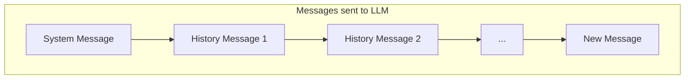
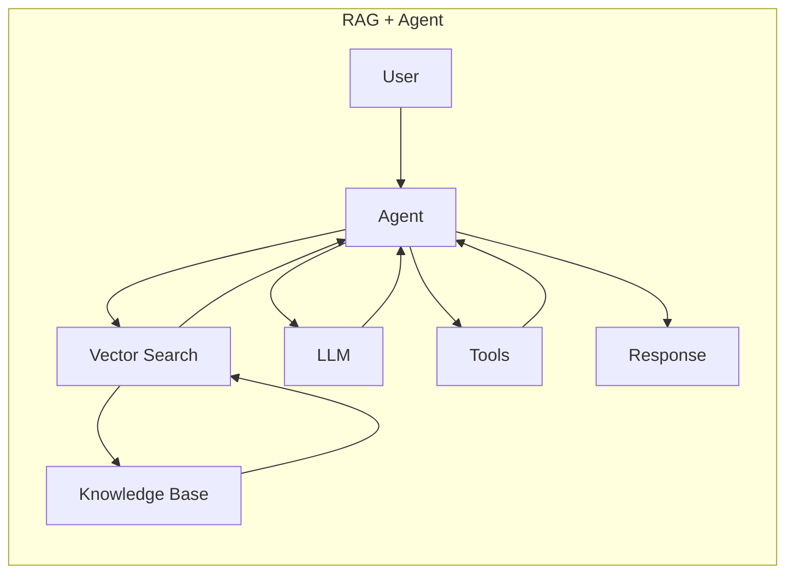

# Agent Core Concepts Q&A

> Phase 0 Supplementary Material
> Deep understanding of Agent fundamentals

---

## Q1: What are the messages in Agent?

### Question
```python
for msg in messages:
    self._chat_history.append(self._to_llm_message(msg))
```
Are these `messages` from the user? Are messages sent to LLM accumulated iteratively?

### Answer

**`messages` are not just user messages**. In multi-agent scenarios, they may come from:
- Users (initial task)
- Other Agents (collaborative dialogue)
- Team orchestrator (passing context)

**Yes, messages are accumulated:**

```python
# Each call sends complete history
llm_messages = []
if self._system_message:
    llm_messages.append(SystemMessage(content=self._system_message))
llm_messages.extend(self._chat_history)  # Complete history
```



**Reason**: LLM APIs are stateless. Each request is independent, so history must be resent for conversation coherence.

---

## Q2: What is the essence of an Agent?

### Question
Is Agent just a tool for organizing context for LLM?

### Answer

**Partially correct, but incomplete.**

```text
Complete definition: Agent = LLM + Loop + Tools + Autonomous Decision
```

| Comparison | Plain LLM Call | Agent |
|------------|---------------|-------|
| Call count | 1 time | Multiple (loop) |
| Tool usage | ❌ | ✅ |
| Decision making | ❌ Just answers | ✅ Decides next step |
| State maintenance | ❌ | ✅ |

### Complete Agent Responsibilities

```text
┌─────────────────────────────────────────────────────────────┐
│  1. Context Management ← What you mentioned                  │
│     • Maintain conversation history                          │
│     • Organize message format                                │
│                                                              │
│  2. Decision Loop ← Key difference!                          │
│     • Think → Decide → Act → Observe → Repeat                │
│                                                              │
│  3. Tool Orchestration                                       │
│     • Know available tools, decide when to call              │
│                                                              │
│  4. Goal Tracking                                            │
│     • Remember original goal, judge if complete              │
└─────────────────────────────────────────────────────────────┘
```

---

## Q3: How does Agent "think"?

### Question
Doesn't Agent thinking rely on LLM?

### Answer

**Absolutely correct! Agent itself doesn't think. All "thinking" is done by LLM.**

```text
Agent Framework = Just code, no intelligence
LLM = The actual "brain"
```

### Real Value of Agent Framework

```python
class Agent:
    def run(self, task):
        while True:
            # ┌─────────────────────────────┐
            # │ This line = only "thinking" │
            # └─────────────────────────────┘
            response = self.llm.chat(messages, tools)
            
            # ┌─────────────────────────────┐
            # │ Below = plain code, no AI   │
            # └─────────────────────────────┘
            if response.has_tool_call:
                result = self.execute_tool(response.tool)
                messages.append(result)
            else:
                return response.content
```

| Agent Framework Does | LLM Does |
|---------------------|----------|
| Maintain history | Understand intent |
| Loop control | Decide which tool |
| Execute tools | Analyze results |
| Format messages | Generate response |

**Analogy**:
- LLM = Brain (thinking, decision-making)
- Agent Framework = Body (executes brain's commands)

---

## Q4: Does message accumulation cause token waste?

### Question
Accumulated messages cause repeated token billing. Any solutions?

### Answer

**The problem definitely exists:**

```text
Call 1: [M1]           → 1 message
Call 2: [M1, M2]       → 2 messages (M1 repeated)
Call 3: [M1, M2, M3]   → 3 messages
...
Call N: [M1...MN]      → N messages

Total billing = 1+2+3+...+N = N(N+1)/2 ≈ O(N²) 🔥
```

### Solutions

#### Solution 1: Sliding Window (Most Common)

```python
class SlidingWindowMemory:
    def __init__(self, max_messages=10):
        self.max = max_messages
    
    def add(self, msg):
        self.messages.append(msg)
        if len(self.messages) > self.max:
            self.messages = self.messages[-self.max:]
```

- ✅ Simple, controlled cost
- ❌ Loses early context

#### Solution 2: Summary Memory

```python
class SummaryMemory:
    def compress(self):
        # Use LLM to summarize old messages
        old = self.messages[:-3]
        self.summary = self.llm.summarize(old)
        self.messages = self.messages[-3:]
    
    def get_messages(self):
        return [
            SystemMessage(f"Summary: {self.summary}"),
            *self.messages
        ]
```

- ✅ Preserves key information
- ❌ Summarization consumes tokens

#### Solution 3: Vector Retrieval (RAG)

```python
class VectorMemory:
    def get_relevant(self, query, top_k=5):
        # Only retrieve relevant history
        embedding = self.embed(query)
        return self.db.search(embedding, top_k)
```

- ✅ On-demand retrieval, maintains relevance in long conversations
- ❌ Requires vector database

#### Cost Comparison

| Solution | 10 rounds | 100 rounds |
|----------|-----------|------------|
| No optimization | 55x | 5050x |
| Sliding window | ~50x | ~500x |
| Summary memory | ~30x | ~150x |
| Vector retrieval | ~20x | ~200x |

---

## Q5: Is RAG + Agent mainstream?

### Answer

**Yes, RAG + Agent is the most mainstream production architecture.**



| Capability | Pure LLM | RAG | Agent | RAG+Agent |
|------------|----------|-----|-------|-----------|
| Knowledge update | ❌ | ✅ | ❌ | ✅ |
| Private data | ❌ | ✅ | ❌ | ✅ |
| Execute actions | ❌ | ❌ | ✅ | ✅ |
| Multi-step reasoning | ❌ | ❌ | ✅ | ✅ |

---

## Q6: What vector databases exist? Can they be installed locally?

### Answer

**Yes, local installation is possible!**

#### Recommended (Local Installation)

| Database | Difficulty | Features |
|----------|------------|----------|
| **Chroma** | ⭐ Easiest | `pip install chromadb` |
| **LanceDB** | ⭐ | Embedded, serverless |
| **Qdrant** | ⭐⭐ | Docker one-click, has .NET SDK |
| **pgvector** | ⭐⭐ | PostgreSQL extension |
| **Milvus** | ⭐⭐⭐ | Enterprise-grade |

#### Quick Start Example (Chroma)

```python
pip install chromadb
```

```python
import chromadb

client = chromadb.PersistentClient(path="./db")
collection = client.create_collection("docs")

# Add
collection.add(
    documents=["Weather is nice", "Rain tomorrow"],
    ids=["doc1", "doc2"]
)

# Query
results = collection.query(query_texts=["weather"], n_results=2)
```

#### Selection Guide

```text
Development/Learning: Chroma or LanceDB (simplest)
.NET Ecosystem: Qdrant or pgvector
Production: Qdrant / Milvus / Pinecone
Already have PG: pgvector
```

---

## Summary

| Concept | Core Understanding |
|---------|-------------------|
| Agent message flow | Sends complete history each time (LLM is stateless) |
| Agent essence | Loop + Tools + Context management |
| Agent thinking | All by LLM, framework is just executor |
| Token optimization | Sliding window / Summary / Vector retrieval |
| Mainstream architecture | RAG + Agent |
| Vector databases | Chroma/LanceDB for learning, Qdrant for production |
