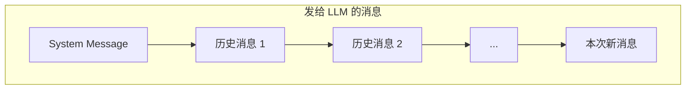
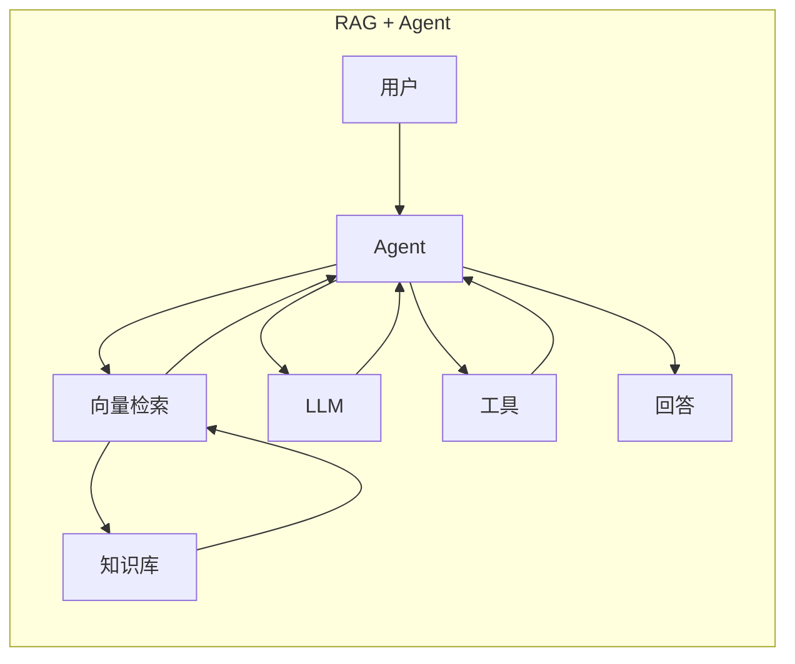

# Agent 核心概念 Q&A

> Phase 0 补充材料
> 深入理解 Agent 的本质与关键问题

---

## Q1: Agent 中的 messages 是什么？

### 问题
```python
for msg in messages:
    self._chat_history.append(self._to_llm_message(msg))
```
这里的 `messages` 是用户发的消息吗？发给 LLM 的消息是迭代累积的吗？

### 答案

**`messages` 不仅是用户消息**，在多 Agent 场景中可能来自：
- 用户（初始任务）
- 其他 Agent（协作对话）
- Team 编排器（传递上下文）

**是的，消息会累积发送：**

```python
# 每次调用都发送完整历史
llm_messages = []
if self._system_message:
    llm_messages.append(SystemMessage(content=self._system_message))
llm_messages.extend(self._chat_history)  # 完整历史
```



**原因**：LLM API 是无状态的，每次请求都独立，必须重发历史才能保持对话连贯。

---

## Q2: Agent 的本质是什么？

### 问题
Agent 是不是就是为 LLM 组织上下文的工具？

### 答案

**部分正确，但不完整。**

```text
完整定义: Agent = LLM + 循环 + 工具 + 自主决策
```

| 对比 | 普通 LLM 调用 | Agent |
|------|--------------|-------|
| 调用次数 | 1 次 | 多次（循环） |
| 工具使用 | ❌ | ✅ |
| 自主决策 | ❌ 只回答 | ✅ 决定下一步 |
| 状态维护 | ❌ | ✅ |

### Agent 的完整职责

```text
┌─────────────────────────────────────────────────────────────┐
│  1. 上下文管理 ← 你说的这部分                                │
│     • 维护对话历史                                          │
│     • 组织消息格式                                          │
│                                                             │
│  2. 决策循环 ← 关键区别！                                   │
│     • 思考 → 决策 → 行动 → 观察 → 重复                      │
│                                                             │
│  3. 工具编排                                                │
│     • 知道有哪些工具，决定何时调用                           │
│                                                             │
│  4. 目标追踪                                                │
│     • 记住原始目标，判断是否完成                             │
└─────────────────────────────────────────────────────────────┘
```

---

## Q3: Agent 如何"思考"？

### 问题
Agent 的思考不也是借助 LLM 吗？

### 答案

**完全正确！Agent 本身不会思考，所有"思考"都是 LLM 在做。**

```text
Agent 框架 = 只是代码，没有智能
LLM = 真正的"大脑"
```

### Agent 框架的真正价值

```python
class Agent:
    def run(self, task):
        while True:
            # ┌─────────────────────────────┐
            # │ 这一行 = 唯一的"思考"        │
            # └─────────────────────────────┘
            response = self.llm.chat(messages, tools)
            
            # ┌─────────────────────────────┐
            # │ 下面 = 普通代码，无智能      │
            # └─────────────────────────────┘
            if response.has_tool_call:
                result = self.execute_tool(response.tool)
                messages.append(result)
            else:
                return response.content
```

| Agent 框架做的 | LLM 做的 |
|---------------|----------|
| 维护消息历史 | 理解意图 |
| 循环控制 | 决定调用哪个工具 |
| 执行工具 | 分析结果 |
| 格式化消息 | 生成回复 |

**比喻**：
- LLM = 大脑（思考、决策）
- Agent 框架 = 身体（执行大脑指令）

---

## Q4: 消息累积导致 Token 重复消费？

### 问题
累积的 messages 会导致 token 重复计费，有解决办法吗？

### 答案

**问题确实存在：**

```text
第1次: [M1]           → 1条
第2次: [M1, M2]       → 2条（M1重复）
第3次: [M1, M2, M3]   → 3条
...
第N次: [M1...MN]      → N条

总计费 = 1+2+3+...+N = N(N+1)/2 ≈ O(N²) 🔥
```

### 解决方案

#### 方案 1: 滑动窗口（最常用）

```python
class SlidingWindowMemory:
    def __init__(self, max_messages=10):
        self.max = max_messages
    
    def add(self, msg):
        self.messages.append(msg)
        if len(self.messages) > self.max:
            self.messages = self.messages[-self.max:]
```

- ✅ 简单，成本可控
- ❌ 丢失早期上下文

#### 方案 2: 摘要记忆

```python
class SummaryMemory:
    def compress(self):
        # 用 LLM 总结旧消息
        old = self.messages[:-3]
        self.summary = self.llm.summarize(old)
        self.messages = self.messages[-3:]
    
    def get_messages(self):
        return [
            SystemMessage(f"摘要: {self.summary}"),
            *self.messages
        ]
```

- ✅ 保留关键信息
- ❌ 总结本身消耗 token

#### 方案 3: 向量检索（RAG）

```python
class VectorMemory:
    def get_relevant(self, query, top_k=5):
        # 只检索相关历史
        embedding = self.embed(query)
        return self.db.search(embedding, top_k)
```

- ✅ 按需检索，长对话也能保持相关性
- ❌ 需要向量数据库

#### 成本对比

| 方案 | 10轮对话 | 100轮对话 |
|------|----------|-----------|
| 无优化 | 55x | 5050x |
| 滑动窗口 | ~50x | ~500x |
| 摘要记忆 | ~30x | ~150x |
| 向量检索 | ~20x | ~200x |

---

## Q5: RAG + Agent 是否主流？

### 答案

**是的，RAG + Agent 是目前最主流的生产架构。**



| 能力 | 纯 LLM | RAG | Agent | RAG+Agent |
|------|--------|-----|-------|-----------|
| 知识更新 | ❌ | ✅ | ❌ | ✅ |
| 私有数据 | ❌ | ✅ | ❌ | ✅ |
| 执行操作 | ❌ | ❌ | ✅ | ✅ |
| 多步推理 | ❌ | ❌ | ✅ | ✅ |

---

## Q6: 有哪些向量数据库？可以本地安装吗？

### 答案

**可以本地安装！**

#### 推荐（本地安装）

| 数据库 | 安装难度 | 特点 |
|--------|----------|------|
| **Chroma** | ⭐ 最简单 | `pip install chromadb` |
| **LanceDB** | ⭐ | 嵌入式，无需服务器 |
| **Qdrant** | ⭐⭐ | Docker 一键启动，有 .NET SDK |
| **pgvector** | ⭐⭐ | PostgreSQL 扩展 |
| **Milvus** | ⭐⭐⭐ | 企业级 |

#### 快速上手示例（Chroma）

```python
pip install chromadb
```

```python
import chromadb

client = chromadb.PersistentClient(path="./db")
collection = client.create_collection("docs")

# 添加
collection.add(
    documents=["今天天气好", "明天下雨"],
    ids=["doc1", "doc2"]
)

# 查询
results = collection.query(query_texts=["天气"], n_results=2)
```

#### 选择建议

```text
开发/学习: Chroma 或 LanceDB（最简单）
.NET 生态: Qdrant 或 pgvector
生产环境: Qdrant / Milvus / Pinecone
已有 PG: pgvector
```

---

## 总结

| 概念 | 核心理解 |
|------|----------|
| Agent 消息流 | 每次发送完整历史，因为 LLM 无状态 |
| Agent 本质 | 循环 + 工具 + 上下文管理 |
| Agent 思考 | 全靠 LLM，框架只是执行器 |
| Token 优化 | 滑动窗口 / 摘要 / 向量检索 |
| 主流架构 | RAG + Agent |
| 向量数据库 | Chroma/LanceDB 入门，Qdrant 生产 |
