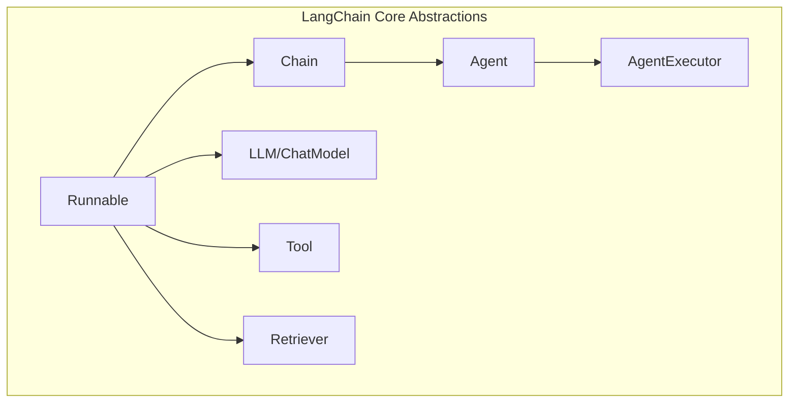

# Week 0A: LangChain Core Architecture Analysis

> Phase 0: Framework Analysis
> Learning to understand existing frameworks before building our own

---

## Overview

**LangChain** is one of the most popular frameworks for building LLM applications. Understanding its architecture will help us make informed design decisions for dawning-agents.

- **GitHub**: https://github.com/langchain-ai/langchain
- **Language**: Python (primary), TypeScript/JavaScript
- **First Release**: October 2022
- **Philosophy**: Composable abstractions for LLM applications

---

## Day 1: Core Abstractions

### 1. Project Structure

```text
langchain/
├── langchain-core/          # Core abstractions (MOST IMPORTANT)
│   ├── language_models/     # LLM interfaces
│   ├── prompts/             # Prompt templates
│   ├── output_parsers/      # Parse LLM outputs
│   ├── runnables/           # LCEL (LangChain Expression Language)
│   ├── messages/            # Chat message types
│   └── tools/               # Tool abstractions
├── langchain/               # Main package
│   ├── agents/              # Agent implementations
│   ├── chains/              # Chain implementations
│   └── memory/              # Memory implementations
└── langchain-community/     # Third-party integrations
```

### 2. Key Abstractions



| Abstraction | Purpose | Key Interface |
|-------------|---------|---------------|
| **Runnable** | Base interface for all components | `invoke()`, `stream()`, `batch()` |
| **BaseChatModel** | LLM wrapper | `invoke(messages) -> AIMessage` |
| **BaseTool** | Tool definition | `_run(input) -> str` |
| **BaseMemory** | Conversation memory | `load_memory_variables()`, `save_context()` |
| **BaseRetriever** | Document retrieval | `get_relevant_documents(query)` |
| **AgentExecutor** | Agent loop runner | `invoke(input) -> output` |

### 3. The Runnable Interface (LCEL)

LangChain Expression Language (LCEL) is the foundation:

```python
# Source: langchain-core/runnables/base.py (simplified)

class Runnable(Generic[Input, Output], ABC):
    """Base interface for all LangChain components."""
    
    @abstractmethod
    def invoke(self, input: Input, config: Optional[RunnableConfig] = None) -> Output:
        """Transform a single input into an output."""
        ...
    
    async def ainvoke(self, input: Input, config: Optional[RunnableConfig] = None) -> Output:
        """Async version of invoke."""
        return await asyncio.get_running_loop().run_in_executor(
            None, self.invoke, input, config
        )
    
    def stream(self, input: Input, config: Optional[RunnableConfig] = None) -> Iterator[Output]:
        """Stream output chunks."""
        yield self.invoke(input, config)
    
    def batch(self, inputs: List[Input], config: Optional[RunnableConfig] = None) -> List[Output]:
        """Process multiple inputs."""
        return [self.invoke(input, config) for input in inputs]
    
    # Composition operators
    def __or__(self, other: Runnable) -> RunnableSequence:
        """Chain with | operator: runnable1 | runnable2"""
        return RunnableSequence(first=self, last=other)
    
    def __ror__(self, other: Runnable) -> RunnableSequence:
        """Reverse chain."""
        return RunnableSequence(first=other, last=self)
```

**Key Design Decision**: Everything is a `Runnable`, enabling composition via `|` operator.

---

## Day 2: Agent Architecture

### 1. Agent Interface

```python
# Source: langchain-core/agents.py (simplified)

@dataclass
class AgentAction:
    """Action returned by agent."""
    tool: str
    tool_input: Union[str, dict]
    log: str  # Agent's reasoning

@dataclass  
class AgentFinish:
    """Final result from agent."""
    return_values: dict
    log: str

class BaseAgent(ABC):
    """Base class for agents."""
    
    @abstractmethod
    def plan(
        self,
        intermediate_steps: List[Tuple[AgentAction, str]],
        **kwargs
    ) -> Union[AgentAction, AgentFinish]:
        """Given input and previous steps, decide what to do."""
        ...
```

### 2. AgentExecutor - The Core Loop

```python
# Source: langchain/agents/agent.py (simplified)

class AgentExecutor(Chain):
    """Executes an agent in a loop."""
    
    agent: BaseAgent
    tools: List[BaseTool]
    max_iterations: int = 15
    early_stopping_method: str = "force"
    
    def _call(self, inputs: Dict[str, Any]) -> Dict[str, Any]:
        """Run the agent loop."""
        intermediate_steps: List[Tuple[AgentAction, str]] = []
        iterations = 0
        
        while iterations < self.max_iterations:
            # 1. THINK: Agent decides next action
            output = self.agent.plan(
                intermediate_steps=intermediate_steps,
                **inputs
            )
            
            # 2. CHECK: Is agent done?
            if isinstance(output, AgentFinish):
                return output.return_values
            
            # 3. ACT: Execute the tool
            action = output
            tool = self._get_tool(action.tool)
            observation = tool.run(action.tool_input)
            
            # 4. OBSERVE: Record result
            intermediate_steps.append((action, observation))
            iterations += 1
        
        # Handle max iterations
        return self._handle_max_iterations(intermediate_steps)
```

### 3. ReAct Agent Implementation

```python
# Source: langchain/agents/react/agent.py (simplified)

class ReActAgent(BaseAgent):
    """ReAct pattern agent."""
    
    llm: BaseChatModel
    tools: List[BaseTool]
    prompt: ChatPromptTemplate
    output_parser: AgentOutputParser
    
    def plan(
        self,
        intermediate_steps: List[Tuple[AgentAction, str]],
        **kwargs
    ) -> Union[AgentAction, AgentFinish]:
        # Build scratchpad from previous steps
        scratchpad = self._build_scratchpad(intermediate_steps)
        
        # Format prompt
        prompt = self.prompt.format_messages(
            input=kwargs["input"],
            agent_scratchpad=scratchpad,
            tools=self._format_tools(),
        )
        
        # Get LLM response
        response = self.llm.invoke(prompt)
        
        # Parse response into action or finish
        return self.output_parser.parse(response.content)
    
    def _build_scratchpad(self, steps: List[Tuple[AgentAction, str]]) -> str:
        """Build the agent scratchpad from intermediate steps."""
        scratchpad = ""
        for action, observation in steps:
            scratchpad += f"Thought: {action.log}\n"
            scratchpad += f"Action: {action.tool}\n"
            scratchpad += f"Action Input: {action.tool_input}\n"
            scratchpad += f"Observation: {observation}\n"
        return scratchpad
```

---

## Day 3: Tool System

### 1. Tool Interface

```python
# Source: langchain-core/tools.py (simplified)

class BaseTool(Runnable, ABC):
    """Base class for tools."""
    
    name: str
    description: str
    args_schema: Optional[Type[BaseModel]] = None  # Pydantic model
    
    @abstractmethod
    def _run(self, *args, **kwargs) -> Any:
        """Execute the tool."""
        ...
    
    async def _arun(self, *args, **kwargs) -> Any:
        """Async execution."""
        return await asyncio.get_running_loop().run_in_executor(
            None, self._run, *args, **kwargs
        )
    
    def invoke(self, input: Union[str, dict], config: Optional[RunnableConfig] = None) -> Any:
        """Runnable interface."""
        return self._run(input)

# Decorator for easy tool creation
def tool(
    name: Optional[str] = None,
    description: Optional[str] = None,
    args_schema: Optional[Type[BaseModel]] = None,
) -> Callable:
    """Decorator to create a tool from a function."""
    def decorator(func: Callable) -> BaseTool:
        return StructuredTool.from_function(
            func=func,
            name=name or func.__name__,
            description=description or func.__doc__,
            args_schema=args_schema,
        )
    return decorator
```

### 2. Tool Usage Pattern

```python
# Example: Creating tools

from langchain_core.tools import tool
from pydantic import BaseModel, Field

class SearchInput(BaseModel):
    query: str = Field(description="The search query")

@tool(args_schema=SearchInput)
def search(query: str) -> str:
    """Search the web for information."""
    # Implementation
    return f"Results for: {query}"

# Tools are auto-converted to LLM function calling format
tools = [search]
llm_with_tools = llm.bind_tools(tools)
```

---

## Day 4: Memory System

### 1. Memory Interface

```python
# Source: langchain-core/memory.py (simplified)

class BaseMemory(ABC):
    """Base class for memory."""
    
    @property
    @abstractmethod
    def memory_variables(self) -> List[str]:
        """Variables this memory provides."""
        ...
    
    @abstractmethod
    def load_memory_variables(self, inputs: Dict[str, Any]) -> Dict[str, Any]:
        """Load memory variables."""
        ...
    
    @abstractmethod
    def save_context(self, inputs: Dict[str, Any], outputs: Dict[str, Any]) -> None:
        """Save context from this conversation."""
        ...
    
    def clear(self) -> None:
        """Clear memory."""
        pass
```

### 2. Memory Implementations

```python
# ConversationBufferMemory - stores all messages
class ConversationBufferMemory(BaseMemory):
    buffer: List[BaseMessage] = []
    
    def load_memory_variables(self, inputs: Dict) -> Dict:
        return {"history": self.buffer}
    
    def save_context(self, inputs: Dict, outputs: Dict) -> None:
        self.buffer.append(HumanMessage(content=inputs["input"]))
        self.buffer.append(AIMessage(content=outputs["output"]))

# ConversationBufferWindowMemory - sliding window
class ConversationBufferWindowMemory(BaseMemory):
    k: int = 5  # Window size
    buffer: List[BaseMessage] = []
    
    def load_memory_variables(self, inputs: Dict) -> Dict:
        return {"history": self.buffer[-self.k * 2:]}  # Last k exchanges

# ConversationSummaryMemory - summarizes old messages
class ConversationSummaryMemory(BaseMemory):
    llm: BaseChatModel
    buffer: str = ""  # Running summary
    
    def save_context(self, inputs: Dict, outputs: Dict) -> None:
        new_lines = f"Human: {inputs['input']}\nAI: {outputs['output']}"
        self.buffer = self._summarize(self.buffer, new_lines)
```

---

## Key Design Patterns in LangChain

### 1. Composition via Operators

```python
# LCEL enables declarative composition
chain = prompt | llm | output_parser

# Parallel execution
chain = RunnableParallel({
    "summary": prompt1 | llm,
    "translation": prompt2 | llm,
})

# Branching
chain = RunnableBranch(
    (lambda x: x["type"] == "a", chain_a),
    (lambda x: x["type"] == "b", chain_b),
    default_chain,
)
```

### 2. Callbacks for Observability

```python
class BaseCallbackHandler(ABC):
    """Handle events during execution."""
    
    def on_llm_start(self, serialized: Dict, prompts: List[str], **kwargs): ...
    def on_llm_end(self, response: LLMResult, **kwargs): ...
    def on_tool_start(self, serialized: Dict, input_str: str, **kwargs): ...
    def on_tool_end(self, output: str, **kwargs): ...
    def on_agent_action(self, action: AgentAction, **kwargs): ...
    def on_agent_finish(self, finish: AgentFinish, **kwargs): ...
```

### 3. Serialization

All components can be serialized to JSON for storage/sharing.

---

## Strengths & Weaknesses

| Strengths | Weaknesses |
|-----------|------------|
| ✅ Very flexible composition | ❌ Complex abstraction layers |
| ✅ Rich ecosystem of integrations | ❌ Can be slow due to overhead |
| ✅ Good documentation | ❌ Frequent breaking changes |
| ✅ LCEL is elegant | ❌ Magic can obscure debugging |
| ✅ Active community | ❌ Python-first (TypeScript is secondary) |

---

## Lessons for dawning-agents

1. **Runnable pattern is powerful** - Consider a similar base interface
2. **Operator composition is elegant** - But can make debugging hard
3. **Separate core from integrations** - Keep core package minimal
4. **Callbacks for observability** - Essential for production
5. **Type safety matters** - LangChain's Python duck-typing can cause issues

---

## Source Code Reading Guide

| Priority | Path | Purpose |
|----------|------|---------|
| ⭐⭐⭐ | `langchain-core/runnables/base.py` | Runnable interface |
| ⭐⭐⭐ | `langchain/agents/agent.py` | AgentExecutor loop |
| ⭐⭐ | `langchain-core/tools.py` | Tool abstractions |
| ⭐⭐ | `langchain-core/prompts/` | Prompt templates |
| ⭐ | `langchain/memory/` | Memory implementations |
