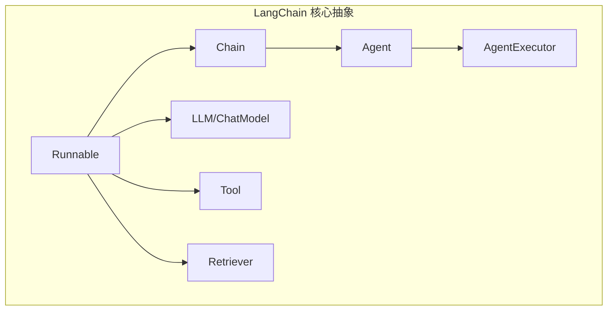

# Week 0A: LangChain 核心架构分析

> Phase 0: 框架分析
> 在构建自己的框架之前，先理解现有框架

---

## 概述

**LangChain** 是构建 LLM 应用最流行的框架之一。理解其架构将帮助我们为 dawning-agents 做出明智的设计决策。

- **GitHub**: https://github.com/langchain-ai/langchain
- **语言**: Python (主要), TypeScript/JavaScript
- **首次发布**: 2022年10月
- **设计理念**: 可组合的 LLM 应用抽象

---

## 第一天：核心抽象

### 1. 项目结构

```text
langchain/
├── langchain-core/          # 核心抽象（最重要）
│   ├── language_models/     # LLM 接口
│   ├── prompts/             # 提示模板
│   ├── output_parsers/      # 解析 LLM 输出
│   ├── runnables/           # LCEL（LangChain 表达式语言）
│   ├── messages/            # 聊天消息类型
│   └── tools/               # 工具抽象
├── langchain/               # 主包
│   ├── agents/              # Agent 实现
│   ├── chains/              # Chain 实现
│   └── memory/              # 记忆实现
└── langchain-community/     # 第三方集成
```

### 2. 关键抽象



| 抽象 | 目的 | 关键接口 |
|------|------|----------|
| **Runnable** | 所有组件的基础接口 | `invoke()`, `stream()`, `batch()` |
| **BaseChatModel** | LLM 包装器 | `invoke(messages) -> AIMessage` |
| **BaseTool** | 工具定义 | `_run(input) -> str` |
| **BaseMemory** | 对话记忆 | `load_memory_variables()`, `save_context()` |
| **BaseRetriever** | 文档检索 | `get_relevant_documents(query)` |
| **AgentExecutor** | Agent 循环执行器 | `invoke(input) -> output` |

### 3. Runnable 接口 (LCEL)

LangChain 表达式语言（LCEL）是基础：

```python
# 源码: langchain-core/runnables/base.py（简化版）

class Runnable(Generic[Input, Output], ABC):
    """所有 LangChain 组件的基础接口。"""
    
    @abstractmethod
    def invoke(self, input: Input, config: Optional[RunnableConfig] = None) -> Output:
        """将单个输入转换为输出。"""
        ...
    
    async def ainvoke(self, input: Input, config: Optional[RunnableConfig] = None) -> Output:
        """invoke 的异步版本。"""
        return await asyncio.get_running_loop().run_in_executor(
            None, self.invoke, input, config
        )
    
    def stream(self, input: Input, config: Optional[RunnableConfig] = None) -> Iterator[Output]:
        """流式输出块。"""
        yield self.invoke(input, config)
    
    def batch(self, inputs: List[Input], config: Optional[RunnableConfig] = None) -> List[Output]:
        """处理多个输入。"""
        return [self.invoke(input, config) for input in inputs]
    
    # 组合操作符
    def __or__(self, other: Runnable) -> RunnableSequence:
        """使用 | 操作符链式调用: runnable1 | runnable2"""
        return RunnableSequence(first=self, last=other)
    
    def __ror__(self, other: Runnable) -> RunnableSequence:
        """反向链式调用。"""
        return RunnableSequence(first=other, last=self)
```

**关键设计决策**：一切都是 `Runnable`，通过 `|` 操作符实现组合。

---

## 第二天：Agent 架构

### 1. Agent 接口

```python
# 源码: langchain-core/agents.py（简化版）

@dataclass
class AgentAction:
    """Agent 返回的动作。"""
    tool: str
    tool_input: Union[str, dict]
    log: str  # Agent 的推理过程

@dataclass  
class AgentFinish:
    """Agent 的最终结果。"""
    return_values: dict
    log: str

class BaseAgent(ABC):
    """Agent 的基类。"""
    
    @abstractmethod
    def plan(
        self,
        intermediate_steps: List[Tuple[AgentAction, str]],
        **kwargs
    ) -> Union[AgentAction, AgentFinish]:
        """根据输入和之前的步骤，决定下一步做什么。"""
        ...
```

### 2. AgentExecutor - 核心循环

```python
# 源码: langchain/agents/agent.py（简化版）

class AgentExecutor(Chain):
    """在循环中执行 Agent。"""
    
    agent: BaseAgent
    tools: List[BaseTool]
    max_iterations: int = 15
    early_stopping_method: str = "force"
    
    def _call(self, inputs: Dict[str, Any]) -> Dict[str, Any]:
        """运行 Agent 循环。"""
        intermediate_steps: List[Tuple[AgentAction, str]] = []
        iterations = 0
        
        while iterations < self.max_iterations:
            # 1. 思考: Agent 决定下一个动作
            output = self.agent.plan(
                intermediate_steps=intermediate_steps,
                **inputs
            )
            
            # 2. 检查: Agent 是否完成？
            if isinstance(output, AgentFinish):
                return output.return_values
            
            # 3. 行动: 执行工具
            action = output
            tool = self._get_tool(action.tool)
            observation = tool.run(action.tool_input)
            
            # 4. 观察: 记录结果
            intermediate_steps.append((action, observation))
            iterations += 1
        
        # 处理达到最大迭代次数
        return self._handle_max_iterations(intermediate_steps)
```

### 3. ReAct Agent 实现

```python
# 源码: langchain/agents/react/agent.py（简化版）

class ReActAgent(BaseAgent):
    """ReAct 模式的 Agent。"""
    
    llm: BaseChatModel
    tools: List[BaseTool]
    prompt: ChatPromptTemplate
    output_parser: AgentOutputParser
    
    def plan(
        self,
        intermediate_steps: List[Tuple[AgentAction, str]],
        **kwargs
    ) -> Union[AgentAction, AgentFinish]:
        # 从之前的步骤构建草稿本
        scratchpad = self._build_scratchpad(intermediate_steps)
        
        # 格式化提示
        prompt = self.prompt.format_messages(
            input=kwargs["input"],
            agent_scratchpad=scratchpad,
            tools=self._format_tools(),
        )
        
        # 获取 LLM 响应
        response = self.llm.invoke(prompt)
        
        # 解析响应为动作或完成
        return self.output_parser.parse(response.content)
    
    def _build_scratchpad(self, steps: List[Tuple[AgentAction, str]]) -> str:
        """从中间步骤构建 Agent 草稿本。"""
        scratchpad = ""
        for action, observation in steps:
            scratchpad += f"Thought: {action.log}\n"
            scratchpad += f"Action: {action.tool}\n"
            scratchpad += f"Action Input: {action.tool_input}\n"
            scratchpad += f"Observation: {observation}\n"
        return scratchpad
```

---

## 第三天：工具系统

### 1. 工具接口

```python
# 源码: langchain-core/tools.py（简化版）

class BaseTool(Runnable, ABC):
    """工具的基类。"""
    
    name: str
    description: str
    args_schema: Optional[Type[BaseModel]] = None  # Pydantic 模型
    
    @abstractmethod
    def _run(self, *args, **kwargs) -> Any:
        """执行工具。"""
        ...
    
    async def _arun(self, *args, **kwargs) -> Any:
        """异步执行。"""
        return await asyncio.get_running_loop().run_in_executor(
            None, self._run, *args, **kwargs
        )
    
    def invoke(self, input: Union[str, dict], config: Optional[RunnableConfig] = None) -> Any:
        """Runnable 接口。"""
        return self._run(input)

# 用于轻松创建工具的装饰器
def tool(
    name: Optional[str] = None,
    description: Optional[str] = None,
    args_schema: Optional[Type[BaseModel]] = None,
) -> Callable:
    """从函数创建工具的装饰器。"""
    def decorator(func: Callable) -> BaseTool:
        return StructuredTool.from_function(
            func=func,
            name=name or func.__name__,
            description=description or func.__doc__,
            args_schema=args_schema,
        )
    return decorator
```

### 2. 工具使用模式

```python
# 示例：创建工具

from langchain_core.tools import tool
from pydantic import BaseModel, Field

class SearchInput(BaseModel):
    query: str = Field(description="搜索查询")

@tool(args_schema=SearchInput)
def search(query: str) -> str:
    """在网上搜索信息。"""
    # 实现
    return f"Results for: {query}"

# 工具自动转换为 LLM 函数调用格式
tools = [search]
llm_with_tools = llm.bind_tools(tools)
```

---

## 第四天：记忆系统

### 1. 记忆接口

```python
# 源码: langchain-core/memory.py（简化版）

class BaseMemory(ABC):
    """记忆的基类。"""
    
    @property
    @abstractmethod
    def memory_variables(self) -> List[str]:
        """此记忆提供的变量。"""
        ...
    
    @abstractmethod
    def load_memory_variables(self, inputs: Dict[str, Any]) -> Dict[str, Any]:
        """加载记忆变量。"""
        ...
    
    @abstractmethod
    def save_context(self, inputs: Dict[str, Any], outputs: Dict[str, Any]) -> None:
        """保存本次对话的上下文。"""
        ...
    
    def clear(self) -> None:
        """清除记忆。"""
        pass
```

### 2. 记忆实现

```python
# ConversationBufferMemory - 存储所有消息
class ConversationBufferMemory(BaseMemory):
    buffer: List[BaseMessage] = []
    
    def load_memory_variables(self, inputs: Dict) -> Dict:
        return {"history": self.buffer}
    
    def save_context(self, inputs: Dict, outputs: Dict) -> None:
        self.buffer.append(HumanMessage(content=inputs["input"]))
        self.buffer.append(AIMessage(content=outputs["output"]))

# ConversationBufferWindowMemory - 滑动窗口
class ConversationBufferWindowMemory(BaseMemory):
    k: int = 5  # 窗口大小
    buffer: List[BaseMessage] = []
    
    def load_memory_variables(self, inputs: Dict) -> Dict:
        return {"history": self.buffer[-self.k * 2:]}  # 最后 k 轮对话

# ConversationSummaryMemory - 总结旧消息
class ConversationSummaryMemory(BaseMemory):
    llm: BaseChatModel
    buffer: str = ""  # 持续更新的总结
    
    def save_context(self, inputs: Dict, outputs: Dict) -> None:
        new_lines = f"Human: {inputs['input']}\nAI: {outputs['output']}"
        self.buffer = self._summarize(self.buffer, new_lines)
```

---

## LangChain 中的关键设计模式

### 1. 通过操作符组合

```python
# LCEL 实现声明式组合
chain = prompt | llm | output_parser

# 并行执行
chain = RunnableParallel({
    "summary": prompt1 | llm,
    "translation": prompt2 | llm,
})

# 分支
chain = RunnableBranch(
    (lambda x: x["type"] == "a", chain_a),
    (lambda x: x["type"] == "b", chain_b),
    default_chain,
)
```

### 2. 回调实现可观测性

```python
class BaseCallbackHandler(ABC):
    """处理执行期间的事件。"""
    
    def on_llm_start(self, serialized: Dict, prompts: List[str], **kwargs): ...
    def on_llm_end(self, response: LLMResult, **kwargs): ...
    def on_tool_start(self, serialized: Dict, input_str: str, **kwargs): ...
    def on_tool_end(self, output: str, **kwargs): ...
    def on_agent_action(self, action: AgentAction, **kwargs): ...
    def on_agent_finish(self, finish: AgentFinish, **kwargs): ...
```

### 3. 序列化

所有组件都可以序列化为 JSON 以便存储/共享。

---

## 优势与劣势

| 优势 | 劣势 |
|------|------|
| ✅ 非常灵活的组合 | ❌ 抽象层复杂 |
| ✅ 丰富的集成生态 | ❌ 由于开销可能较慢 |
| ✅ 文档完善 | ❌ 频繁的破坏性变更 |
| ✅ LCEL 很优雅 | ❌ 魔法可能让调试变难 |
| ✅ 活跃的社区 | ❌ Python 优先（TypeScript 是次要的） |

---

## 对 dawning-agents 的启示

1. **Runnable 模式很强大** - 考虑类似的基础接口
2. **操作符组合很优雅** - 但可能使调试变难
3. **将核心与集成分开** - 保持核心包最小化
4. **回调实现可观测性** - 生产环境必需
5. **类型安全很重要** - LangChain 的 Python 鸭子类型可能导致问题

---

## 源码阅读指南

| 优先级 | 路径 | 目的 |
|--------|------|------|
| ⭐⭐⭐ | `langchain-core/runnables/base.py` | Runnable 接口 |
| ⭐⭐⭐ | `langchain/agents/agent.py` | AgentExecutor 循环 |
| ⭐⭐ | `langchain-core/tools.py` | 工具抽象 |
| ⭐⭐ | `langchain-core/prompts/` | 提示模板 |
| ⭐ | `langchain/memory/` | 记忆实现 |
