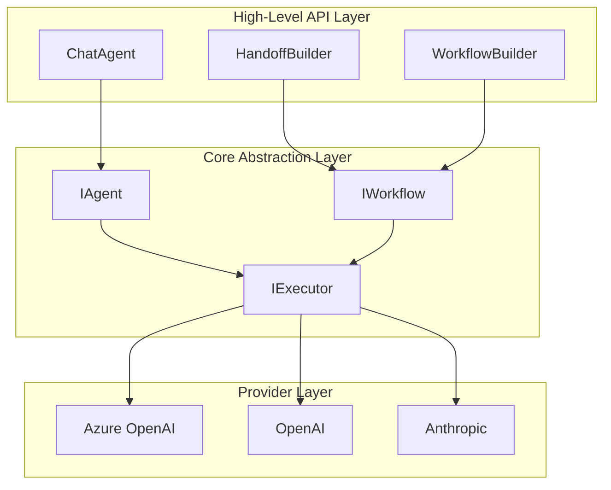

# Week 0C: Microsoft Agent Framework Architecture Analysis

> Phase 0: Framework Analysis (Updated January 2026)
> Deep dive into Microsoft Agent Framework architecture and design patterns

---

## Overview

**Microsoft Agent Framework** is Microsoft's unified Agent framework released in November 2025, consolidating the best features of Semantic Kernel and AutoGen.

- **GitHub**: https://github.com/microsoft/agent-framework
- **Languages**: Python + .NET (first-class citizens)
- **Status**: Preview (as of January 2026)
- **Predecessors**: Semantic Kernel + AutoGen

> ⚠️ **Migration Note**: Microsoft provides migration guides from both Semantic Kernel and AutoGen.

---

## Part 1: Project Structure

### Repository Structure

```text
agent-framework/
├── python/
│   └── packages/
│       ├── agent-core/              # Core abstractions
│       │   ├── agents/              # Agent base classes
│       │   ├── workflows/           # Workflow orchestration
│       │   └── executors/           # Executors
│       ├── agent-framework/         # High-level API
│       │   ├── handoffs/            # Handoff builders
│       │   └── chat/                # Chat agents
│       └── agent-azure/             # Azure integration
│
├── dotnet/
│   └── src/
│       ├── Microsoft.Agents.Abstractions/   # Core interfaces
│       ├── Microsoft.Agents.Core/           # Core implementation
│       ├── Microsoft.Agents.AI/             # AI integration
│       └── Microsoft.Agents.Azure/          # Azure services
│
└── docs/
    ├── getting-started/
    ├── migration/                   # Migration from SK/AutoGen
    └── concepts/
```

### Architecture Layers



---

## Part 2: Core Concepts

### 1. Agent

Agent is the core of the framework, representing an LLM configured with instructions and tools.

```python
# Python
from agent_framework import ChatAgent
from agent_framework.azure import AzureOpenAIChatClient

client = AzureOpenAIChatClient(
    endpoint="https://xxx.openai.azure.com",
    credential=AzureCliCredential()
)

agent = client.create_agent(
    name="assistant",
    instructions="You are a helpful assistant.",
    tools=[search_tool, calculator_tool]
)

# Run
result = await agent.run("What's the weather like today?")
print(result.output)
```

```csharp
// .NET
var client = new AzureOpenAIChatClient(
    new Uri("https://xxx.openai.azure.com"),
    new AzureCliCredential());

var agent = client.CreateAgent(
    name: "assistant",
    instructions: "You are a helpful assistant.",
    tools: [searchTool, calculatorTool]);

// Run
var result = await agent.RunAsync("What's the weather like today?");
Console.WriteLine(result.Output);
```

### 2. Workflow

Workflow is the core mechanism for orchestrating multi-agent collaboration.

```python
# Python - HandoffBuilder
from agent_framework import HandoffBuilder

# Create multiple agents
triage = client.create_agent(name="triage", instructions="Analyze user needs...")
billing = client.create_agent(name="billing", instructions="Handle billing...")
support = client.create_agent(name="support", instructions="Technical support...")

# Build handoff workflow
workflow = (
    HandoffBuilder(participants=[triage, billing, support])
    .with_start_agent(triage)
    .add_handoff(triage, [billing, support])
    .add_handoff(billing, [triage])  # Can hand back
    .with_autonomous_mode(turn_limits={"billing": 10})
    .build()
)

# Stream execution
async for event in workflow.run_stream(messages):
    if event.type == "agent_response":
        print(f"[{event.agent}]: {event.content}")
    elif event.type == "handoff":
        print(f"Handoff: {event.from_agent} -> {event.to_agent}")
```

```csharp
// .NET - HandoffBuilder
var workflow = new HandoffBuilder()
    .WithParticipants(triageAgent, billingAgent, supportAgent)
    .WithStartAgent(triageAgent)
    .AddHandoff(triageAgent, billingAgent, "Handle billing issues")
    .AddHandoff(triageAgent, supportAgent, "Handle technical support")
    .AddHandoff(billingAgent, triageAgent)
    .WithAutonomousMode(turnLimits: new() { ["billing"] = 10 })
    .Build();

await foreach (var evt in workflow.RunStreamAsync(messages))
{
    switch (evt)
    {
        case AgentResponseEvent response:
            Console.WriteLine($"[{response.Agent}]: {response.Content}");
            break;
        case HandoffEvent handoff:
            Console.WriteLine($"Handoff: {handoff.From} -> {handoff.To}");
            break;
    }
}
```

### 3. Tool

Tools are functions that agents can call.

```python
# Python
from agent_framework import ai_function

@ai_function(description="Search the web for information")
def search_web(query: str) -> str:
    """
    Args:
        query: Search query
    """
    # Implement search logic
    return f"Search results: {query}"

@ai_function(description="Calculate mathematical expressions")
def calculate(expression: str) -> float:
    """
    Args:
        expression: Mathematical expression
    """
    return eval(expression)

agent = client.create_agent(
    name="calculator",
    instructions="You are a calculation assistant",
    tools=[search_web, calculate]
)
```

```csharp
// .NET
public class WebTools
{
    [AIFunction("search_web", "Search the web for information")]
    public async Task<string> SearchAsync(
        [Description("Search query")] string query)
    {
        // Implement search logic
        return $"Search results: {query}";
    }
    
    [AIFunction("calculate", "Calculate mathematical expressions")]
    public double Calculate(
        [Description("Mathematical expression")] string expression)
    {
        // Safe calculation
        return ExpressionEvaluator.Evaluate(expression);
    }
}

var tools = AIFunctionFactory.CreateFromType<WebTools>();
var agent = client.CreateAgent(
    name: "calculator",
    instructions: "You are a calculation assistant",
    tools: tools);
```

### 4. Executor

Executor is responsible for running agents and handling events.

```python
# Python
from agent_framework import Executor, ExecutorSettings

settings = ExecutorSettings(
    max_iterations=20,
    timeout_seconds=300,
    enable_tracing=True
)

executor = Executor(settings=settings)

# Run and listen to events
async for event in executor.run_stream(workflow, messages):
    print(event)
```

```csharp
// .NET
var settings = new ExecutorSettings
{
    MaxIterations = 20,
    Timeout = TimeSpan.FromMinutes(5),
    EnableTracing = true
};

var executor = new Executor(settings);

await foreach (var evt in executor.RunStreamAsync(workflow, messages))
{
    Console.WriteLine(evt);
}
```

---

## Part 3: Advanced Features

### 1. Autonomous Mode

Allows agents to run multiple turns autonomously after handoff without human intervention.

```python
workflow = (
    HandoffBuilder(participants=[triage, billing, support])
    .with_start_agent(triage)
    .add_handoff(triage, [billing, support])
    .with_autonomous_mode(
        turn_limits={
            "billing": 10,   # billing runs max 10 turns autonomously
            "support": 5     # support runs max 5 turns autonomously
        },
        checkpointing=True   # Enable checkpointing
    )
    .build()
)
```

### 2. Human-in-the-Loop

Pause at critical decision points and wait for human confirmation.

```python
workflow = (
    HandoffBuilder(participants=[triage, billing])
    .with_start_agent(triage)
    .add_handoff(triage, [billing])
    .with_human_in_loop(
        agents=["billing"],     # Which agents need human confirmation
        trigger="confirm_action" # Trigger condition
    )
    .build()
)

async for event in workflow.run_stream(messages):
    if event.type == "human_input_required":
        # Wait for human input
        human_response = await get_human_input(event.prompt)
        await workflow.provide_human_input(human_response)
```

### 3. Checkpointing and Recovery

Support persistence and recovery for long-running workflows.

```python
from agent_framework import CheckpointStore

store = CheckpointStore(connection_string="...")

workflow = (
    HandoffBuilder(...)
    .with_checkpointing(store)
    .build()
)

# Run
run_id = await workflow.start(messages)

# Resume later
workflow = await store.restore(run_id)
async for event in workflow.resume():
    print(event)
```

### 4. MCP/A2A Support

Support for Model Context Protocol and Agent-to-Agent open standards.

```python
from agent_framework.mcp import MCPServer, MCPClient

# As MCP server
server = MCPServer(agent)
await server.start(port=8080)

# As MCP client
client = MCPClient("http://external-agent:8080")
external_tools = await client.get_tools()

agent = client.create_agent(
    name="orchestrator",
    tools=[*local_tools, *external_tools]
)
```

---

## Part 4: Comparison with Previous Frameworks

### Migration from Semantic Kernel

| Semantic Kernel | Agent Framework | Notes |
|-----------------|-----------------|-------|
| `Kernel` | `ChatClient` | Entry point |
| `KernelFunction` | `ai_function` | Tool definition |
| `KernelPlugin` | Tool class | Tool group |
| `ChatCompletionAgent` | `ChatAgent` | Chat agent |
| Custom orchestration | `HandoffBuilder` | Multi-agent orchestration |

```csharp
// Semantic Kernel (old)
var kernel = Kernel.CreateBuilder()
    .AddAzureOpenAIChatCompletion(...)
    .Build();
kernel.Plugins.AddFromType<MyPlugin>();
var agent = new ChatCompletionAgent { Kernel = kernel };

// Agent Framework (new)
var client = new AzureOpenAIChatClient(...);
var tools = AIFunctionFactory.CreateFromType<MyPlugin>();
var agent = client.CreateAgent(tools: tools);
```

### Migration from AutoGen

| AutoGen | Agent Framework | Notes |
|---------|-----------------|-------|
| `AssistantAgent` | `ChatAgent` | Chat agent |
| `GroupChat` | `HandoffBuilder` | Multi-agent orchestration |
| `UserProxyAgent` | Human-in-loop mode | Human collaboration |
| Message passing | Event stream | Communication mechanism |

```python
# AutoGen (old)
from autogen import AssistantAgent, GroupChat

assistant = AssistantAgent("assistant", ...)
user_proxy = UserProxyAgent("user", ...)
group_chat = GroupChat([assistant, user_proxy], ...)

# Agent Framework (new)
from agent_framework import HandoffBuilder, ChatAgent

assistant = client.create_agent(name="assistant", ...)
workflow = (
    HandoffBuilder(participants=[assistant, support])
    .with_human_in_loop(agents=["support"])
    .build()
)
```

---

## Part 5: What dawning-agents Adopts

### Design Patterns Adopted

| Feature | Source | dawning-agents Implementation |
|---------|--------|------------------------------|
| **HandoffBuilder** | Agent Framework | `HandoffBuilder<TContext>` |
| **Workflow orchestration** | Agent Framework | `IWorkflow<TContext>` |
| **Two-layer architecture** | Agent Framework | Abstractions + Core |
| **ai_function decorator** | Agent Framework | `[Tool]` attribute |
| **Event stream** | Agent Framework | `IAsyncEnumerable<Event>` |
| **Autonomous mode** | Agent Framework | `WithAutonomousMode()` |
| **.NET native support** | Agent Framework | .NET 8+ first |

### Design Not Adopted

| Feature | Reason |
|---------|--------|
| **Strong Azure binding** | Need multi-cloud/multi-model support |
| **Preview APIs** | Wait for stability before following |
| **Complex Executor** | Simplify to Runner pattern |

---

## Summary

Microsoft Agent Framework is an enterprise-grade Agent framework, particularly suitable for:

- ✅ Projects requiring .NET native support
- ✅ Scenarios with deep Azure integration
- ✅ Complex multi-agent collaboration workflows
- ✅ Need for MCP/A2A interoperability

**dawning-agents** primarily adopts:
- 🔗 HandoffBuilder fluent API
- 📦 Two-layer architecture (Abstractions + Core)
- ⚙️ ai_function decorator pattern → `[Tool]` attribute
- 🔄 Event stream design → `IAsyncEnumerable`
