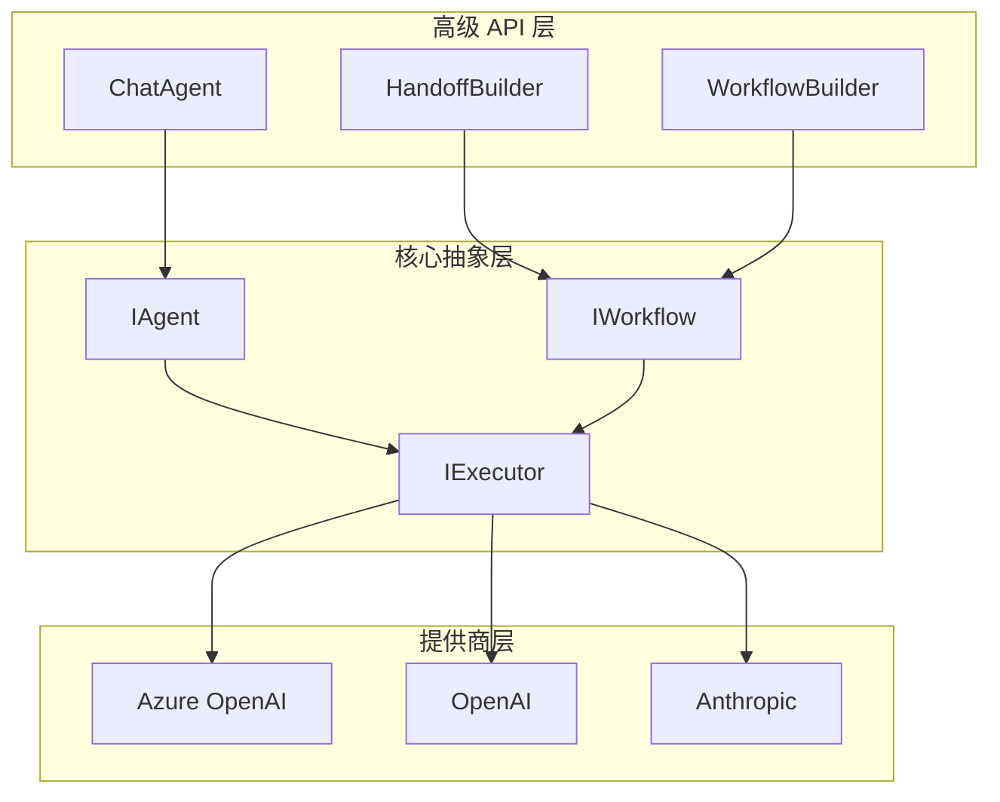

# Week 0C: Microsoft Agent Framework 架构分析

> Phase 0: 框架分析（2026年1月更新）
> 深入分析 Microsoft Agent Framework 的架构和设计模式

---

## 概述

**Microsoft Agent Framework** 是微软在 2025年11月发布的统一 Agent 框架，整合了 Semantic Kernel 和 AutoGen 的最佳特性。

- **GitHub**: https://github.com/microsoft/agent-framework
- **语言**: Python + .NET（一等公民）
- **状态**: Preview（截至2026年1月）
- **前身**: Semantic Kernel + AutoGen

> ⚠️ **迁移说明**: 微软提供了从 Semantic Kernel 和 AutoGen 的迁移指南。

---

## 第一部分：项目结构

### 仓库结构

```text
agent-framework/
├── python/
│   └── packages/
│       ├── agent-core/              # 核心抽象
│       │   ├── agents/              # Agent 基类
│       │   ├── workflows/           # 工作流编排
│       │   └── executors/           # 执行器
│       ├── agent-framework/         # 高级 API
│       │   ├── handoffs/            # Handoff 构建器
│       │   └── chat/                # 聊天 Agent
│       └── agent-azure/             # Azure 集成
│
├── dotnet/
│   └── src/
│       ├── Microsoft.Agents.Abstractions/   # 核心接口
│       ├── Microsoft.Agents.Core/           # 核心实现
│       ├── Microsoft.Agents.AI/             # AI 集成
│       └── Microsoft.Agents.Azure/          # Azure 服务
│
└── docs/
    ├── getting-started/
    ├── migration/                   # 从 SK/AutoGen 迁移
    └── concepts/
```

### 架构层次



---

## 第二部分：核心概念

### 1. Agent（代理）

Agent 是框架的核心，代表一个配置了指令和工具的 LLM。

```python
# Python
from agent_framework import ChatAgent
from agent_framework.azure import AzureOpenAIChatClient

client = AzureOpenAIChatClient(
    endpoint="https://xxx.openai.azure.com",
    credential=AzureCliCredential()
)

agent = client.create_agent(
    name="assistant",
    instructions="你是一个有帮助的助手。",
    tools=[search_tool, calculator_tool]
)

# 运行
result = await agent.run("今天天气怎么样？")
print(result.output)
```

```csharp
// .NET
var client = new AzureOpenAIChatClient(
    new Uri("https://xxx.openai.azure.com"),
    new AzureCliCredential());

var agent = client.CreateAgent(
    name: "assistant",
    instructions: "你是一个有帮助的助手。",
    tools: [searchTool, calculatorTool]);

// 运行
var result = await agent.RunAsync("今天天气怎么样？");
Console.WriteLine(result.Output);
```

### 2. Workflow（工作流）

Workflow 是编排多个 Agent 协作的核心机制。

```python
# Python - HandoffBuilder
from agent_framework import HandoffBuilder

# 创建多个 Agent
triage = client.create_agent(name="triage", instructions="分析用户需求...")
billing = client.create_agent(name="billing", instructions="处理账单...")
support = client.create_agent(name="support", instructions="技术支持...")

# 构建 Handoff 工作流
workflow = (
    HandoffBuilder(participants=[triage, billing, support])
    .with_start_agent(triage)
    .add_handoff(triage, [billing, support])
    .add_handoff(billing, [triage])  # 可以交接回
    .with_autonomous_mode(turn_limits={"billing": 10})
    .build()
)

# 流式运行
async for event in workflow.run_stream(messages):
    if event.type == "agent_response":
        print(f"[{event.agent}]: {event.content}")
    elif event.type == "handoff":
        print(f"交接: {event.from_agent} -> {event.to_agent}")
```

```csharp
// .NET - HandoffBuilder
var workflow = new HandoffBuilder()
    .WithParticipants(triageAgent, billingAgent, supportAgent)
    .WithStartAgent(triageAgent)
    .AddHandoff(triageAgent, billingAgent, "处理账单问题")
    .AddHandoff(triageAgent, supportAgent, "处理技术支持")
    .AddHandoff(billingAgent, triageAgent)
    .WithAutonomousMode(turnLimits: new() { ["billing"] = 10 })
    .Build();

await foreach (var evt in workflow.RunStreamAsync(messages))
{
    switch (evt)
    {
        case AgentResponseEvent response:
            Console.WriteLine($"[{response.Agent}]: {response.Content}");
            break;
        case HandoffEvent handoff:
            Console.WriteLine($"交接: {handoff.From} -> {handoff.To}");
            break;
    }
}
```

### 3. Tool（工具）

工具是 Agent 可以调用的函数。

```python
# Python
from agent_framework import ai_function

@ai_function(description="在网上搜索信息")
def search_web(query: str) -> str:
    """
    Args:
        query: 搜索查询
    """
    # 实现搜索逻辑
    return f"搜索结果: {query}"

@ai_function(description="计算数学表达式")
def calculate(expression: str) -> float:
    """
    Args:
        expression: 数学表达式
    """
    return eval(expression)

agent = client.create_agent(
    name="calculator",
    instructions="你是一个计算助手",
    tools=[search_web, calculate]
)
```

```csharp
// .NET
public class WebTools
{
    [AIFunction("search_web", "在网上搜索信息")]
    public async Task<string> SearchAsync(
        [Description("搜索查询")] string query)
    {
        // 实现搜索逻辑
        return $"搜索结果: {query}";
    }
    
    [AIFunction("calculate", "计算数学表达式")]
    public double Calculate(
        [Description("数学表达式")] string expression)
    {
        // 安全计算
        return ExpressionEvaluator.Evaluate(expression);
    }
}

var tools = AIFunctionFactory.CreateFromType<WebTools>();
var agent = client.CreateAgent(
    name: "calculator",
    instructions: "你是一个计算助手",
    tools: tools);
```

### 4. Executor（执行器）

执行器负责实际运行 Agent 和处理事件。

```python
# Python
from agent_framework import Executor, ExecutorSettings

settings = ExecutorSettings(
    max_iterations=20,
    timeout_seconds=300,
    enable_tracing=True
)

executor = Executor(settings=settings)

# 运行并监听事件
async for event in executor.run_stream(workflow, messages):
    print(event)
```

```csharp
// .NET
var settings = new ExecutorSettings
{
    MaxIterations = 20,
    Timeout = TimeSpan.FromMinutes(5),
    EnableTracing = true
};

var executor = new Executor(settings);

await foreach (var evt in executor.RunStreamAsync(workflow, messages))
{
    Console.WriteLine(evt);
}
```

---

## 第三部分：高级特性

### 1. 自主模式（Autonomous Mode）

允许 Agent 在交接后自主运行多轮，无需人工干预。

```python
workflow = (
    HandoffBuilder(participants=[triage, billing, support])
    .with_start_agent(triage)
    .add_handoff(triage, [billing, support])
    .with_autonomous_mode(
        turn_limits={
            "billing": 10,   # billing 最多自主运行 10 轮
            "support": 5     # support 最多自主运行 5 轮
        },
        checkpointing=True   # 启用检查点
    )
    .build()
)
```

### 2. 人机协作（Human-in-the-Loop）

在关键决策点暂停等待人类确认。

```python
workflow = (
    HandoffBuilder(participants=[triage, billing])
    .with_start_agent(triage)
    .add_handoff(triage, [billing])
    .with_human_in_loop(
        agents=["billing"],     # 哪些 Agent 需要人工确认
        trigger="confirm_action" # 触发条件
    )
    .build()
)

async for event in workflow.run_stream(messages):
    if event.type == "human_input_required":
        # 等待人类输入
        human_response = await get_human_input(event.prompt)
        await workflow.provide_human_input(human_response)
```

### 3. 检查点与恢复

支持长时间运行的工作流持久化和恢复。

```python
from agent_framework import CheckpointStore

store = CheckpointStore(connection_string="...")

workflow = (
    HandoffBuilder(...)
    .with_checkpointing(store)
    .build()
)

# 运行
run_id = await workflow.start(messages)

# 稍后恢复
workflow = await store.restore(run_id)
async for event in workflow.resume():
    print(event)
```

### 4. MCP/A2A 支持

支持 Model Context Protocol 和 Agent-to-Agent 开放标准。

```python
from agent_framework.mcp import MCPServer, MCPClient

# 作为 MCP 服务端
server = MCPServer(agent)
await server.start(port=8080)

# 作为 MCP 客户端
client = MCPClient("http://external-agent:8080")
external_tools = await client.get_tools()

agent = client.create_agent(
    name="orchestrator",
    tools=[*local_tools, *external_tools]
)
```

---

## 第四部分：与旧框架对比

### 从 Semantic Kernel 迁移

| Semantic Kernel | Agent Framework | 说明 |
|-----------------|-----------------|------|
| `Kernel` | `ChatClient` | 入口点 |
| `KernelFunction` | `ai_function` | 工具定义 |
| `KernelPlugin` | 工具类 | 工具组 |
| `ChatCompletionAgent` | `ChatAgent` | 聊天代理 |
| 自定义编排 | `HandoffBuilder` | 多 Agent 编排 |

```csharp
// Semantic Kernel（旧）
var kernel = Kernel.CreateBuilder()
    .AddAzureOpenAIChatCompletion(...)
    .Build();
kernel.Plugins.AddFromType<MyPlugin>();
var agent = new ChatCompletionAgent { Kernel = kernel };

// Agent Framework（新）
var client = new AzureOpenAIChatClient(...);
var tools = AIFunctionFactory.CreateFromType<MyPlugin>();
var agent = client.CreateAgent(tools: tools);
```

### 从 AutoGen 迁移

| AutoGen | Agent Framework | 说明 |
|---------|-----------------|------|
| `AssistantAgent` | `ChatAgent` | 聊天代理 |
| `GroupChat` | `HandoffBuilder` | 多 Agent 编排 |
| `UserProxyAgent` | Human-in-loop 模式 | 人机协作 |
| 消息传递 | 事件流 | 通信机制 |

```python
# AutoGen（旧）
from autogen import AssistantAgent, GroupChat

assistant = AssistantAgent("assistant", ...)
user_proxy = UserProxyAgent("user", ...)
group_chat = GroupChat([assistant, user_proxy], ...)

# Agent Framework（新）
from agent_framework import HandoffBuilder, ChatAgent

assistant = client.create_agent(name="assistant", ...)
workflow = (
    HandoffBuilder(participants=[assistant, support])
    .with_human_in_loop(agents=["support"])
    .build()
)
```

---

## 第五部分：dawning-agents 借鉴

### 采用的设计模式

| 特性 | 来源 | dawning-agents 实现 |
|------|------|---------------------|
| **HandoffBuilder** | Agent Framework | `HandoffBuilder<TContext>` |
| **Workflow 编排** | Agent Framework | `IWorkflow<TContext>` |
| **两层架构** | Agent Framework | Abstractions + Core |
| **ai_function 装饰器** | Agent Framework | `[Tool]` 属性 |
| **事件流** | Agent Framework | `IAsyncEnumerable<Event>` |
| **自主模式** | Agent Framework | `WithAutonomousMode()` |
| **.NET 原生支持** | Agent Framework | .NET 8+ 优先 |

### 不采用的设计

| 特性 | 原因 |
|------|------|
| **强绑定 Azure** | 需要多云/多模型支持 |
| **Preview API** | 等待稳定后再跟进 |
| **复杂的 Executor** | 简化为 Runner 模式 |

---

## 总结

Microsoft Agent Framework 是一个企业级的 Agent 框架，特别适合：

- ✅ 需要 .NET 原生支持的项目
- ✅ 与 Azure 深度集成的场景
- ✅ 多 Agent 协作的复杂工作流
- ✅ 需要 MCP/A2A 互操作性

**dawning-agents** 主要借鉴：
- 🔗 HandoffBuilder 流畅 API
- 📦 两层架构（Abstractions + Core）
- ⚙️ ai_function 装饰器模式 → `[Tool]` 属性
- 🔄 事件流设计 → `IAsyncEnumerable`
