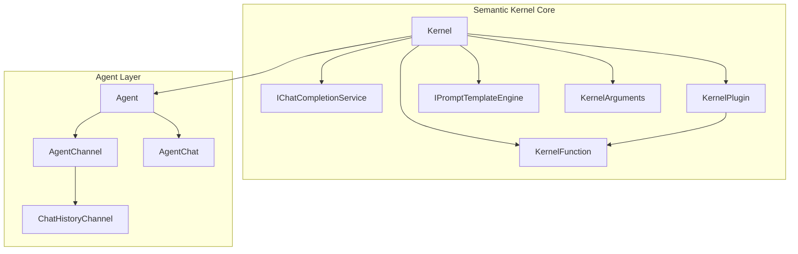
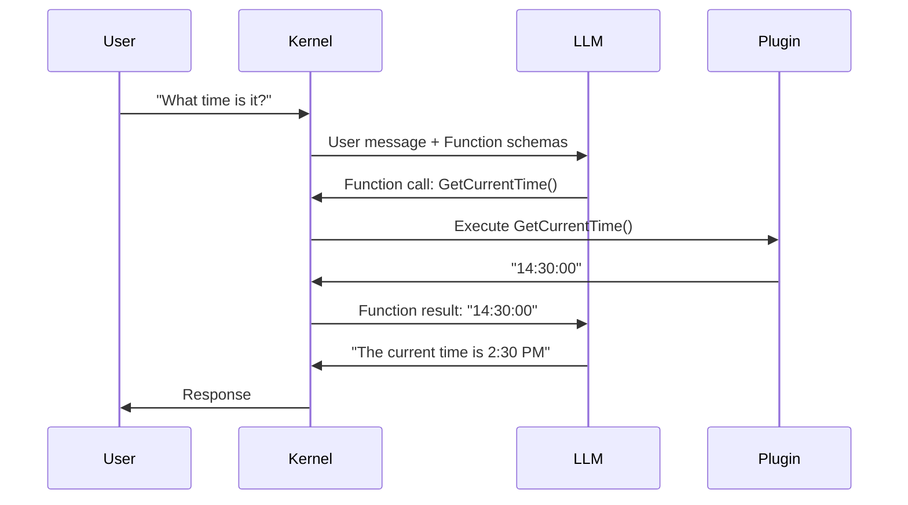

# Week 0B: Semantic Kernel Core Architecture Analysis

> Phase 0: Framework Analysis
> Learning to understand existing frameworks before building our own

---

## Overview

**Semantic Kernel** is Microsoft's SDK for integrating LLMs into applications. As a .NET-first framework, it's the most directly relevant to dawning-agents.

- **GitHub**: https://github.com/microsoft/semantic-kernel
- **Language**: C# (.NET), Python, Java
- **First Release**: March 2023
- **Philosophy**: Enterprise-grade, plugin-based AI orchestration

---

## Day 1: Core Abstractions

### 1. Project Structure

```text
semantic-kernel/
├── dotnet/
│   ├── src/
│   │   ├── SemanticKernel.Abstractions/    # Core interfaces
│   │   ├── SemanticKernel.Core/            # Main implementation
│   │   ├── Connectors.*/                   # LLM providers
│   │   ├── Agents.*/                       # Agent implementations
│   │   └── Plugins.*/                      # Built-in plugins
│   └── samples/                            # Example projects
├── python/                                  # Python SDK
└── java/                                    # Java SDK
```

### 2. Key Abstractions



| Abstraction | Purpose | C# Interface |
|-------------|---------|--------------|
| **Kernel** | Central orchestrator | `Kernel` class |
| **KernelFunction** | Callable unit (native or prompt) | `KernelFunction` |
| **KernelPlugin** | Collection of functions | `KernelPlugin` |
| **IChatCompletionService** | LLM interface | `GetChatMessageContentAsync()` |
| **Agent** | Autonomous agent | `Agent` abstract class |
| **AgentChat** | Multi-agent conversation | `AgentChat` |

### 3. The Kernel - Central Hub

```csharp
// Source: SemanticKernel.Abstractions/Kernel.cs (simplified)

public sealed class Kernel
{
    /// <summary>Services registered with this kernel.</summary>
    public IServiceProvider Services { get; }
    
    /// <summary>Plugins registered with this kernel.</summary>
    public KernelPluginCollection Plugins { get; }
    
    /// <summary>Culture for formatting.</summary>
    public CultureInfo Culture { get; set; }
    
    /// <summary>Invoke a function by name.</summary>
    public Task<FunctionResult> InvokeAsync(
        KernelFunction function,
        KernelArguments? arguments = null,
        CancellationToken cancellationToken = default);
    
    /// <summary>Get a required service.</summary>
    public T GetRequiredService<T>() where T : class
        => Services.GetRequiredService<T>();
    
    /// <summary>Clone the kernel with new services.</summary>
    public Kernel Clone();
}

// Builder pattern for Kernel creation
public sealed class KernelBuilder
{
    public IKernelBuilder AddAzureOpenAIChatCompletion(
        string deploymentName,
        string endpoint,
        string apiKey);
    
    public IKernelBuilder AddOpenAIChatCompletion(
        string modelId,
        string apiKey);
    
    public IKernelBuilder Plugins { get; }
    public IKernelBuilder Services { get; }
    
    public Kernel Build();
}
```

**Key Design Decision**: Kernel uses .NET's `IServiceProvider` for dependency injection.

---

## Day 2: Function & Plugin System

### 1. KernelFunction

```csharp
// Source: SemanticKernel.Abstractions/Functions/KernelFunction.cs (simplified)

public abstract class KernelFunction
{
    /// <summary>Name of the function.</summary>
    public string Name { get; }
    
    /// <summary>Plugin this function belongs to.</summary>
    public string? PluginName { get; }
    
    /// <summary>Description for AI to understand.</summary>
    public string? Description { get; }
    
    /// <summary>Parameters metadata.</summary>
    public IReadOnlyList<KernelParameterMetadata> Metadata { get; }
    
    /// <summary>Invoke the function.</summary>
    public abstract ValueTask<FunctionResult> InvokeAsync(
        Kernel kernel,
        KernelArguments? arguments = null,
        CancellationToken cancellationToken = default);
}

// Two types of functions:
// 1. Native functions (C# methods)
// 2. Prompt functions (templated prompts)
```

### 2. Creating Native Functions

```csharp
// Method 1: Using attributes
public class TimePlugin
{
    [KernelFunction("GetCurrentTime")]
    [Description("Gets the current time")]
    public string GetCurrentTime()
    {
        return DateTime.Now.ToString("HH:mm:ss");
    }
    
    [KernelFunction("GetDate")]
    [Description("Gets the current date")]
    public string GetDate(
        [Description("Date format string")] string format = "yyyy-MM-dd")
    {
        return DateTime.Now.ToString(format);
    }
}

// Method 2: From lambda
var function = KernelFunctionFactory.CreateFromMethod(
    (string input) => input.ToUpper(),
    "ToUpper",
    "Converts text to uppercase"
);

// Registration
kernel.Plugins.AddFromType<TimePlugin>();
kernel.Plugins.AddFromFunctions("TextTools", new[] { function });
```

### 3. Creating Prompt Functions

```csharp
// From inline prompt
var summarize = KernelFunctionFactory.CreateFromPrompt(
    "Summarize the following text in {{$style}} style:\n\n{{$input}}",
    functionName: "Summarize",
    description: "Summarizes text"
);

// From YAML file
// plugins/WriterPlugin/ShortPoem/config.yaml
/*
name: ShortPoem
description: Generate a short poem about a topic
template: |
  Write a short poem about {{$topic}}.
  Style: {{$style}}
template_format: semantic-kernel
input_variables:
  - name: topic
    description: The poem topic
    is_required: true
  - name: style
    description: Poetry style
    default: haiku
execution_settings:
  default:
    temperature: 0.7
    max_tokens: 150
*/

// Load from directory
var plugins = kernel.CreatePluginFromPromptDirectory("plugins/WriterPlugin");
```

---

## Day 3: Chat Completion & Function Calling

### 1. Chat Completion Service

```csharp
// Source: SemanticKernel.Abstractions/AI/ChatCompletion/IChatCompletionService.cs

public interface IChatCompletionService : IAIService
{
    /// <summary>Get chat message content.</summary>
    Task<IReadOnlyList<ChatMessageContent>> GetChatMessageContentsAsync(
        ChatHistory chatHistory,
        PromptExecutionSettings? executionSettings = null,
        Kernel? kernel = null,
        CancellationToken cancellationToken = default);
    
    /// <summary>Get streaming chat message content.</summary>
    IAsyncEnumerable<StreamingChatMessageContent> GetStreamingChatMessageContentsAsync(
        ChatHistory chatHistory,
        PromptExecutionSettings? executionSettings = null,
        Kernel? kernel = null,
        CancellationToken cancellationToken = default);
}
```

### 2. Automatic Function Calling

```csharp
// Enable auto function calling
var settings = new OpenAIPromptExecutionSettings
{
    FunctionChoiceBehavior = FunctionChoiceBehavior.Auto()
};

// The kernel automatically:
// 1. Sends function schemas to LLM
// 2. Parses function call requests from LLM
// 3. Executes the functions
// 4. Returns results to LLM
// 5. Repeats until LLM responds with text

ChatHistory history = new();
history.AddUserMessage("What time is it in Tokyo?");

var result = await chatCompletionService.GetChatMessageContentAsync(
    history,
    settings,
    kernel
);
```

### 3. Function Calling Flow



---

## Day 4: Agent System

### 1. Agent Base Class

```csharp
// Source: Agents.Abstractions/Agent.cs (simplified)

public abstract class Agent
{
    /// <summary>Unique identifier.</summary>
    public string Id { get; }
    
    /// <summary>Agent name for display.</summary>
    public string? Name { get; init; }
    
    /// <summary>System instructions.</summary>
    public string? Instructions { get; init; }
    
    /// <summary>Associated kernel.</summary>
    public Kernel Kernel { get; init; }
    
    /// <summary>Create a channel for communication.</summary>
    protected internal abstract Task<AgentChannel> CreateChannelAsync(
        CancellationToken cancellationToken);
    
    /// <summary>Invoke the agent with a message.</summary>
    public abstract IAsyncEnumerable<ChatMessageContent> InvokeAsync(
        ChatHistory history,
        CancellationToken cancellationToken = default);
}
```

### 2. ChatCompletionAgent

```csharp
// Source: Agents.Core/ChatCompletionAgent.cs (simplified)

public sealed class ChatCompletionAgent : Agent
{
    /// <summary>Execution settings for the LLM.</summary>
    public PromptExecutionSettings? ExecutionSettings { get; init; }
    
    public override async IAsyncEnumerable<ChatMessageContent> InvokeAsync(
        ChatHistory history,
        [EnumeratorCancellation] CancellationToken cancellationToken = default)
    {
        // Get chat completion service
        var chatService = Kernel.GetRequiredService<IChatCompletionService>();
        
        // Build history with system instructions
        ChatHistory agentHistory = new();
        if (!string.IsNullOrEmpty(Instructions))
        {
            agentHistory.AddSystemMessage(Instructions);
        }
        agentHistory.AddRange(history);
        
        // Get response
        var messages = await chatService.GetChatMessageContentsAsync(
            agentHistory,
            ExecutionSettings,
            Kernel,
            cancellationToken);
        
        foreach (var message in messages)
        {
            yield return message;
        }
    }
}

// Usage
var agent = new ChatCompletionAgent
{
    Name = "Assistant",
    Instructions = "You are a helpful assistant.",
    Kernel = kernel,
    ExecutionSettings = new OpenAIPromptExecutionSettings
    {
        FunctionChoiceBehavior = FunctionChoiceBehavior.Auto()
    }
};
```

### 3. AgentGroupChat - Multi-Agent

```csharp
// Source: Agents.Core/AgentGroupChat.cs (simplified)

public sealed class AgentGroupChat : AgentChat
{
    /// <summary>Agents participating in chat.</summary>
    public IReadOnlyList<Agent> Agents { get; }
    
    /// <summary>Strategy for selecting next agent.</summary>
    public SelectionStrategy SelectionStrategy { get; init; }
    
    /// <summary>Strategy for terminating chat.</summary>
    public TerminationStrategy TerminationStrategy { get; init; }
    
    public override async IAsyncEnumerable<ChatMessageContent> InvokeAsync(
        CancellationToken cancellationToken = default)
    {
        while (!await TerminationStrategy.ShouldTerminateAsync(this, cancellationToken))
        {
            // Select next agent
            Agent agent = await SelectionStrategy.SelectAgentAsync(
                Agents, 
                History, 
                cancellationToken);
            
            // Invoke agent
            await foreach (var message in agent.InvokeAsync(History, cancellationToken))
            {
                History.Add(message);
                yield return message;
            }
        }
    }
}

// Selection strategies
public class SequentialSelectionStrategy : SelectionStrategy { }  // Round-robin
public class KernelFunctionSelectionStrategy : SelectionStrategy { } // LLM decides

// Termination strategies  
public class MaximumIterationsTerminationStrategy : TerminationStrategy { }
public class KernelFunctionTerminationStrategy : TerminationStrategy { } // LLM decides
```

---

## Key Design Patterns in Semantic Kernel

### 1. Dependency Injection

```csharp
// Kernel integrates with .NET DI
var builder = Kernel.CreateBuilder();
builder.Services.AddSingleton<IMyService, MyService>();
builder.AddAzureOpenAIChatCompletion(deployment, endpoint, apiKey);

var kernel = builder.Build();

// Access services anywhere
var service = kernel.GetRequiredService<IMyService>();
```

### 2. Filters for Interception

```csharp
// Function invocation filter
public class LoggingFilter : IFunctionInvocationFilter
{
    public async Task OnFunctionInvocationAsync(
        FunctionInvocationContext context,
        Func<FunctionInvocationContext, Task> next)
    {
        Console.WriteLine($"Calling: {context.Function.Name}");
        await next(context);
        Console.WriteLine($"Result: {context.Result}");
    }
}

// Prompt render filter
public class PromptFilter : IPromptRenderFilter
{
    public async Task OnPromptRenderAsync(
        PromptRenderContext context,
        Func<PromptRenderContext, Task> next)
    {
        await next(context);
        Console.WriteLine($"Rendered prompt: {context.RenderedPrompt}");
    }
}

// Auto function invocation filter
public class AutoFunctionFilter : IAutoFunctionInvocationFilter
{
    public async Task OnAutoFunctionInvocationAsync(
        AutoFunctionInvocationContext context,
        Func<AutoFunctionInvocationContext, Task> next)
    {
        // Can terminate auto-invocation early
        if (context.Function.Name == "DangerousFunction")
        {
            context.Terminate = true;
            return;
        }
        await next(context);
    }
}
```

### 3. Handlebars/Liquid Templating

```csharp
// Handlebars template
var template = """
    {{#each items}}
    - {{this.name}}: {{this.value}}
    {{/each}}
    
    {{#if showSummary}}
    Total: {{total}}
    {{/if}}
    """;

var function = KernelFunctionFactory.CreateFromPrompt(
    template,
    templateFormat: "handlebars"
);
```

---

## Strengths & Weaknesses

| Strengths | Weaknesses |
|-----------|------------|
| ✅ Native .NET with strong typing | ❌ Steeper learning curve |
| ✅ Enterprise features (DI, filters) | ❌ More verbose than LangChain |
| ✅ Excellent Azure integration | ❌ Smaller community than LangChain |
| ✅ Multi-language (C#, Python, Java) | ❌ Python/Java lag behind C# |
| ✅ Plugin/function system is clean | ❌ Agent system still evolving |
| ✅ Built-in OpenAPI import | ❌ Documentation can be sparse |

---

## Lessons for dawning-agents

1. **DI integration is essential** - .NET developers expect it
2. **Filters are powerful** - Consider similar interception points
3. **Plugin system is elegant** - Attribute-based discovery is nice
4. **Type safety matters** - Strong typing prevents many bugs
5. **Agent abstraction needs work** - Their multi-agent is basic

---

## Source Code Reading Guide

| Priority | Path | Purpose |
|----------|------|---------|
| ⭐⭐⭐ | `SemanticKernel.Core/Kernel.cs` | Central orchestrator |
| ⭐⭐⭐ | `Agents.Core/ChatCompletionAgent.cs` | Agent implementation |
| ⭐⭐⭐ | `Agents.Core/AgentGroupChat.cs` | Multi-agent |
| ⭐⭐ | `SemanticKernel.Abstractions/Functions/` | Function system |
| ⭐⭐ | `Connectors.OpenAI/` | OpenAI integration |
| ⭐ | `SemanticKernel.Abstractions/AI/` | AI service interfaces |
