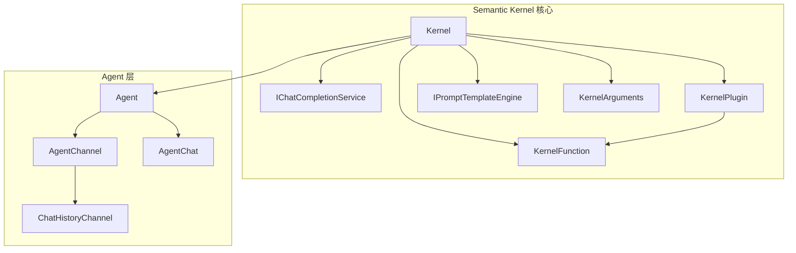
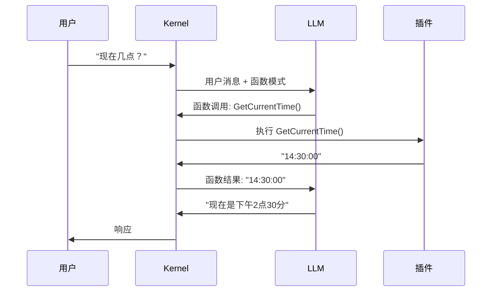

# Week 0B: Semantic Kernel 核心架构分析

> Phase 0: 框架分析
> 在构建自己的框架之前，先理解现有框架

---

## 概述

**Semantic Kernel** 是微软的 LLM 应用集成 SDK。作为 .NET 优先的框架，它与 dawning-agents 最直接相关。

- **GitHub**: https://github.com/microsoft/semantic-kernel
- **语言**: C# (.NET), Python, Java
- **首次发布**: 2023年3月
- **设计理念**: 企业级、基于插件的 AI 编排

---

## 第一天：核心抽象

### 1. 项目结构

```text
semantic-kernel/
├── dotnet/
│   ├── src/
│   │   ├── SemanticKernel.Abstractions/    # 核心接口
│   │   ├── SemanticKernel.Core/            # 主要实现
│   │   ├── Connectors.*/                   # LLM 提供商
│   │   ├── Agents.*/                       # Agent 实现
│   │   └── Plugins.*/                      # 内置插件
│   └── samples/                            # 示例项目
├── python/                                  # Python SDK
└── java/                                    # Java SDK
```

### 2. 关键抽象



| 抽象 | 目的 | C# 接口 |
|------|------|---------|
| **Kernel** | 中央编排器 | `Kernel` 类 |
| **KernelFunction** | 可调用单元（原生或提示） | `KernelFunction` |
| **KernelPlugin** | 函数集合 | `KernelPlugin` |
| **IChatCompletionService** | LLM 接口 | `GetChatMessageContentAsync()` |
| **Agent** | 自主 Agent | `Agent` 抽象类 |
| **AgentChat** | 多 Agent 对话 | `AgentChat` |

### 3. Kernel - 中央枢纽

```csharp
// 源码: SemanticKernel.Abstractions/Kernel.cs（简化版）

public sealed class Kernel
{
    /// <summary>注册到此 kernel 的服务。</summary>
    public IServiceProvider Services { get; }
    
    /// <summary>注册到此 kernel 的插件。</summary>
    public KernelPluginCollection Plugins { get; }
    
    /// <summary>格式化的区域设置。</summary>
    public CultureInfo Culture { get; set; }
    
    /// <summary>通过名称调用函数。</summary>
    public Task<FunctionResult> InvokeAsync(
        KernelFunction function,
        KernelArguments? arguments = null,
        CancellationToken cancellationToken = default);
    
    /// <summary>获取必需的服务。</summary>
    public T GetRequiredService<T>() where T : class
        => Services.GetRequiredService<T>();
    
    /// <summary>使用新服务克隆 kernel。</summary>
    public Kernel Clone();
}

// 创建 Kernel 的建造者模式
public sealed class KernelBuilder
{
    public IKernelBuilder AddAzureOpenAIChatCompletion(
        string deploymentName,
        string endpoint,
        string apiKey);
    
    public IKernelBuilder AddOpenAIChatCompletion(
        string modelId,
        string apiKey);
    
    public IKernelBuilder Plugins { get; }
    public IKernelBuilder Services { get; }
    
    public Kernel Build();
}
```

**关键设计决策**：Kernel 使用 .NET 的 `IServiceProvider` 进行依赖注入。

---

## 第二天：函数与插件系统

### 1. KernelFunction

```csharp
// 源码: SemanticKernel.Abstractions/Functions/KernelFunction.cs（简化版）

public abstract class KernelFunction
{
    /// <summary>函数名称。</summary>
    public string Name { get; }
    
    /// <summary>此函数所属的插件。</summary>
    public string? PluginName { get; }
    
    /// <summary>供 AI 理解的描述。</summary>
    public string? Description { get; }
    
    /// <summary>参数元数据。</summary>
    public IReadOnlyList<KernelParameterMetadata> Metadata { get; }
    
    /// <summary>调用函数。</summary>
    public abstract ValueTask<FunctionResult> InvokeAsync(
        Kernel kernel,
        KernelArguments? arguments = null,
        CancellationToken cancellationToken = default);
}

// 两种类型的函数：
// 1. 原生函数（C# 方法）
// 2. 提示函数（模板化的提示）
```

### 2. 创建原生函数

```csharp
// 方法 1：使用属性
public class TimePlugin
{
    [KernelFunction("GetCurrentTime")]
    [Description("获取当前时间")]
    public string GetCurrentTime()
    {
        return DateTime.Now.ToString("HH:mm:ss");
    }
    
    [KernelFunction("GetDate")]
    [Description("获取当前日期")]
    public string GetDate(
        [Description("日期格式字符串")] string format = "yyyy-MM-dd")
    {
        return DateTime.Now.ToString(format);
    }
}

// 方法 2：从 lambda 创建
var function = KernelFunctionFactory.CreateFromMethod(
    (string input) => input.ToUpper(),
    "ToUpper",
    "将文本转换为大写"
);

// 注册
kernel.Plugins.AddFromType<TimePlugin>();
kernel.Plugins.AddFromFunctions("TextTools", new[] { function });
```

### 3. 创建提示函数

```csharp
// 从内联提示创建
var summarize = KernelFunctionFactory.CreateFromPrompt(
    "用 {{$style}} 风格总结以下文本:\n\n{{$input}}",
    functionName: "Summarize",
    description: "总结文本"
);

// 从 YAML 文件创建
// plugins/WriterPlugin/ShortPoem/config.yaml
/*
name: ShortPoem
description: 生成关于某主题的短诗
template: |
  写一首关于 {{$topic}} 的短诗。
  风格: {{$style}}
template_format: semantic-kernel
input_variables:
  - name: topic
    description: 诗的主题
    is_required: true
  - name: style
    description: 诗歌风格
    default: 俳句
execution_settings:
  default:
    temperature: 0.7
    max_tokens: 150
*/

// 从目录加载
var plugins = kernel.CreatePluginFromPromptDirectory("plugins/WriterPlugin");
```

---

## 第三天：聊天补全与函数调用

### 1. 聊天补全服务

```csharp
// 源码: SemanticKernel.Abstractions/AI/ChatCompletion/IChatCompletionService.cs

public interface IChatCompletionService : IAIService
{
    /// <summary>获取聊天消息内容。</summary>
    Task<IReadOnlyList<ChatMessageContent>> GetChatMessageContentsAsync(
        ChatHistory chatHistory,
        PromptExecutionSettings? executionSettings = null,
        Kernel? kernel = null,
        CancellationToken cancellationToken = default);
    
    /// <summary>获取流式聊天消息内容。</summary>
    IAsyncEnumerable<StreamingChatMessageContent> GetStreamingChatMessageContentsAsync(
        ChatHistory chatHistory,
        PromptExecutionSettings? executionSettings = null,
        Kernel? kernel = null,
        CancellationToken cancellationToken = default);
}
```

### 2. 自动函数调用

```csharp
// 启用自动函数调用
var settings = new OpenAIPromptExecutionSettings
{
    FunctionChoiceBehavior = FunctionChoiceBehavior.Auto()
};

// Kernel 自动：
// 1. 将函数模式发送给 LLM
// 2. 从 LLM 解析函数调用请求
// 3. 执行函数
// 4. 将结果返回给 LLM
// 5. 重复直到 LLM 返回文本

ChatHistory history = new();
history.AddUserMessage("东京现在几点？");

var result = await chatCompletionService.GetChatMessageContentAsync(
    history,
    settings,
    kernel
);
```

### 3. 函数调用流程



---

## 第四天：Agent 系统

### 1. Agent 基类

```csharp
// 源码: Agents.Abstractions/Agent.cs（简化版）

public abstract class Agent
{
    /// <summary>唯一标识符。</summary>
    public string Id { get; }
    
    /// <summary>用于显示的 Agent 名称。</summary>
    public string? Name { get; init; }
    
    /// <summary>系统指令。</summary>
    public string? Instructions { get; init; }
    
    /// <summary>关联的 kernel。</summary>
    public Kernel Kernel { get; init; }
    
    /// <summary>创建通信通道。</summary>
    protected internal abstract Task<AgentChannel> CreateChannelAsync(
        CancellationToken cancellationToken);
    
    /// <summary>用消息调用 agent。</summary>
    public abstract IAsyncEnumerable<ChatMessageContent> InvokeAsync(
        ChatHistory history,
        CancellationToken cancellationToken = default);
}
```

### 2. ChatCompletionAgent

```csharp
// 源码: Agents.Core/ChatCompletionAgent.cs（简化版）

public sealed class ChatCompletionAgent : Agent
{
    /// <summary>LLM 的执行设置。</summary>
    public PromptExecutionSettings? ExecutionSettings { get; init; }
    
    public override async IAsyncEnumerable<ChatMessageContent> InvokeAsync(
        ChatHistory history,
        [EnumeratorCancellation] CancellationToken cancellationToken = default)
    {
        // 获取聊天补全服务
        var chatService = Kernel.GetRequiredService<IChatCompletionService>();
        
        // 用系统指令构建历史
        ChatHistory agentHistory = new();
        if (!string.IsNullOrEmpty(Instructions))
        {
            agentHistory.AddSystemMessage(Instructions);
        }
        agentHistory.AddRange(history);
        
        // 获取响应
        var messages = await chatService.GetChatMessageContentsAsync(
            agentHistory,
            ExecutionSettings,
            Kernel,
            cancellationToken);
        
        foreach (var message in messages)
        {
            yield return message;
        }
    }
}

// 使用示例
var agent = new ChatCompletionAgent
{
    Name = "Assistant",
    Instructions = "你是一个有帮助的助手。",
    Kernel = kernel,
    ExecutionSettings = new OpenAIPromptExecutionSettings
    {
        FunctionChoiceBehavior = FunctionChoiceBehavior.Auto()
    }
};
```

### 3. AgentGroupChat - 多 Agent

```csharp
// 源码: Agents.Core/AgentGroupChat.cs（简化版）

public sealed class AgentGroupChat : AgentChat
{
    /// <summary>参与聊天的 Agent。</summary>
    public IReadOnlyList<Agent> Agents { get; }
    
    /// <summary>选择下一个 agent 的策略。</summary>
    public SelectionStrategy SelectionStrategy { get; init; }
    
    /// <summary>终止聊天的策略。</summary>
    public TerminationStrategy TerminationStrategy { get; init; }
    
    public override async IAsyncEnumerable<ChatMessageContent> InvokeAsync(
        CancellationToken cancellationToken = default)
    {
        while (!await TerminationStrategy.ShouldTerminateAsync(this, cancellationToken))
        {
            // 选择下一个 agent
            Agent agent = await SelectionStrategy.SelectAgentAsync(
                Agents, 
                History, 
                cancellationToken);
            
            // 调用 agent
            await foreach (var message in agent.InvokeAsync(History, cancellationToken))
            {
                History.Add(message);
                yield return message;
            }
        }
    }
}

// 选择策略
public class SequentialSelectionStrategy : SelectionStrategy { }  // 轮询
public class KernelFunctionSelectionStrategy : SelectionStrategy { } // LLM 决定

// 终止策略  
public class MaximumIterationsTerminationStrategy : TerminationStrategy { }
public class KernelFunctionTerminationStrategy : TerminationStrategy { } // LLM 决定
```

---

## Semantic Kernel 中的关键设计模式

### 1. 依赖注入

```csharp
// Kernel 与 .NET DI 集成
var builder = Kernel.CreateBuilder();
builder.Services.AddSingleton<IMyService, MyService>();
builder.AddAzureOpenAIChatCompletion(deployment, endpoint, apiKey);

var kernel = builder.Build();

// 在任何地方访问服务
var service = kernel.GetRequiredService<IMyService>();
```

### 2. 过滤器用于拦截

```csharp
// 函数调用过滤器
public class LoggingFilter : IFunctionInvocationFilter
{
    public async Task OnFunctionInvocationAsync(
        FunctionInvocationContext context,
        Func<FunctionInvocationContext, Task> next)
    {
        Console.WriteLine($"调用: {context.Function.Name}");
        await next(context);
        Console.WriteLine($"结果: {context.Result}");
    }
}

// 提示渲染过滤器
public class PromptFilter : IPromptRenderFilter
{
    public async Task OnPromptRenderAsync(
        PromptRenderContext context,
        Func<PromptRenderContext, Task> next)
    {
        await next(context);
        Console.WriteLine($"渲染的提示: {context.RenderedPrompt}");
    }
}

// 自动函数调用过滤器
public class AutoFunctionFilter : IAutoFunctionInvocationFilter
{
    public async Task OnAutoFunctionInvocationAsync(
        AutoFunctionInvocationContext context,
        Func<AutoFunctionInvocationContext, Task> next)
    {
        // 可以提前终止自动调用
        if (context.Function.Name == "DangerousFunction")
        {
            context.Terminate = true;
            return;
        }
        await next(context);
    }
}
```

### 3. Handlebars/Liquid 模板

```csharp
// Handlebars 模板
var template = """
    {{#each items}}
    - {{this.name}}: {{this.value}}
    {{/each}}
    
    {{#if showSummary}}
    总计: {{total}}
    {{/if}}
    """;

var function = KernelFunctionFactory.CreateFromPrompt(
    template,
    templateFormat: "handlebars"
);
```

---

## 优势与劣势

| 优势 | 劣势 |
|------|------|
| ✅ 原生 .NET，强类型 | ❌ 学习曲线较陡 |
| ✅ 企业级特性（DI、过滤器） | ❌ 比 LangChain 更冗长 |
| ✅ 优秀的 Azure 集成 | ❌ 社区比 LangChain 小 |
| ✅ 多语言（C#、Python、Java） | ❌ Python/Java 落后于 C# |
| ✅ 插件/函数系统干净 | ❌ Agent 系统仍在发展 |
| ✅ 内置 OpenAPI 导入 | ❌ 文档可能不够详细 |

---

## 对 dawning-agents 的启示

1. **DI 集成是必需的** - .NET 开发者期望它
2. **过滤器很强大** - 考虑类似的拦截点
3. **插件系统很优雅** - 基于属性的发现很好
4. **类型安全很重要** - 强类型可以防止很多 bug
5. **Agent 抽象需要改进** - 他们的多 Agent 还比较基础

---

## 源码阅读指南

| 优先级 | 路径 | 目的 |
|--------|------|------|
| ⭐⭐⭐ | `SemanticKernel.Core/Kernel.cs` | 中央编排器 |
| ⭐⭐⭐ | `Agents.Core/ChatCompletionAgent.cs` | Agent 实现 |
| ⭐⭐⭐ | `Agents.Core/AgentGroupChat.cs` | 多 Agent |
| ⭐⭐ | `SemanticKernel.Abstractions/Functions/` | 函数系统 |
| ⭐⭐ | `Connectors.OpenAI/` | OpenAI 集成 |
| ⭐ | `SemanticKernel.Abstractions/AI/` | AI 服务接口 |
