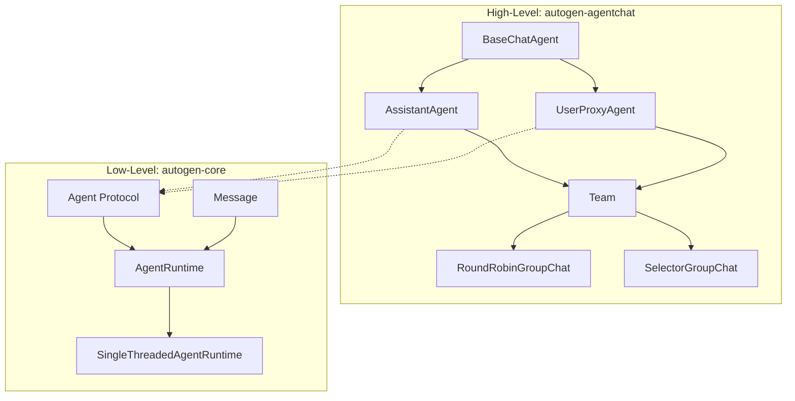

# Week 0C: AutoGen Core Architecture Analysis

> Phase 0: Framework Analysis
> Learning to understand existing frameworks before building our own

---

## Overview

**AutoGen** is Microsoft Research's framework for building multi-agent systems. It emphasizes conversational agents and autonomous workflows.

- **GitHub**: https://github.com/microsoft/autogen
- **Language**: Python (primary), .NET (AutoGen.Net)
- **First Release**: September 2023
- **Philosophy**: Conversational multi-agent with human-in-the-loop

---

## Day 1: Core Abstractions

### 1. Project Structure (AutoGen 0.4+)

```text
autogen/
├── python/
│   └── packages/
│       ├── autogen-core/              # Core abstractions
│       │   ├── src/autogen_core/
│       │   │   ├── _agent.py          # Agent base
│       │   │   ├── _agent_runtime.py  # Runtime
│       │   │   ├── _message_context.py
│       │   │   └── components/        # Built-in components
│       ├── autogen-agentchat/         # High-level chat agents
│       │   ├── src/autogen_agentchat/
│       │   │   ├── agents/            # Agent implementations
│       │   │   ├── teams/             # Multi-agent teams
│       │   │   └── messages/          # Message types
│       └── autogen-ext/               # Extensions
└── dotnet/                            # .NET version
```

### 2. Two-Layer Architecture

AutoGen 0.4 introduced a clean separation:



| Layer | Package | Purpose |
|-------|---------|---------|
| **High-Level** | `autogen-agentchat` | Ready-to-use chat agents |
| **Low-Level** | `autogen-core` | Actor-model primitives |

### 3. Core Agent Protocol

```python
# Source: autogen-core/src/autogen_core/_agent.py (simplified)

from abc import ABC, abstractmethod
from typing import Any, Mapping

class Agent(ABC):
    """Base protocol for all agents."""
    
    @property
    @abstractmethod
    def metadata(self) -> AgentMetadata:
        """Agent's metadata including id and type."""
        ...
    
    @abstractmethod
    async def on_message(
        self,
        message: Any,
        ctx: MessageContext,
    ) -> Any:
        """Handle an incoming message."""
        ...

@dataclass
class AgentMetadata:
    """Metadata about an agent."""
    key: str
    type: str
    description: str

@dataclass
class MessageContext:
    """Context for message handling."""
    sender: AgentId | None
    topic_id: TopicId | None
    is_rpc: bool
    cancellation_token: CancellationToken
```

---

## Day 2: Agent Runtime

### 1. Runtime Interface

```python
# Source: autogen-core/src/autogen_core/_agent_runtime.py (simplified)

class AgentRuntime(ABC):
    """Runtime that hosts and manages agents."""
    
    @abstractmethod
    async def send_message(
        self,
        message: Any,
        recipient: AgentId,
        *,
        sender: AgentId | None = None,
        cancellation_token: CancellationToken | None = None,
    ) -> Any:
        """Send a message to an agent and wait for response (RPC)."""
        ...
    
    @abstractmethod
    async def publish_message(
        self,
        message: Any,
        topic_id: TopicId,
        *,
        sender: AgentId | None = None,
        cancellation_token: CancellationToken | None = None,
    ) -> None:
        """Publish message to a topic (pub/sub)."""
        ...
    
    @abstractmethod
    async def register(
        self,
        type: str,
        agent_factory: Callable[[], Agent],
        subscriptions: Sequence[Subscription] | None = None,
    ) -> AgentType:
        """Register an agent type with a factory."""
        ...
    
    @abstractmethod
    async def get_agent(self, agent_id: AgentId) -> Agent:
        """Get or create an agent by ID."""
        ...
```

### 2. Single-Threaded Runtime

```python
# Source: autogen-core/src/autogen_core/_single_threaded_agent_runtime.py (simplified)

class SingleThreadedAgentRuntime(AgentRuntime):
    """In-process agent runtime."""
    
    def __init__(self) -> None:
        self._agents: dict[AgentId, Agent] = {}
        self._agent_factories: dict[str, Callable[[], Agent]] = {}
        self._subscriptions: dict[TopicId, list[AgentId]] = {}
        self._message_queue: asyncio.Queue = asyncio.Queue()
    
    async def send_message(
        self,
        message: Any,
        recipient: AgentId,
        *,
        sender: AgentId | None = None,
        cancellation_token: CancellationToken | None = None,
    ) -> Any:
        # Get or create the recipient agent
        agent = await self.get_agent(recipient)
        
        # Create message context
        ctx = MessageContext(
            sender=sender,
            topic_id=None,
            is_rpc=True,
            cancellation_token=cancellation_token or CancellationToken(),
        )
        
        # Invoke agent's message handler
        return await agent.on_message(message, ctx)
    
    async def publish_message(
        self,
        message: Any,
        topic_id: TopicId,
        *,
        sender: AgentId | None = None,
        cancellation_token: CancellationToken | None = None,
    ) -> None:
        # Get subscribers for this topic
        subscribers = self._subscriptions.get(topic_id, [])
        
        # Send to all subscribers
        for agent_id in subscribers:
            await self.send_message(
                message, 
                agent_id, 
                sender=sender,
                cancellation_token=cancellation_token,
            )
```

---

## Day 3: High-Level Chat Agents

### 1. BaseChatAgent

```python
# Source: autogen-agentchat/src/autogen_agentchat/agents/_base_chat_agent.py (simplified)

class BaseChatAgent(ABC):
    """Base class for chat agents."""
    
    def __init__(
        self,
        name: str,
        description: str,
    ) -> None:
        self._name = name
        self._description = description
    
    @property
    def name(self) -> str:
        return self._name
    
    @property
    def description(self) -> str:
        return self._description
    
    @abstractmethod
    async def on_messages(
        self,
        messages: Sequence[ChatMessage],
        cancellation_token: CancellationToken,
    ) -> Response:
        """Process messages and generate response."""
        ...
    
    async def on_messages_stream(
        self,
        messages: Sequence[ChatMessage],
        cancellation_token: CancellationToken,
    ) -> AsyncGenerator[AgentEvent | Response, None]:
        """Stream version - override for streaming support."""
        yield await self.on_messages(messages, cancellation_token)
    
    async def on_reset(self, cancellation_token: CancellationToken) -> None:
        """Reset agent state."""
        pass
```

### 2. AssistantAgent

```python
# Source: autogen-agentchat/src/autogen_agentchat/agents/_assistant_agent.py (simplified)

class AssistantAgent(BaseChatAgent):
    """An AI assistant agent powered by a language model."""
    
    def __init__(
        self,
        name: str,
        model_client: ChatCompletionClient,
        *,
        tools: List[Tool | Callable] | None = None,
        system_message: str | None = None,
        description: str = "An AI assistant.",
        handoffs: List[Handoff | str] | None = None,
    ) -> None:
        super().__init__(name, description)
        self._model_client = model_client
        self._tools = tools or []
        self._system_message = system_message
        self._handoffs = handoffs or []
        self._chat_history: List[LLMMessage] = []
    
    async def on_messages(
        self,
        messages: Sequence[ChatMessage],
        cancellation_token: CancellationToken,
    ) -> Response:
        # Add messages to history
        for msg in messages:
            self._chat_history.append(self._to_llm_message(msg))
        
        # Build messages for LLM
        llm_messages = []
        if self._system_message:
            llm_messages.append(SystemMessage(content=self._system_message))
        llm_messages.extend(self._chat_history)
        
        # Get LLM response
        result = await self._model_client.create(
            llm_messages,
            tools=self._get_tool_schemas(),
            cancellation_token=cancellation_token,
        )
        
        # Handle tool calls if present
        if result.content and isinstance(result.content[0], FunctionCall):
            return await self._handle_tool_calls(result, cancellation_token)
        
        # Return text response
        return Response(
            chat_message=TextMessage(
                content=result.content,
                source=self.name,
            )
        )
    
    async def _handle_tool_calls(
        self,
        result: CreateResult,
        cancellation_token: CancellationToken,
    ) -> Response:
        """Execute tool calls and continue conversation."""
        tool_results = []
        for call in result.content:
            tool = self._get_tool(call.name)
            output = await tool.run(call.arguments, cancellation_token)
            tool_results.append(FunctionExecutionResult(
                call_id=call.id,
                content=output,
            ))
        
        # Add tool results to history and recurse
        self._chat_history.append(AssistantMessage(content=result.content))
        self._chat_history.append(FunctionExecutionResultMessage(content=tool_results))
        
        # Continue the conversation
        return await self.on_messages([], cancellation_token)
```

---

## Day 4: Multi-Agent Teams

### 1. Team Abstraction

```python
# Source: autogen-agentchat/src/autogen_agentchat/teams/_group_chat/_base_group_chat.py (simplified)

class BaseGroupChat(ABC, Team):
    """Base class for group chat teams."""
    
    def __init__(
        self,
        participants: List[ChatAgent],
        termination_condition: TerminationCondition | None = None,
    ) -> None:
        self._participants = participants
        self._termination_condition = termination_condition
    
    @abstractmethod
    def _select_speaker(
        self,
        messages: Sequence[AgentEvent | ChatMessage],
    ) -> str | None:
        """Select the next speaker. Return None to end."""
        ...
    
    async def run(
        self,
        *,
        task: str | ChatMessage | Sequence[ChatMessage] | None = None,
        cancellation_token: CancellationToken | None = None,
    ) -> TaskResult:
        """Run the team on a task."""
        cancellation_token = cancellation_token or CancellationToken()
        messages: List[AgentEvent | ChatMessage] = []
        
        # Add initial task
        if task:
            messages.extend(self._normalize_task(task))
        
        # Main loop
        while True:
            # Check termination
            if self._termination_condition:
                stop = await self._termination_condition(messages)
                if stop:
                    break
            
            # Select next speaker
            speaker_name = self._select_speaker(messages)
            if speaker_name is None:
                break
            
            # Get speaker agent
            speaker = self._get_participant(speaker_name)
            
            # Get agent response
            response = await speaker.on_messages(
                self._get_messages_for_agent(messages, speaker),
                cancellation_token,
            )
            
            # Add to messages
            messages.append(response.chat_message)
        
        return TaskResult(messages=messages)
```

### 2. RoundRobinGroupChat

```python
# Source: autogen-agentchat/src/autogen_agentchat/teams/_group_chat/_round_robin_group_chat.py

class RoundRobinGroupChat(BaseGroupChat):
    """Group chat with round-robin speaker selection."""
    
    def __init__(
        self,
        participants: List[ChatAgent],
        termination_condition: TerminationCondition | None = None,
    ) -> None:
        super().__init__(participants, termination_condition)
        self._current_index = 0
    
    def _select_speaker(
        self,
        messages: Sequence[AgentEvent | ChatMessage],
    ) -> str | None:
        # Get next speaker in round-robin order
        speaker = self._participants[self._current_index]
        self._current_index = (self._current_index + 1) % len(self._participants)
        return speaker.name
```

### 3. SelectorGroupChat

```python
# Source: autogen-agentchat/src/autogen_agentchat/teams/_group_chat/_selector_group_chat.py

class SelectorGroupChat(BaseGroupChat):
    """Group chat with LLM-based speaker selection."""
    
    def __init__(
        self,
        participants: List[ChatAgent],
        model_client: ChatCompletionClient,
        termination_condition: TerminationCondition | None = None,
        selector_prompt: str | None = None,
    ) -> None:
        super().__init__(participants, termination_condition)
        self._model_client = model_client
        self._selector_prompt = selector_prompt or self._default_selector_prompt()
    
    async def _select_speaker(
        self,
        messages: Sequence[AgentEvent | ChatMessage],
    ) -> str | None:
        # Build selection prompt
        prompt = self._build_selection_prompt(messages)
        
        # Ask LLM to select next speaker
        result = await self._model_client.create([
            SystemMessage(content=self._selector_prompt),
            UserMessage(content=prompt),
        ])
        
        # Parse speaker name from response
        selected_name = self._parse_speaker_name(result.content)
        return selected_name
```

---

## Key Design Patterns in AutoGen

### 1. Actor Model Foundation

```python
# Agents communicate via messages, not method calls
runtime = SingleThreadedAgentRuntime()

# Register agents
await runtime.register("assistant", lambda: AssistantAgent(...))
await runtime.register("user", lambda: UserProxyAgent(...))

# Send message (RPC style)
response = await runtime.send_message(
    message=TextMessage(content="Hello"),
    recipient=AgentId("assistant", "default"),
)

# Or publish (pub/sub style)
await runtime.publish_message(
    message=TaskMessage(content="Do this"),
    topic_id=TopicId("tasks", "project1"),
)
```

### 2. Handoffs Between Agents

```python
# Define handoff targets
assistant = AssistantAgent(
    name="Assistant",
    model_client=model_client,
    handoffs=["Specialist", "Human"],  # Can hand off to these
)

# During conversation, LLM can choose to hand off
# by calling a handoff function: handoff_to_Specialist()
```

### 3. Termination Conditions

```python
# Built-in termination conditions
from autogen_agentchat.conditions import (
    MaxMessageTermination,
    TextMentionTermination,
    HandoffTermination,
    SourceMatchTermination,
)

# Combine conditions
termination = (
    MaxMessageTermination(max_messages=10) |
    TextMentionTermination("TERMINATE") |
    HandoffTermination(target="Human")
)

team = RoundRobinGroupChat(
    participants=[agent1, agent2],
    termination_condition=termination,
)
```

### 4. Human-in-the-Loop

```python
class UserProxyAgent(BaseChatAgent):
    """Agent that can request human input."""
    
    def __init__(
        self,
        name: str,
        input_func: Callable[[str], Awaitable[str]] | None = None,
    ) -> None:
        super().__init__(name, "Human proxy")
        self._input_func = input_func or self._default_input
    
    async def on_messages(
        self,
        messages: Sequence[ChatMessage],
        cancellation_token: CancellationToken,
    ) -> Response:
        # Show messages to human
        for msg in messages:
            print(f"{msg.source}: {msg.content}")
        
        # Get human input
        user_input = await self._input_func("Your response: ")
        
        return Response(
            chat_message=TextMessage(content=user_input, source=self.name)
        )
```

---

## Strengths & Weaknesses

| Strengths | Weaknesses |
|-----------|------------|
| ✅ Clean actor-model foundation | ❌ Python-first (.NET lags) |
| ✅ Excellent multi-agent patterns | ❌ Breaking changes in 0.4 |
| ✅ Built-in human-in-the-loop | ❌ Complex for simple use cases |
| ✅ Handoff pattern is elegant | ❌ Less ecosystem than LangChain |
| ✅ Good termination handling | ❌ Documentation still catching up |
| ✅ Two-layer architecture | ❌ Steep learning curve |

---

## Lessons for dawning-agents

1. **Actor model is natural for agents** - Message-passing fits well
2. **Two-layer separation is wise** - High-level for users, low-level for power users
3. **Handoffs are powerful** - First-class support for agent delegation
4. **Termination conditions matter** - Need flexible, composable conditions
5. **Human-in-the-loop is essential** - Build it in from the start

---

## Source Code Reading Guide

| Priority | Path | Purpose |
|----------|------|---------|
| ⭐⭐⭐ | `autogen-core/_agent.py` | Agent protocol |
| ⭐⭐⭐ | `autogen-agentchat/agents/_assistant_agent.py` | Main agent impl |
| ⭐⭐⭐ | `autogen-agentchat/teams/_group_chat/` | Multi-agent teams |
| ⭐⭐ | `autogen-core/_agent_runtime.py` | Runtime interface |
| ⭐⭐ | `autogen-agentchat/conditions.py` | Termination |
| ⭐ | `autogen-core/_message_context.py` | Message handling |
