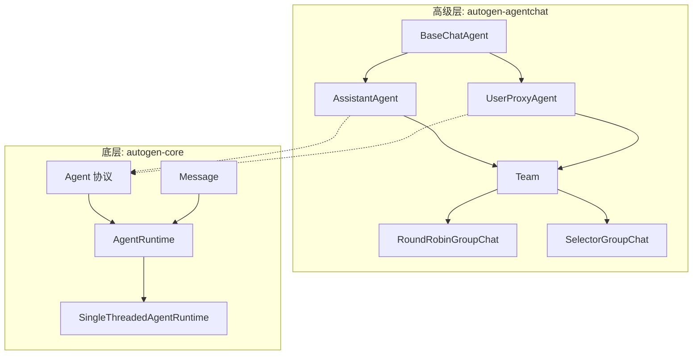

# Week 0C: AutoGen 核心架构分析

> Phase 0: 框架分析
> 在构建自己的框架之前，先理解现有框架

---

## 概述

**AutoGen** 是微软研究院用于构建多 Agent 系统的框架。它强调对话式 Agent 和自主工作流。

- **GitHub**: https://github.com/microsoft/autogen
- **语言**: Python (主要), .NET (AutoGen.Net)
- **首次发布**: 2023年9月
- **设计理念**: 支持人机协作的对话式多 Agent

---

## 第一天：核心抽象

### 1. 项目结构 (AutoGen 0.4+)

```text
autogen/
├── python/
│   └── packages/
│       ├── autogen-core/              # 核心抽象
│       │   ├── src/autogen_core/
│       │   │   ├── _agent.py          # Agent 基类
│       │   │   ├── _agent_runtime.py  # 运行时
│       │   │   ├── _message_context.py
│       │   │   └── components/        # 内置组件
│       ├── autogen-agentchat/         # 高级聊天 Agent
│       │   ├── src/autogen_agentchat/
│       │   │   ├── agents/            # Agent 实现
│       │   │   ├── teams/             # 多 Agent 团队
│       │   │   └── messages/          # 消息类型
│       └── autogen-ext/               # 扩展
└── dotnet/                            # .NET 版本
```

### 2. 两层架构

AutoGen 0.4 引入了清晰的分层：



| 层级 | 包 | 目的 |
|------|-----|------|
| **高级层** | `autogen-agentchat` | 开箱即用的聊天 Agent |
| **底层** | `autogen-core` | Actor 模型原语 |

### 3. 核心 Agent 协议

```python
# 源码: autogen-core/src/autogen_core/_agent.py（简化版）

from abc import ABC, abstractmethod
from typing import Any, Mapping

class Agent(ABC):
    """所有 Agent 的基础协议。"""
    
    @property
    @abstractmethod
    def metadata(self) -> AgentMetadata:
        """Agent 的元数据，包括 id 和类型。"""
        ...
    
    @abstractmethod
    async def on_message(
        self,
        message: Any,
        ctx: MessageContext,
    ) -> Any:
        """处理传入的消息。"""
        ...

@dataclass
class AgentMetadata:
    """关于 Agent 的元数据。"""
    key: str
    type: str
    description: str

@dataclass
class MessageContext:
    """消息处理的上下文。"""
    sender: AgentId | None
    topic_id: TopicId | None
    is_rpc: bool
    cancellation_token: CancellationToken
```

---

## 第二天：Agent 运行时

### 1. 运行时接口

```python
# 源码: autogen-core/src/autogen_core/_agent_runtime.py（简化版）

class AgentRuntime(ABC):
    """托管和管理 Agent 的运行时。"""
    
    @abstractmethod
    async def send_message(
        self,
        message: Any,
        recipient: AgentId,
        *,
        sender: AgentId | None = None,
        cancellation_token: CancellationToken | None = None,
    ) -> Any:
        """向 Agent 发送消息并等待响应（RPC）。"""
        ...
    
    @abstractmethod
    async def publish_message(
        self,
        message: Any,
        topic_id: TopicId,
        *,
        sender: AgentId | None = None,
        cancellation_token: CancellationToken | None = None,
    ) -> None:
        """向主题发布消息（发布/订阅）。"""
        ...
    
    @abstractmethod
    async def register(
        self,
        type: str,
        agent_factory: Callable[[], Agent],
        subscriptions: Sequence[Subscription] | None = None,
    ) -> AgentType:
        """用工厂注册 Agent 类型。"""
        ...
    
    @abstractmethod
    async def get_agent(self, agent_id: AgentId) -> Agent:
        """通过 ID 获取或创建 Agent。"""
        ...
```

### 2. 单线程运行时

```python
# 源码: autogen-core/src/autogen_core/_single_threaded_agent_runtime.py（简化版）

class SingleThreadedAgentRuntime(AgentRuntime):
    """进程内 Agent 运行时。"""
    
    def __init__(self) -> None:
        self._agents: dict[AgentId, Agent] = {}
        self._agent_factories: dict[str, Callable[[], Agent]] = {}
        self._subscriptions: dict[TopicId, list[AgentId]] = {}
        self._message_queue: asyncio.Queue = asyncio.Queue()
    
    async def send_message(
        self,
        message: Any,
        recipient: AgentId,
        *,
        sender: AgentId | None = None,
        cancellation_token: CancellationToken | None = None,
    ) -> Any:
        # 获取或创建接收方 Agent
        agent = await self.get_agent(recipient)
        
        # 创建消息上下文
        ctx = MessageContext(
            sender=sender,
            topic_id=None,
            is_rpc=True,
            cancellation_token=cancellation_token or CancellationToken(),
        )
        
        # 调用 Agent 的消息处理器
        return await agent.on_message(message, ctx)
    
    async def publish_message(
        self,
        message: Any,
        topic_id: TopicId,
        *,
        sender: AgentId | None = None,
        cancellation_token: CancellationToken | None = None,
    ) -> None:
        # 获取此主题的订阅者
        subscribers = self._subscriptions.get(topic_id, [])
        
        # 发送给所有订阅者
        for agent_id in subscribers:
            await self.send_message(
                message, 
                agent_id, 
                sender=sender,
                cancellation_token=cancellation_token,
            )
```

---

## 第三天：高级聊天 Agent

### 1. BaseChatAgent

```python
# 源码: autogen-agentchat/src/autogen_agentchat/agents/_base_chat_agent.py（简化版）

class BaseChatAgent(ABC):
    """聊天 Agent 的基类。"""
    
    def __init__(
        self,
        name: str,
        description: str,
    ) -> None:
        self._name = name
        self._description = description
    
    @property
    def name(self) -> str:
        return self._name
    
    @property
    def description(self) -> str:
        return self._description
    
    @abstractmethod
    async def on_messages(
        self,
        messages: Sequence[ChatMessage],
        cancellation_token: CancellationToken,
    ) -> Response:
        """处理消息并生成响应。"""
        ...
    
    async def on_messages_stream(
        self,
        messages: Sequence[ChatMessage],
        cancellation_token: CancellationToken,
    ) -> AsyncGenerator[AgentEvent | Response, None]:
        """流式版本 - 覆盖以支持流式输出。"""
        yield await self.on_messages(messages, cancellation_token)
    
    async def on_reset(self, cancellation_token: CancellationToken) -> None:
        """重置 Agent 状态。"""
        pass
```

### 2. AssistantAgent

```python
# 源码: autogen-agentchat/src/autogen_agentchat/agents/_assistant_agent.py（简化版）

class AssistantAgent(BaseChatAgent):
    """由语言模型驱动的 AI 助手 Agent。"""
    
    def __init__(
        self,
        name: str,
        model_client: ChatCompletionClient,
        *,
        tools: List[Tool | Callable] | None = None,
        system_message: str | None = None,
        description: str = "An AI assistant.",
        handoffs: List[Handoff | str] | None = None,
    ) -> None:
        super().__init__(name, description)
        self._model_client = model_client
        self._tools = tools or []
        self._system_message = system_message
        self._handoffs = handoffs or []
        self._chat_history: List[LLMMessage] = []
    
    async def on_messages(
        self,
        messages: Sequence[ChatMessage],
        cancellation_token: CancellationToken,
    ) -> Response:
        # 将消息添加到历史
        for msg in messages:
            self._chat_history.append(self._to_llm_message(msg))
        
        # 为 LLM 构建消息
        llm_messages = []
        if self._system_message:
            llm_messages.append(SystemMessage(content=self._system_message))
        llm_messages.extend(self._chat_history)
        
        # 获取 LLM 响应
        result = await self._model_client.create(
            llm_messages,
            tools=self._get_tool_schemas(),
            cancellation_token=cancellation_token,
        )
        
        # 如果存在工具调用，处理它们
        if result.content and isinstance(result.content[0], FunctionCall):
            return await self._handle_tool_calls(result, cancellation_token)
        
        # 返回文本响应
        return Response(
            chat_message=TextMessage(
                content=result.content,
                source=self.name,
            )
        )
    
    async def _handle_tool_calls(
        self,
        result: CreateResult,
        cancellation_token: CancellationToken,
    ) -> Response:
        """执行工具调用并继续对话。"""
        tool_results = []
        for call in result.content:
            tool = self._get_tool(call.name)
            output = await tool.run(call.arguments, cancellation_token)
            tool_results.append(FunctionExecutionResult(
                call_id=call.id,
                content=output,
            ))
        
        # 将工具结果添加到历史并递归
        self._chat_history.append(AssistantMessage(content=result.content))
        self._chat_history.append(FunctionExecutionResultMessage(content=tool_results))
        
        # 继续对话
        return await self.on_messages([], cancellation_token)
```

---

## 第四天：多 Agent 团队

### 1. Team 抽象

```python
# 源码: autogen-agentchat/src/autogen_agentchat/teams/_group_chat/_base_group_chat.py（简化版）

class BaseGroupChat(ABC, Team):
    """群聊团队的基类。"""
    
    def __init__(
        self,
        participants: List[ChatAgent],
        termination_condition: TerminationCondition | None = None,
    ) -> None:
        self._participants = participants
        self._termination_condition = termination_condition
    
    @abstractmethod
    def _select_speaker(
        self,
        messages: Sequence[AgentEvent | ChatMessage],
    ) -> str | None:
        """选择下一个发言者。返回 None 结束。"""
        ...
    
    async def run(
        self,
        *,
        task: str | ChatMessage | Sequence[ChatMessage] | None = None,
        cancellation_token: CancellationToken | None = None,
    ) -> TaskResult:
        """在任务上运行团队。"""
        cancellation_token = cancellation_token or CancellationToken()
        messages: List[AgentEvent | ChatMessage] = []
        
        # 添加初始任务
        if task:
            messages.extend(self._normalize_task(task))
        
        # 主循环
        while True:
            # 检查终止条件
            if self._termination_condition:
                stop = await self._termination_condition(messages)
                if stop:
                    break
            
            # 选择下一个发言者
            speaker_name = self._select_speaker(messages)
            if speaker_name is None:
                break
            
            # 获取发言者 Agent
            speaker = self._get_participant(speaker_name)
            
            # 获取 Agent 响应
            response = await speaker.on_messages(
                self._get_messages_for_agent(messages, speaker),
                cancellation_token,
            )
            
            # 添加到消息
            messages.append(response.chat_message)
        
        return TaskResult(messages=messages)
```

### 2. RoundRobinGroupChat

```python
# 源码: autogen-agentchat/src/autogen_agentchat/teams/_group_chat/_round_robin_group_chat.py

class RoundRobinGroupChat(BaseGroupChat):
    """轮询发言者选择的群聊。"""
    
    def __init__(
        self,
        participants: List[ChatAgent],
        termination_condition: TerminationCondition | None = None,
    ) -> None:
        super().__init__(participants, termination_condition)
        self._current_index = 0
    
    def _select_speaker(
        self,
        messages: Sequence[AgentEvent | ChatMessage],
    ) -> str | None:
        # 按轮询顺序获取下一个发言者
        speaker = self._participants[self._current_index]
        self._current_index = (self._current_index + 1) % len(self._participants)
        return speaker.name
```

### 3. SelectorGroupChat

```python
# 源码: autogen-agentchat/src/autogen_agentchat/teams/_group_chat/_selector_group_chat.py

class SelectorGroupChat(BaseGroupChat):
    """基于 LLM 的发言者选择群聊。"""
    
    def __init__(
        self,
        participants: List[ChatAgent],
        model_client: ChatCompletionClient,
        termination_condition: TerminationCondition | None = None,
        selector_prompt: str | None = None,
    ) -> None:
        super().__init__(participants, termination_condition)
        self._model_client = model_client
        self._selector_prompt = selector_prompt or self._default_selector_prompt()
    
    async def _select_speaker(
        self,
        messages: Sequence[AgentEvent | ChatMessage],
    ) -> str | None:
        # 构建选择提示
        prompt = self._build_selection_prompt(messages)
        
        # 请求 LLM 选择下一个发言者
        result = await self._model_client.create([
            SystemMessage(content=self._selector_prompt),
            UserMessage(content=prompt),
        ])
        
        # 从响应中解析发言者名称
        selected_name = self._parse_speaker_name(result.content)
        return selected_name
```

---

## AutoGen 中的关键设计模式

### 1. Actor 模型基础

```python
# Agent 通过消息通信，而不是方法调用
runtime = SingleThreadedAgentRuntime()

# 注册 Agent
await runtime.register("assistant", lambda: AssistantAgent(...))
await runtime.register("user", lambda: UserProxyAgent(...))

# 发送消息（RPC 风格）
response = await runtime.send_message(
    message=TextMessage(content="Hello"),
    recipient=AgentId("assistant", "default"),
)

# 或者发布（发布/订阅风格）
await runtime.publish_message(
    message=TaskMessage(content="Do this"),
    topic_id=TopicId("tasks", "project1"),
)
```

### 2. Agent 间的交接

```python
# 定义交接目标
assistant = AssistantAgent(
    name="Assistant",
    model_client=model_client,
    handoffs=["Specialist", "Human"],  # 可以交接给这些
)

# 在对话过程中，LLM 可以选择交接
# 通过调用交接函数: handoff_to_Specialist()
```

### 3. 终止条件

```python
# 内置终止条件
from autogen_agentchat.conditions import (
    MaxMessageTermination,
    TextMentionTermination,
    HandoffTermination,
    SourceMatchTermination,
)

# 组合条件
termination = (
    MaxMessageTermination(max_messages=10) |
    TextMentionTermination("TERMINATE") |
    HandoffTermination(target="Human")
)

team = RoundRobinGroupChat(
    participants=[agent1, agent2],
    termination_condition=termination,
)
```

### 4. 人机协作

```python
class UserProxyAgent(BaseChatAgent):
    """可以请求人类输入的 Agent。"""
    
    def __init__(
        self,
        name: str,
        input_func: Callable[[str], Awaitable[str]] | None = None,
    ) -> None:
        super().__init__(name, "Human proxy")
        self._input_func = input_func or self._default_input
    
    async def on_messages(
        self,
        messages: Sequence[ChatMessage],
        cancellation_token: CancellationToken,
    ) -> Response:
        # 向人类显示消息
        for msg in messages:
            print(f"{msg.source}: {msg.content}")
        
        # 获取人类输入
        user_input = await self._input_func("Your response: ")
        
        return Response(
            chat_message=TextMessage(content=user_input, source=self.name)
        )
```

---

## 优势与劣势

| 优势 | 劣势 |
|------|------|
| ✅ 清晰的 Actor 模型基础 | ❌ Python 优先（.NET 落后） |
| ✅ 优秀的多 Agent 模式 | ❌ 0.4 版本有破坏性变更 |
| ✅ 内置人机协作 | ❌ 简单用例过于复杂 |
| ✅ 交接模式很优雅 | ❌ 生态系统不如 LangChain |
| ✅ 良好的终止处理 | ❌ 文档仍在完善中 |
| ✅ 两层架构 | ❌ 学习曲线陡峭 |

---

## 对 dawning-agents 的启示

1. **Actor 模型很适合 Agent** - 消息传递很自然
2. **两层分离是明智的** - 高级层给用户，底层给高级用户
3. **交接很强大** - 一等公民支持 Agent 委托
4. **终止条件很重要** - 需要灵活、可组合的条件
5. **人机协作是必需的** - 从一开始就构建它

---

## 源码阅读指南

| 优先级 | 路径 | 目的 |
|--------|------|------|
| ⭐⭐⭐ | `autogen-core/_agent.py` | Agent 协议 |
| ⭐⭐⭐ | `autogen-agentchat/agents/_assistant_agent.py` | 主要 Agent 实现 |
| ⭐⭐⭐ | `autogen-agentchat/teams/_group_chat/` | 多 Agent 团队 |
| ⭐⭐ | `autogen-core/_agent_runtime.py` | 运行时接口 |
| ⭐⭐ | `autogen-agentchat/conditions.py` | 终止条件 |
| ⭐ | `autogen-core/_message_context.py` | 消息处理 |
