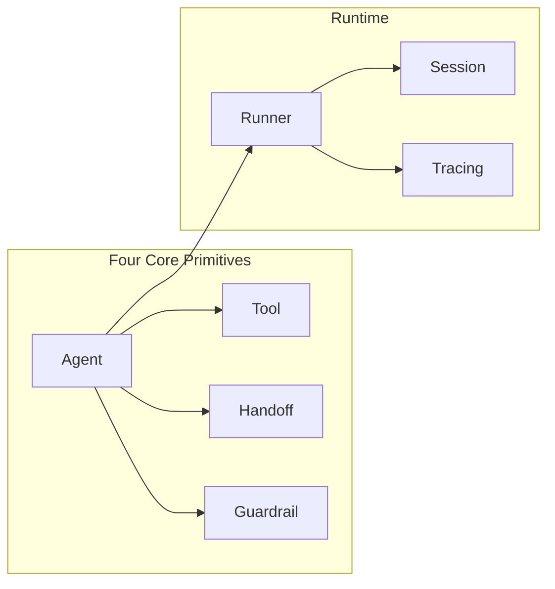

# Week 0C: OpenAI Agents SDK Architecture Analysis

> Phase 0: Framework Analysis (Updated January 2026)
> Deep dive into OpenAI Agents SDK architecture and design patterns

---

## Overview

**OpenAI Agents SDK** is OpenAI's official Agent framework released in March 2025, the production-ready version of the Swarm project. It adopts a minimalist design philosophy.

- **GitHub**: https://github.com/openai/openai-agents-python
- **Languages**: Python + TypeScript
- **Status**: Production Ready
- **Predecessor**: Swarm (experimental project)
- **Installation**: `pip install openai-agents` (Python) / `npm install @openai/agents` (TypeScript)

---

## Part 1: Core Design Philosophy

### Four Core Primitives

The design philosophy of OpenAI Agents SDK is "four primitives solve everything":



| Primitive | Responsibility | Analogy |
|-----------|----------------|---------|
| **Agent** | LLM configured with instructions and tools | Employee |
| **Tool** | Functions that agents can call | Tools |
| **Handoff** | Task delegation between agents | Transfer |
| **Guardrail** | Input/output validation | Safety rails |

---

## Part 2: Core Concepts Deep Dive

### 1. Agent

Agent is the core of the framework, representing an LLM configured with instructions and tools.

```python
from agents import Agent

agent = Agent(
    name="Assistant",
    instructions="You are a helpful assistant that can search the web.",
    model="gpt-4o",
    tools=[search_web, calculate],
)
```

**Agent Properties:**

| Property | Type | Description |
|----------|------|-------------|
| `name` | str | Agent name |
| `instructions` | str | System instructions |
| `model` | str | Model to use |
| `tools` | list | Available tools |
| `handoffs` | list | Agents that can be handed off to |
| `input_guardrails` | list | Input guardrails |
| `output_guardrails` | list | Output guardrails |

### 2. Tool

Tools are functions that agents can call. Defined using the `@function_tool` decorator.

```python
from agents import function_tool

@function_tool
def search_web(query: str) -> str:
    """
    Search the web for information.
    
    Args:
        query: The search query
    """
    # Implement search logic
    return f"Search results for: {query}"

@function_tool
def calculate(expression: str) -> float:
    """
    Calculate a mathematical expression.
    
    Args:
        expression: The math expression to evaluate
    """
    return eval(expression)

# Use in Agent
agent = Agent(
    name="Calculator",
    instructions="You can search and calculate.",
    tools=[search_web, calculate],
)
```

**Automatic Tool Features:**
- ✅ Auto-generates JSON Schema from function signature
- ✅ Auto-extracts description from docstring
- ✅ Type hints used for parameter validation

### 3. Handoff

Handoff allows agents to delegate tasks to other agents.

```python
from agents import Agent, handoff

# Define specialized agents
research_agent = Agent(
    name="Researcher",
    instructions="You are a research specialist. Find detailed information.",
    tools=[search_web, fetch_page],
)

writer_agent = Agent(
    name="Writer",
    instructions="You are a writing specialist. Create well-written content.",
    handoffs=[research_agent],  # Can hand back to researcher for more info
)

# Triage agent can hand off to any specialist
triage_agent = Agent(
    name="Triage",
    instructions="""
    You are a triage agent. Analyze the user's request and delegate to:
    - Researcher: for information gathering
    - Writer: for content creation
    """,
    handoffs=[research_agent, writer_agent],
)
```

**Custom Handoff:**

```python
from agents import handoff

@handoff(
    agent=research_agent,
    tool_name="transfer_to_researcher",
    tool_description="Transfer to the research specialist for detailed information gathering"
)
def custom_handoff(context, input_data):
    # Custom processing before handoff
    return handoff.default_handoff(context, input_data)
```

### 4. Guardrail

Guardrails validate inputs and outputs to ensure agent behavior is safe and controllable.

```python
from agents import Agent, InputGuardrail, OutputGuardrail, GuardrailFunctionOutput

# Input guardrail: check for sensitive content
async def content_filter(ctx, agent, input_text):
    # Check for inappropriate content
    is_safe = not any(word in input_text.lower() for word in ["hack", "exploit"])
    
    return GuardrailFunctionOutput(
        output_info={"safe": is_safe, "input": input_text},
        tripwire_triggered=not is_safe,  # True means trigger guardrail, block execution
    )

# Output guardrail: check for PII
async def pii_filter(ctx, agent, output):
    # Check if output contains personal information
    has_pii = detect_pii(output)
    
    return GuardrailFunctionOutput(
        output_info={"has_pii": has_pii},
        tripwire_triggered=has_pii,
    )

# Use guardrails
agent = Agent(
    name="SafeAgent",
    instructions="You are a helpful assistant.",
    input_guardrails=[InputGuardrail(guardrail_function=content_filter)],
    output_guardrails=[OutputGuardrail(guardrail_function=pii_filter)],
)
```

**Guardrail Trigger Handling:**

```python
from agents import Runner, GuardrailTripwireTriggered

try:
    result = await Runner.run(agent, "hack the system")
except GuardrailTripwireTriggered as e:
    print(f"Guardrail triggered: {e.guardrail_result.output_info}")
```

---

## Part 3: Runtime

### Runner

Runner is responsible for executing agents and managing the conversation loop.

```python
from agents import Runner

# Simple run
result = await Runner.run(agent, "What is the weather today?")
print(result.final_output)

# Run with configuration
from agents import RunConfig

config = RunConfig(
    max_turns=10,
    tracing_enabled=True,
    trace_include_sensitive_data=False,
)

result = await Runner.run(agent, "Help me write an article", config=config)
```

**Streaming:**

```python
# Streamed output
async for event in Runner.run_streamed(agent, "Tell me a story"):
    if event.type == "agent_updated_stream_event":
        print(event.new_agent.name, end="")
    elif event.type == "run_item_stream_event":
        if event.item.type == "tool_call_item":
            print(f"\n[Calling tool: {event.item.tool_name}]")
        elif event.item.type == "tool_call_output_item":
            print(f"[Tool returned: {event.item.output}]")
        elif event.item.type == "message_output_item":
            print(event.item.content, end="")
```

### Session

Session manages conversation history and context.

```python
from agents import Session

# Create session
session = Session()

# Multi-turn conversation
result1 = await Runner.run(agent, "My name is Alice", session=session)
result2 = await Runner.run(agent, "What's my name?", session=session)
# Agent will remember the user's name is Alice

# Get conversation history
print(session.messages)
```

### Tracing

Built-in tracing system, visualizable in OpenAI dashboard.

```python
from agents import Runner, RunConfig

config = RunConfig(
    tracing_enabled=True,
    trace_include_sensitive_data=False,
)

result = await Runner.run(agent, "Hello", config=config)

# Trace data is automatically sent to OpenAI dashboard
# Or export to custom backend
from agents.tracing import TracingExporter

class CustomExporter(TracingExporter):
    async def export(self, spans):
        for span in spans:
            print(f"Span: {span.name}, Duration: {span.duration_ms}ms")

Runner.set_tracing_exporter(CustomExporter())
```

---

## Part 4: Advanced Features

### 1. Provider Agnostic

Supports 100+ LLM providers (via LiteLLM).

```python
from agents import Agent, set_default_model_provider
from agents.extensions.litellm import LiteLLMProvider

# Use Anthropic
set_default_model_provider(LiteLLMProvider())

agent = Agent(
    name="Claude Agent",
    model="anthropic/claude-3-opus",  # or "openai/gpt-4o", "azure/..."
    instructions="You are helpful.",
)
```

### 2. Parallel Tool Calls

Agents can call multiple tools in parallel.

```python
@function_tool
async def fetch_weather(city: str) -> str:
    """Fetch weather for a city"""
    await asyncio.sleep(1)  # Simulate API call
    return f"Weather in {city}: Sunny"

@function_tool
async def fetch_news(topic: str) -> str:
    """Fetch news about a topic"""
    await asyncio.sleep(1)
    return f"News about {topic}: ..."

agent = Agent(
    name="InfoAgent",
    instructions="You can fetch weather and news in parallel.",
    tools=[fetch_weather, fetch_news],
)

# Agent will call fetch_weather and fetch_news simultaneously
result = await Runner.run(agent, "What's the weather in NYC and latest AI news?")
```

### 3. Dynamic Instructions

Generate instructions dynamically based on context.

```python
def dynamic_instructions(context):
    user_name = context.get("user_name", "User")
    return f"You are helping {user_name}. Be friendly and helpful."

agent = Agent(
    name="DynamicAgent",
    instructions=dynamic_instructions,  # Function instead of string
)

result = await Runner.run(
    agent, 
    "Hello", 
    context={"user_name": "Alice"}
)
```

### 4. Structured Output

Force agent to output a specific format.

```python
from pydantic import BaseModel
from agents import Agent, Runner

class ArticleOutline(BaseModel):
    title: str
    sections: list[str]
    word_count: int

agent = Agent(
    name="Outliner",
    instructions="Create article outlines.",
    output_type=ArticleOutline,  # Force output format
)

result = await Runner.run(agent, "Create an outline about AI")
outline: ArticleOutline = result.final_output
print(f"Title: {outline.title}")
print(f"Sections: {outline.sections}")
```

---

## Part 5: Complete Example

### Multi-Agent Collaboration System

```python
from agents import Agent, Runner, function_tool

# Tools
@function_tool
def search_web(query: str) -> str:
    """Search the web"""
    return f"Results for: {query}"

@function_tool
def write_file(filename: str, content: str) -> str:
    """Write content to a file"""
    with open(filename, "w") as f:
        f.write(content)
    return f"Wrote {len(content)} chars to {filename}"

# Specialist agents
researcher = Agent(
    name="Researcher",
    instructions="You research topics thoroughly using web search.",
    tools=[search_web],
)

writer = Agent(
    name="Writer", 
    instructions="You write well-structured articles based on research.",
    tools=[write_file],
    handoffs=[researcher],  # Can request researcher for more info
)

# Coordinator
coordinator = Agent(
    name="Coordinator",
    instructions="""
    You coordinate article creation:
    1. First, delegate to Researcher for information
    2. Then, delegate to Writer for the article
    """,
    handoffs=[researcher, writer],
)

# Run
result = await Runner.run(
    coordinator,
    "Write an article about the future of AI agents"
)
print(result.final_output)
```

---

## Part 6: What dawning-agents Adopts

### Design Patterns Adopted

| Feature | Source | dawning-agents Implementation |
|---------|--------|------------------------------|
| **Four core primitives** | Agents SDK | `IAgent`, `ITool`, `IHandoff`, `IGuardrail` |
| **function_tool decorator** | Agents SDK | `[Tool]` attribute |
| **Guardrails** | Agents SDK | `IInputGuardrail`, `IOutputGuardrail` |
| **Tracing** | Agents SDK | `ITracingProvider`, `ISpan` |
| **Runner pattern** | Agents SDK | `Runner.RunAsync()` |
| **Session management** | Agents SDK | `ISession` |
| **Structured output** | Agents SDK | Generic `Agent<TOutput>` |

### Design Not Adopted

| Feature | Reason |
|---------|--------|
| **No complex workflows** | Need StateGraph for complex scenarios |
| **No vector memory** | Need built-in RAG support |
| **Python-specific syntax** | Use .NET attributes instead of decorators |

### Interface Mapping

```csharp
// OpenAI Agents SDK (Python)          dawning-agents (C#)
// ─────────────────────────────────────────────────────────
// Agent(name, instructions, tools)  →  IAgent<TContext>
// @function_tool                    →  [Tool] attribute
// handoff(agent)                    →  IHandoff<TContext>
// InputGuardrail                    →  IInputGuardrail<TContext>
// OutputGuardrail                   →  IOutputGuardrail<TContext>
// Runner.run()                      →  Runner.RunAsync()
// Runner.run_streamed()             →  Runner.RunStreamAsync()
// Session                           →  ISession
// RunConfig                         →  RunConfig
```

---

## Summary

OpenAI Agents SDK is a minimalist but powerful Agent framework, particularly suitable for:

- ✅ Rapid prototyping
- ✅ Simple multi-agent collaboration
- ✅ Scenarios requiring built-in Guardrails
- ✅ Production environments needing observability

**dawning-agents** primarily adopts:
- 🎯 Minimalist design with four core primitives
- 🛡️ Built-in Guardrails (input/output validation)
- 👁️ Built-in Tracing (observability)
- 🔧 function_tool → `[Tool]` attribute
- 🏃 Runner pattern
