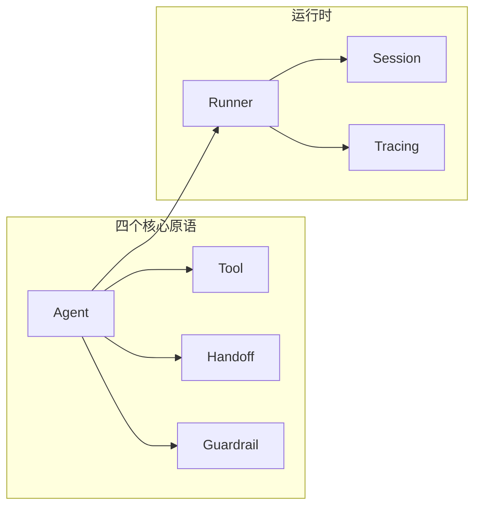

# Week 0C: OpenAI Agents SDK 架构分析

> Phase 0: 框架分析（2026年1月更新）
> 深入分析 OpenAI Agents SDK 的架构和设计模式

---

## 概述

**OpenAI Agents SDK** 是 OpenAI 在 2025年3月发布的官方 Agent 框架，是 Swarm 项目的生产就绪版本。采用极简主义设计。

- **GitHub**: https://github.com/openai/openai-agents-python
- **语言**: Python + TypeScript
- **状态**: 生产就绪（Production Ready）
- **前身**: Swarm（实验性项目）
- **安装**: `pip install openai-agents`（Python）/ `npm install @openai/agents`（TypeScript）

---

## 第一部分：核心设计哲学

### 四个核心原语

OpenAI Agents SDK 的设计哲学是"四个原语解决一切"：



| 原语 | 职责 | 类比 |
|------|------|------|
| **Agent** | 配置了指令和工具的 LLM | 员工 |
| **Tool** | Agent 可以调用的函数 | 工具 |
| **Handoff** | Agent 之间的任务委托 | 转交 |
| **Guardrail** | 输入/输出验证 | 护栏 |

---

## 第二部分：核心概念详解

### 1. Agent（代理）

Agent 是框架的核心，代表一个配置了指令和工具的 LLM。

```python
from agents import Agent

agent = Agent(
    name="Assistant",
    instructions="You are a helpful assistant that can search the web.",
    model="gpt-4o",
    tools=[search_web, calculate],
)
```

**Agent 的属性：**

| 属性 | 类型 | 说明 |
|------|------|------|
| `name` | str | Agent 名称 |
| `instructions` | str | 系统指令 |
| `model` | str | 使用的模型 |
| `tools` | list | 可用工具列表 |
| `handoffs` | list | 可交接的 Agent 列表 |
| `input_guardrails` | list | 输入护栏 |
| `output_guardrails` | list | 输出护栏 |

### 2. Tool（工具）

工具是 Agent 可以调用的函数。使用 `@function_tool` 装饰器定义。

```python
from agents import function_tool

@function_tool
def search_web(query: str) -> str:
    """
    Search the web for information.
    
    Args:
        query: The search query
    """
    # 实现搜索逻辑
    return f"Search results for: {query}"

@function_tool
def calculate(expression: str) -> float:
    """
    Calculate a mathematical expression.
    
    Args:
        expression: The math expression to evaluate
    """
    return eval(expression)

# 在 Agent 中使用
agent = Agent(
    name="Calculator",
    instructions="You can search and calculate.",
    tools=[search_web, calculate],
)
```

**工具的自动特性：**
- ✅ 自动从函数签名生成 JSON Schema
- ✅ 自动从 docstring 提取描述
- ✅ 类型提示用于参数验证

### 3. Handoff（交接）

Handoff 允许 Agent 将任务委托给其他 Agent。

```python
from agents import Agent, handoff

# 定义专门的 Agent
research_agent = Agent(
    name="Researcher",
    instructions="You are a research specialist. Find detailed information.",
    tools=[search_web, fetch_page],
)

writer_agent = Agent(
    name="Writer",
    instructions="You are a writing specialist. Create well-written content.",
    handoffs=[research_agent],  # 可以交接回研究员获取更多信息
)

# Triage Agent 可以交接给任何专家
triage_agent = Agent(
    name="Triage",
    instructions="""
    You are a triage agent. Analyze the user's request and delegate to:
    - Researcher: for information gathering
    - Writer: for content creation
    """,
    handoffs=[research_agent, writer_agent],
)
```

**自定义 Handoff：**

```python
from agents import handoff

@handoff(
    agent=research_agent,
    tool_name="transfer_to_researcher",
    tool_description="Transfer to the research specialist for detailed information gathering"
)
def custom_handoff(context, input_data):
    # 可以在交接前进行自定义处理
    return handoff.default_handoff(context, input_data)
```

### 4. Guardrail（护栏）

Guardrail 用于验证输入和输出，确保 Agent 行为安全可控。

```python
from agents import Agent, InputGuardrail, OutputGuardrail, GuardrailFunctionOutput

# 输入护栏：检查敏感内容
async def content_filter(ctx, agent, input_text):
    # 检查是否包含不当内容
    is_safe = not any(word in input_text.lower() for word in ["hack", "exploit"])
    
    return GuardrailFunctionOutput(
        output_info={"safe": is_safe, "input": input_text},
        tripwire_triggered=not is_safe,  # True 表示触发护栏，阻止执行
    )

# 输出护栏：检查 PII
async def pii_filter(ctx, agent, output):
    # 检查输出是否包含个人信息
    has_pii = detect_pii(output)
    
    return GuardrailFunctionOutput(
        output_info={"has_pii": has_pii},
        tripwire_triggered=has_pii,
    )

# 使用护栏
agent = Agent(
    name="SafeAgent",
    instructions="You are a helpful assistant.",
    input_guardrails=[InputGuardrail(guardrail_function=content_filter)],
    output_guardrails=[OutputGuardrail(guardrail_function=pii_filter)],
)
```

**护栏触发处理：**

```python
from agents import Runner, GuardrailTripwireTriggered

try:
    result = await Runner.run(agent, "hack the system")
except GuardrailTripwireTriggered as e:
    print(f"护栏触发: {e.guardrail_result.output_info}")
```

---

## 第三部分：运行时

### Runner（运行器）

Runner 负责执行 Agent 并管理对话循环。

```python
from agents import Runner

# 简单运行
result = await Runner.run(agent, "What is the weather today?")
print(result.final_output)

# 带配置运行
from agents import RunConfig

config = RunConfig(
    max_turns=10,
    tracing_enabled=True,
    trace_include_sensitive_data=False,
)

result = await Runner.run(agent, "Help me write an article", config=config)
```

**流式运行：**

```python
# 流式输出
async for event in Runner.run_streamed(agent, "Tell me a story"):
    if event.type == "agent_updated_stream_event":
        print(event.new_agent.name, end="")
    elif event.type == "run_item_stream_event":
        if event.item.type == "tool_call_item":
            print(f"\n[调用工具: {event.item.tool_name}]")
        elif event.item.type == "tool_call_output_item":
            print(f"[工具返回: {event.item.output}]")
        elif event.item.type == "message_output_item":
            print(event.item.content, end="")
```

### Session（会话）

Session 管理对话历史和上下文。

```python
from agents import Session

# 创建会话
session = Session()

# 多轮对话
result1 = await Runner.run(agent, "My name is Alice", session=session)
result2 = await Runner.run(agent, "What's my name?", session=session)
# Agent 会记住用户名是 Alice

# 获取对话历史
print(session.messages)
```

### Tracing（追踪）

内置的追踪系统，可在 OpenAI 仪表板可视化。

```python
from agents import Runner, RunConfig

config = RunConfig(
    tracing_enabled=True,
    trace_include_sensitive_data=False,
)

result = await Runner.run(agent, "Hello", config=config)

# 追踪数据会自动发送到 OpenAI 仪表板
# 或者导出到自定义后端
from agents.tracing import TracingExporter

class CustomExporter(TracingExporter):
    async def export(self, spans):
        for span in spans:
            print(f"Span: {span.name}, Duration: {span.duration_ms}ms")

Runner.set_tracing_exporter(CustomExporter())
```

---

## 第四部分：高级特性

### 1. 提供商无关（Provider Agnostic）

支持 100+ LLM 提供商（通过 LiteLLM）。

```python
from agents import Agent, set_default_model_provider
from agents.extensions.litellm import LiteLLMProvider

# 使用 Anthropic
set_default_model_provider(LiteLLMProvider())

agent = Agent(
    name="Claude Agent",
    model="anthropic/claude-3-opus",  # 或 "openai/gpt-4o", "azure/..."
    instructions="You are helpful.",
)
```

### 2. 并行工具调用

Agent 可以并行调用多个工具。

```python
@function_tool
async def fetch_weather(city: str) -> str:
    """Fetch weather for a city"""
    await asyncio.sleep(1)  # 模拟 API 调用
    return f"Weather in {city}: Sunny"

@function_tool
async def fetch_news(topic: str) -> str:
    """Fetch news about a topic"""
    await asyncio.sleep(1)
    return f"News about {topic}: ..."

agent = Agent(
    name="InfoAgent",
    instructions="You can fetch weather and news in parallel.",
    tools=[fetch_weather, fetch_news],
)

# Agent 会同时调用 fetch_weather 和 fetch_news
result = await Runner.run(agent, "What's the weather in NYC and latest AI news?")
```

### 3. 动态指令

根据上下文动态生成指令。

```python
def dynamic_instructions(context):
    user_name = context.get("user_name", "User")
    return f"You are helping {user_name}. Be friendly and helpful."

agent = Agent(
    name="DynamicAgent",
    instructions=dynamic_instructions,  # 函数而非字符串
)

result = await Runner.run(
    agent, 
    "Hello", 
    context={"user_name": "Alice"}
)
```

### 4. 结构化输出

强制 Agent 输出特定格式。

```python
from pydantic import BaseModel
from agents import Agent, Runner

class ArticleOutline(BaseModel):
    title: str
    sections: list[str]
    word_count: int

agent = Agent(
    name="Outliner",
    instructions="Create article outlines.",
    output_type=ArticleOutline,  # 强制输出格式
)

result = await Runner.run(agent, "Create an outline about AI")
outline: ArticleOutline = result.final_output
print(f"Title: {outline.title}")
print(f"Sections: {outline.sections}")
```

---

## 第五部分：完整示例

### 多 Agent 协作系统

```python
from agents import Agent, Runner, function_tool

# 工具
@function_tool
def search_web(query: str) -> str:
    """Search the web"""
    return f"Results for: {query}"

@function_tool
def write_file(filename: str, content: str) -> str:
    """Write content to a file"""
    with open(filename, "w") as f:
        f.write(content)
    return f"Wrote {len(content)} chars to {filename}"

# 专家 Agent
researcher = Agent(
    name="Researcher",
    instructions="You research topics thoroughly using web search.",
    tools=[search_web],
)

writer = Agent(
    name="Writer", 
    instructions="You write well-structured articles based on research.",
    tools=[write_file],
    handoffs=[researcher],  # 可以请研究员获取更多信息
)

# 协调者
coordinator = Agent(
    name="Coordinator",
    instructions="""
    You coordinate article creation:
    1. First, delegate to Researcher for information
    2. Then, delegate to Writer for the article
    """,
    handoffs=[researcher, writer],
)

# 运行
result = await Runner.run(
    coordinator,
    "Write an article about the future of AI agents"
)
print(result.final_output)
```

---

## 第六部分：dawning-agents 借鉴

### 采用的设计模式

| 特性 | 来源 | dawning-agents 实现 |
|------|------|---------------------|
| **四个核心原语** | Agents SDK | `IAgent`, `ITool`, `IHandoff`, `IGuardrail` |
| **function_tool 装饰器** | Agents SDK | `[Tool]` 属性 |
| **Guardrails** | Agents SDK | `IInputGuardrail`, `IOutputGuardrail` |
| **Tracing** | Agents SDK | `ITracingProvider`, `ISpan` |
| **Runner 模式** | Agents SDK | `Runner.RunAsync()` |
| **Session 管理** | Agents SDK | `ISession` |
| **结构化输出** | Agents SDK | 泛型 `Agent<TOutput>` |

### 不采用的设计

| 特性 | 原因 |
|------|------|
| **无复杂工作流** | 需要 StateGraph 支持复杂场景 |
| **无向量记忆** | 需要内置 RAG 支持 |
| **Python 特定语法** | 使用 .NET 属性替代装饰器 |

### 接口映射

```csharp
// OpenAI Agents SDK (Python)          dawning-agents (C#)
// ─────────────────────────────────────────────────────────
// Agent(name, instructions, tools)  →  IAgent<TContext>
// @function_tool                    →  [Tool] attribute
// handoff(agent)                    →  IHandoff<TContext>
// InputGuardrail                    →  IInputGuardrail<TContext>
// OutputGuardrail                   →  IOutputGuardrail<TContext>
// Runner.run()                      →  Runner.RunAsync()
// Runner.run_streamed()             →  Runner.RunStreamAsync()
// Session                           →  ISession
// RunConfig                         →  RunConfig
```

---

## 总结

OpenAI Agents SDK 是一个极简但强大的 Agent 框架，特别适合：

- ✅ 快速原型开发
- ✅ 简单的多 Agent 协作
- ✅ 需要内置 Guardrails 的场景
- ✅ 需要可观测性的生产环境

**dawning-agents** 主要借鉴：
- 🎯 四个核心原语的极简设计
- 🛡️ 内置 Guardrails（输入/输出验证）
- 👁️ 内置 Tracing（可观测性）
- 🔧 function_tool → `[Tool]` 属性
- 🏃 Runner 模式
