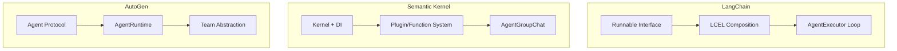

# Week 0D: Framework Comparison & dawning-agents Design Decisions

> Phase 0: Framework Analysis
> Synthesizing learnings into design decisions for dawning-agents

---

## Overview

After analyzing LangChain, Semantic Kernel, and AutoGen, this document synthesizes the learnings and establishes the design principles for dawning-agents.

---

## Part 1: Three-Framework Comparison

### Architecture Comparison



### Feature Matrix

| Feature | LangChain | Semantic Kernel | AutoGen | dawning-agents Goal |
|---------|-----------|-----------------|---------|---------------------|
| **Language** | Python-first | .NET-first | Python-first | **.NET-first** |
| **Composition** | `\|` operator | DI + Invoke | Message passing | **Fluent + DI** |
| **Agent Loop** | AgentExecutor | Agent class | on_messages | **IAgent interface** |
| **Multi-Agent** | Basic | AgentGroupChat | Team + Handoff | **Rich patterns** |
| **Tools** | @tool decorator | [KernelFunction] | Tool class | **[Tool] attribute** |
| **Memory** | BaseMemory | Plugin-based | Chat history | **IMemory interface** |
| **Streaming** | stream() method | IAsyncEnumerable | on_messages_stream | **IAsyncEnumerable** |
| **Human-in-loop** | External | External | Built-in | **Built-in** |
| **Observability** | Callbacks | Filters | Events | **Filters + Events** |

### Design Philosophy Comparison

| Aspect | LangChain | Semantic Kernel | AutoGen |
|--------|-----------|-----------------|---------|
| **Core Idea** | Everything is Runnable | Kernel is the hub | Agents communicate via messages |
| **Composition Style** | Operator chaining | Service injection | Actor model |
| **Abstraction Level** | Very high | High | Medium (two-layer) |
| **Flexibility** | Very flexible | Enterprise structured | Research-oriented |
| **Simplicity** | Magic can confuse | Verbose but clear | Complex for simple cases |

---

## Part 2: Key Learnings

### From LangChain

✅ **Take:**
- Runnable interface with `invoke`, `stream`, `batch` is elegant
- Callbacks/handlers for observability
- Composition is powerful

❌ **Avoid:**
- Too much magic (hard to debug)
- Frequent breaking changes
- Python-specific patterns

### From Semantic Kernel

✅ **Take:**
- Native .NET with strong typing
- DI integration is essential
- Filter/interceptor pattern
- Attribute-based tool discovery
- Clean Plugin/Function model

❌ **Avoid:**
- Overly verbose for simple cases
- Agent system still immature
- Some abstractions feel forced

### From AutoGen

✅ **Take:**
- Actor model for agents (message-passing)
- Two-layer architecture (high/low level)
- Handoff pattern for agent delegation
- Rich termination conditions
- Human-in-the-loop is first-class

❌ **Avoid:**
- Breaking changes between versions
- Python-specific patterns
- Overly complex for simple use cases

---

## Part 3: dawning-agents Design Principles

### Principle 1: .NET-First with Strong Typing

```csharp
// All interfaces strongly typed
public interface IAgent<TInput, TOutput>
{
    Task<TOutput> InvokeAsync(TInput input, CancellationToken cancellationToken = default);
    IAsyncEnumerable<TOutput> StreamAsync(TInput input, CancellationToken cancellationToken = default);
}

// Generic constraints for type safety
public interface IChatAgent : IAgent<ChatMessage, ChatResponse> { }
```

### Principle 2: Dependency Injection as Foundation

```csharp
// Integrate with Microsoft.Extensions.DependencyInjection
var services = new ServiceCollection();

services.AddDawningAgents(options =>
{
    options.AddOpenAI(config => 
    {
        config.ApiKey = "...";
        config.Model = "gpt-4";
    });
    
    options.AddAgent<ResearchAgent>();
    options.AddAgent<WriterAgent>();
    
    options.AddTool<WebSearchTool>();
    options.AddTool<FileSystemTool>();
});

var provider = services.BuildServiceProvider();
var agent = provider.GetRequiredService<ResearchAgent>();
```

### Principle 3: Two-Layer Architecture

```text
┌─────────────────────────────────────────────────────────────┐
│                    High-Level API                            │
│  ┌──────────┐  ┌──────────┐  ┌──────────┐  ┌──────────────┐ │
│  │ChatAgent │  │TaskAgent │  │CodeAgent │  │ TeamBuilder  │ │
│  └──────────┘  └──────────┘  └──────────┘  └──────────────┘ │
├─────────────────────────────────────────────────────────────┤
│                    Core Abstractions                         │
│  ┌────────┐  ┌────────┐  ┌────────┐  ┌────────┐  ┌────────┐ │
│  │ IAgent │  │ ITool  │  │IMemory │  │IRuntime│  │IChannel│ │
│  └────────┘  └────────┘  └────────┘  └────────┘  └────────┘ │
└─────────────────────────────────────────────────────────────┘
```

### Principle 4: Message-Passing for Multi-Agent

```csharp
// Agents communicate via messages (like AutoGen)
public interface IAgentRuntime
{
    Task<TResponse> SendAsync<TMessage, TResponse>(
        AgentId recipient,
        TMessage message,
        CancellationToken cancellationToken = default);
    
    Task PublishAsync<TMessage>(
        TopicId topic,
        TMessage message,
        CancellationToken cancellationToken = default);
    
    Task<AgentId> RegisterAsync<TAgent>(
        string name,
        Func<TAgent> factory) where TAgent : IAgent;
}
```

### Principle 5: Attribute-Based Discovery

```csharp
// Like Semantic Kernel's approach
public class WebTools
{
    [Tool("Search the web")]
    public async Task<string> SearchAsync(
        [Description("Search query")] string query,
        [Description("Max results")] int maxResults = 10)
    {
        // Implementation
    }
    
    [Tool("Fetch webpage content")]
    public async Task<string> FetchPageAsync(
        [Description("URL to fetch")] string url)
    {
        // Implementation
    }
}

// Auto-discovery
services.AddToolsFromAssembly(typeof(WebTools).Assembly);
```

### Principle 6: Fluent Team Building

```csharp
// Inspired by AutoGen's teams
var team = Team.Create()
    .WithAgent(researchAgent, role: "Researcher")
    .WithAgent(writerAgent, role: "Writer")
    .WithAgent(reviewerAgent, role: "Reviewer")
    .WithSelectionStrategy<RoundRobinSelection>()
    .WithTermination(conditions => conditions
        .MaxMessages(50)
        .Or()
        .TextContains("TASK_COMPLETE")
        .Or()
        .Handoff("Human"))
    .WithHumanInTheLoop(humanProxy)
    .Build();

var result = await team.RunAsync("Write an article about AI agents");
```

### Principle 7: Rich Observability

```csharp
// Combined Filters (like SK) + Events (like AutoGen)
public interface IAgentFilter
{
    Task OnAgentInvokingAsync(AgentInvocationContext context, Func<Task> next);
    Task OnAgentInvokedAsync(AgentInvocationContext context);
}

public interface IToolFilter
{
    Task OnToolInvokingAsync(ToolInvocationContext context, Func<Task> next);
    Task OnToolInvokedAsync(ToolInvocationContext context);
}

// Event-based for external consumers
public interface IAgentEvents
{
    event EventHandler<AgentMessageEventArgs> MessageReceived;
    event EventHandler<ToolCallEventArgs> ToolCalled;
    event EventHandler<HandoffEventArgs> HandoffOccurred;
}
```

### Principle 8: First-Class Handoffs

```csharp
// Like AutoGen's handoff pattern
public class ResearchAgent : ChatAgent
{
    [Handoff("Writer", "Hand off to writer when research is complete")]
    [Handoff("Human", "Escalate to human when uncertain")]
    public override async Task<ChatResponse> InvokeAsync(
        ChatMessage message,
        CancellationToken cancellationToken = default)
    {
        // Agent can trigger handoff via tool call
    }
}
```

---

## Part 4: Core Interfaces (Draft)

### IAgent

```csharp
namespace DawningAgents.Core;

public interface IAgent
{
    string Id { get; }
    string Name { get; }
    string Description { get; }
    AgentMetadata Metadata { get; }
}

public interface IAgent<TInput, TOutput> : IAgent
{
    Task<TOutput> InvokeAsync(
        TInput input,
        AgentContext context,
        CancellationToken cancellationToken = default);
    
    IAsyncEnumerable<TOutput> StreamAsync(
        TInput input,
        AgentContext context,
        CancellationToken cancellationToken = default);
}

public interface IChatAgent : IAgent<IEnumerable<ChatMessage>, ChatResponse>
{
    IReadOnlyList<ITool> Tools { get; }
    IReadOnlyList<Handoff> Handoffs { get; }
}
```

### ITool

```csharp
namespace DawningAgents.Core;

public interface ITool
{
    string Name { get; }
    string Description { get; }
    ToolSchema Schema { get; }  // JSON Schema for parameters
    
    Task<ToolResult> InvokeAsync(
        ToolInput input,
        CancellationToken cancellationToken = default);
}

// Attribute for easy tool creation
[AttributeUsage(AttributeTargets.Method)]
public class ToolAttribute : Attribute
{
    public string? Name { get; set; }
    public string? Description { get; set; }
}
```

### IMemory

```csharp
namespace DawningAgents.Core;

public interface IMemory
{
    Task SaveAsync(MemoryEntry entry, CancellationToken cancellationToken = default);
    
    Task<IEnumerable<MemoryEntry>> RecallAsync(
        string query,
        MemoryRecallOptions? options = null,
        CancellationToken cancellationToken = default);
    
    Task ClearAsync(CancellationToken cancellationToken = default);
}

public interface IChatMemory : IMemory
{
    Task AddMessageAsync(ChatMessage message, CancellationToken cancellationToken = default);
    Task<IEnumerable<ChatMessage>> GetHistoryAsync(int? limit = null, CancellationToken cancellationToken = default);
}
```

### IAgentRuntime

```csharp
namespace DawningAgents.Core;

public interface IAgentRuntime
{
    Task<AgentId> RegisterAsync<TAgent>(
        string type,
        Func<IServiceProvider, TAgent> factory,
        IEnumerable<Subscription>? subscriptions = null)
        where TAgent : IAgent;
    
    Task<TAgent> GetAgentAsync<TAgent>(AgentId id)
        where TAgent : IAgent;
    
    Task<TResponse> SendMessageAsync<TMessage, TResponse>(
        AgentId recipient,
        TMessage message,
        AgentId? sender = null,
        CancellationToken cancellationToken = default);
    
    Task PublishMessageAsync<TMessage>(
        TopicId topic,
        TMessage message,
        AgentId? sender = null,
        CancellationToken cancellationToken = default);
}
```

### ITeam

```csharp
namespace DawningAgents.Core;

public interface ITeam
{
    IReadOnlyList<IAgent> Participants { get; }
    ISelectionStrategy SelectionStrategy { get; }
    ITerminationCondition TerminationCondition { get; }
    
    Task<TeamResult> RunAsync(
        string task,
        CancellationToken cancellationToken = default);
    
    IAsyncEnumerable<TeamEvent> RunStreamAsync(
        string task,
        CancellationToken cancellationToken = default);
}

public interface ISelectionStrategy
{
    Task<IAgent?> SelectNextAsync(
        IReadOnlyList<IAgent> participants,
        IReadOnlyList<ChatMessage> history,
        CancellationToken cancellationToken = default);
}

public interface ITerminationCondition
{
    Task<bool> ShouldTerminateAsync(
        IReadOnlyList<ChatMessage> history,
        CancellationToken cancellationToken = default);
}
```

---

## Part 5: Project Structure (Proposed)

```text
dawning-agents/
├── src/
│   ├── DawningAgents.Abstractions/     # Core interfaces
│   │   ├── IAgent.cs
│   │   ├── ITool.cs
│   │   ├── IMemory.cs
│   │   ├── IAgentRuntime.cs
│   │   └── ITeam.cs
│   │
│   ├── DawningAgents.Core/             # Core implementations
│   │   ├── Agents/
│   │   │   ├── ChatAgent.cs
│   │   │   └── TaskAgent.cs
│   │   ├── Runtime/
│   │   │   └── SingleThreadedRuntime.cs
│   │   ├── Teams/
│   │   │   ├── RoundRobinTeam.cs
│   │   │   └── SelectorTeam.cs
│   │   └── Memory/
│   │       ├── BufferMemory.cs
│   │       └── SummaryMemory.cs
│   │
│   ├── DawningAgents.OpenAI/           # OpenAI integration
│   ├── DawningAgents.Anthropic/        # Anthropic integration
│   ├── DawningAgents.Azure/            # Azure OpenAI integration
│   └── DawningAgents.Tools/            # Built-in tools
│
├── samples/
│   ├── SimpleChat/
│   ├── MultiAgent/
│   └── CodeGeneration/
│
├── tests/
│   ├── DawningAgents.Tests/
│   └── DawningAgents.IntegrationTests/
│
└── docs/
```

---

## Part 6: Implementation Roadmap

### Phase 1: Foundation (Week 1-2)
- [ ] Core interfaces (IAgent, ITool, IMemory)
- [ ] Single-threaded runtime
- [ ] OpenAI integration
- [ ] Basic ChatAgent

### Phase 2: Tools & Memory (Week 3-4)
- [ ] Attribute-based tool discovery
- [ ] Tool execution
- [ ] Buffer memory
- [ ] Summary memory

### Phase 3: Multi-Agent (Week 5-6)
- [ ] Team abstraction
- [ ] Selection strategies
- [ ] Termination conditions
- [ ] Handoff support

### Phase 4: Advanced Features (Week 7-8)
- [ ] Human-in-the-loop
- [ ] Streaming support
- [ ] Filters & observability
- [ ] Error handling & retry

### Phase 5: Polish (Week 9-10)
- [ ] Additional LLM providers
- [ ] Built-in tools
- [ ] Comprehensive tests
- [ ] Documentation

---

## Summary

| Framework | Key Takeaway |
|-----------|--------------|
| **LangChain** | Composition elegance, but avoid magic |
| **Semantic Kernel** | .NET patterns, DI, filters, attributes |
| **AutoGen** | Actor model, teams, handoffs, termination |

**dawning-agents** will combine:
- 🎯 .NET-first with strong typing (from SK)
- 🔌 DI integration and filters (from SK)
- 🔗 Clean interfaces like Runnable (inspired by LC)
- 📬 Message-passing for multi-agent (from AutoGen)
- 👥 Rich team/handoff patterns (from AutoGen)
- 👁️ First-class observability (from all three)
