# Week 0D: Framework Comparison & dawning-agents Design Decisions

> Phase 0: Framework Analysis (Updated January 2026)
> Synthesizing learnings into design decisions for dawning-agents

---

## Overview

This document compares the three major AI Agent frameworks currently in use:
- **LangChain / LangGraph** - The leader in the Python ecosystem
- **Microsoft Agent Framework** - Microsoft's unified Agent framework (consolidating Semantic Kernel and AutoGen)
- **OpenAI Agents SDK** - OpenAI's official lightweight Agent SDK

> ⚠️ **Important Update (November 2025):** Microsoft has consolidated Semantic Kernel and AutoGen into the unified **Microsoft Agent Framework**, with migration guides available from SK/AutoGen.

---

## Part 1: Three-Framework Comparison

### Architecture Comparison

```mermaid
graph TB
    subgraph "LangChain / LangGraph"
        LC1[Runnable Interface]
        LC2[LCEL Composition]
        LC3[LangGraph State Machine]
        LC1 --> LC2 --> LC3
    end
    
    subgraph "Microsoft Agent Framework"
        MS1[ChatAgent / AIAgent]
        MS2[Workflow Orchestration]
        MS3[Handoff Workflows]
        MS1 --> MS2 --> MS3
    end
    
    subgraph "OpenAI Agents SDK"
        OA1[Agent Primitives]
        OA2[Tools + Handoffs]
        OA3[Guardrails + Tracing]
        OA1 --> OA2 --> OA3
    end
```



### Feature Matrix

| Feature | LangChain/LangGraph | MS Agent Framework | OpenAI Agents SDK | dawning-agents Goal |
|---------|---------------------|-------------------|-------------------|---------------------|
| **Language** | Python-first | Python + .NET | Python + TypeScript | **.NET-first** |
| **Installation** | `pip install langchain` | `pip install agent-framework` / `dotnet add Microsoft.Agents.AI` | `pip install openai-agents` | **NuGet packages** |
| **Core Primitives** | Runnable, Chain, Graph | Agent, Workflow, Executor | Agent, Tool, Handoff, Guardrail | **IAgent, ITool, IHandoff** |
| **Multi-Agent** | LangGraph state machine | HandoffBuilder, Workflow | Handoffs delegation | **HandoffBuilder** |
| **Tools** | @tool decorator | ai_function decorator | function_tool decorator | **[Tool] attribute** |
| **Handoffs** | Requires custom | Built-in HandoffBuilder | Built-in Handoff primitive | **Built-in** |
| **Guardrails** | Requires custom | Via middleware | Built-in Guardrails | **Built-in IGuardrail** |
| **Observability** | LangSmith | ExecutorInvokedEvent | Built-in Tracing | **Built-in Tracing** |
| **Human-in-loop** | Via nodes | human_in_loop mode | Via Guardrails | **Built-in** |
| **Streaming** | stream() | run_stream() | run_streamed() | **IAsyncEnumerable** |
| **Session Management** | Requires custom | AgentThread | Built-in Sessions | **Built-in ISession** |
| **LLM Support** | 100+ models | Azure OpenAI first | 100+ via LiteLLM | **Multi-model support** |

### Design Philosophy Comparison

| Aspect | LangChain/LangGraph | MS Agent Framework | OpenAI Agents SDK |
|--------|---------------------|-------------------|-------------------|
| **Core Idea** | Everything is Runnable, Graph is Workflow | Workflow is the orchestration core | Four primitives solve everything |
| **Abstraction Level** | High (LCEL) + Medium (Graph) | Medium (two-layer architecture) | Low (minimalism) |
| **Flexibility** | Very flexible | Enterprise structured | Simple and direct |
| **Learning Curve** | Steep | Medium | Gentle |
| **Production Ready** | LangGraph v1.0 (2025) | Preview (late 2025) | Production ready (March 2025) |
| **Enterprise Features** | LangSmith (paid) | Azure integration | OpenAI platform integration |

---

## Part 2: Detailed Framework Analysis

### LangChain / LangGraph

**Overview:** LangChain is the most mature Agent framework. In May 2025, LangGraph reached v1.0, providing long-running stateful Agent orchestration.

**Core Concepts:**
```python
# LangGraph state machine example
from langgraph.graph import StateGraph, END

workflow = StateGraph(AgentState)
workflow.add_node("research", research_node)
workflow.add_node("write", write_node)
workflow.add_edge("research", "write")
workflow.add_edge("write", END)

app = workflow.compile()
result = await app.ainvoke({"task": "Write an article"})
```

**Pros:**
- ✅ Most mature ecosystem, active community
- ✅ LangGraph provides powerful state machine orchestration
- ✅ LangSmith provides enterprise-grade observability
- ✅ Supports 100+ LLM models
- ✅ Rich documentation and tutorials

**Cons:**
- ❌ Too many abstraction layers, hard to debug
- ❌ Frequent version iterations, many breaking changes
- ❌ Python-first, weak .NET support
- ❌ Overkill for simple tasks

---

### Microsoft Agent Framework

**Overview:** Microsoft released the unified Agent Framework in November 2025, consolidating the best features of Semantic Kernel and AutoGen, with support for both Python and .NET.

**Core Concepts:**
```python
# Python example
from agent_framework import HandoffBuilder, ChatAgent
from agent_framework.azure import AzureOpenAIChatClient

client = AzureOpenAIChatClient(credential=AzureCliCredential())

# Create Agents
triage = client.create_agent(name="triage", instructions="...")
billing = client.create_agent(name="billing", instructions="...")
support = client.create_agent(name="support", instructions="...")

# Build Handoff workflow
workflow = (
    HandoffBuilder(participants=[triage, billing, support])
    .with_start_agent(triage)
    .add_handoff(triage, [billing, support])
    .with_autonomous_mode(turn_limits={"billing": 10})
    .build()
)

# Run
async for event in workflow.run_stream(messages):
    print(event)
```

```csharp
// .NET example
var workflow = AgentWorkflowBuilder
    .CreateHandoffBuilderWith(triageAgent)
    .WithHandoff(triageAgent, billingAgent, "Handle billing issues")
    .WithHandoff(triageAgent, supportAgent, "Handle technical support")
    .Build();

await foreach (var update in workflow.RunStreamingAsync(messages))
{
    Console.WriteLine(update);
}
```

**Pros:**
- ✅ First-class support for both Python and .NET
- ✅ Deep integration with Azure AI Foundry
- ✅ Built-in Handoff workflow pattern
- ✅ Supports MCP, A2A, and other open standards
- ✅ Migration guides from SK/AutoGen available

**Cons:**
- ❌ Still in Preview stage
- ❌ Documentation still being improved
- ❌ Ecosystem still being built

---

### OpenAI Agents SDK

**Overview:** Released in March 2025, this is the production-ready version of the Swarm project. It adopts a minimalist design with only four core primitives.

**Four Core Primitives:**

1. **Agent** - LLM configured with instructions and tools
2. **Tool** - Functions the Agent can call
3. **Handoff** - Task delegation between Agents
4. **Guardrail** - Input/output validation

```python
from agents import Agent, Runner, function_tool, handoff

@function_tool
def search_web(query: str) -> str:
    """Search the web for information"""
    return f"Search results: {query}"

research_agent = Agent(
    name="Researcher",
    instructions="You are a research assistant",
    tools=[search_web],
)

writer_agent = Agent(
    name="Writer",
    instructions="You are a writing assistant",
    handoffs=[research_agent],  # Can hand back to researcher
)

triage_agent = Agent(
    name="Triage",
    instructions="Analyze user needs and assign tasks",
    handoffs=[research_agent, writer_agent],
)

# Run
result = await Runner.run(triage_agent, "Help me write an article about AI")
print(result.final_output)
```

**Guardrails Example:**
```python
from agents import Agent, InputGuardrail, GuardrailFunctionOutput

async def content_filter(ctx, agent, input):
    # Check if input contains sensitive content
    is_safe = check_content(input)
    return GuardrailFunctionOutput(
        output_info={"safe": is_safe},
        tripwire_triggered=not is_safe,
    )

agent = Agent(
    name="SafeAgent",
    instructions="...",
    input_guardrails=[InputGuardrail(guardrail_function=content_filter)],
)
```

**Pros:**
- ✅ Minimalist design, gentle learning curve
- ✅ Built-in Tracing (OpenAI dashboard visualization)
- ✅ Supports both Python and TypeScript
- ✅ Provider-agnostic (supports 100+ LLMs)
- ✅ Production-ready

**Cons:**
- ❌ No built-in vector memory/RAG
- ❌ No graph/state machine workflow engine
- ❌ Complex orchestration requires custom implementation
- ❌ No .NET support

---

## Part 3: Key Learnings

### From LangChain/LangGraph

✅ **Take:**
- State machine orchestration pattern (LangGraph) → for complex flow control
- Composable Runnable interface design
- Comprehensive observability system

❌ **Avoid:**
- Too many abstraction layers
- Frequent breaking changes
- Python-specific magic syntax

### From Microsoft Agent Framework

✅ **Take:**
- Native .NET support with strong typing
- HandoffBuilder fluent API
- Workflow orchestration pattern
- Two-layer architecture (high-level API + core abstractions)
- Azure service integration

❌ **Avoid:**
- Over-dependence on Azure ecosystem
- Unstable Preview-stage APIs

### From OpenAI Agents SDK

✅ **Take:**
- Minimalist design with four core primitives
- Built-in Guardrails (input/output validation)
- Built-in Tracing (observability)
- Handoffs as first-class citizens
- Session management

❌ **Avoid:**
- Lack of complex workflow support
- No vector memory layer

---

## Part 4: dawning-agents Design Principles

### Principle 1: Four Core Primitives + Dual Orchestration Modes

Inspired by OpenAI Agents SDK, combined with orchestration capabilities from LangGraph and MS Agent Framework:

```csharp
// Core primitives
public interface IAgent { }      // Agent - LLM + instructions + tools
public interface ITool { }       // Tool - callable functionality
public interface IHandoff { }    // Handoff - delegation between agents
public interface IGuardrail { }  // Guardrail - input/output validation

// Dual orchestration modes
public interface IWorkflow { }   // Workflow orchestration - LLM dynamic handoff decisions (inspired by MS Agent Framework)
public interface IStateGraph { } // State machine orchestration - developer-defined flows (inspired by LangGraph)
```

**Choosing Between Orchestration Modes:**

| Scenario | Recommended Mode | Reason |
|----------|------------------|--------|
| Multi-agent collaboration, customer service routing | Workflow (HandoffBuilder) | LLM intelligently decides handoff target |
| Approval flows, data pipelines, iterative loops | StateGraph | Requires deterministic flow control |
| Simple conversations | Use Agent directly | No orchestration needed |

### Principle 2: .NET-First with Strong Typing

```csharp
// All interfaces strongly typed
public interface IAgent<TContext>
{
    string Name { get; }
    string Instructions { get; }
    IReadOnlyList<ITool> Tools { get; }
    IReadOnlyList<IHandoff<TContext>> Handoffs { get; }
    IReadOnlyList<IGuardrail<TContext>> InputGuardrails { get; }
    IReadOnlyList<IGuardrail<TContext>> OutputGuardrails { get; }
    
    Task<AgentResult> RunAsync(
        string input,
        TContext? context = default,
        CancellationToken cancellationToken = default);
    
    IAsyncEnumerable<AgentEvent> RunStreamAsync(
        string input,
        TContext? context = default,
        CancellationToken cancellationToken = default);
}
```

### Principle 3: Built-in Guardrails

```csharp
// Input guardrail
public interface IInputGuardrail<TContext>
{
    Task<GuardrailResult> ValidateAsync(
        string input,
        IAgent<TContext> agent,
        TContext context,
        CancellationToken cancellationToken = default);
}

// Output guardrail
public interface IOutputGuardrail<TContext>
{
    Task<GuardrailResult> ValidateAsync(
        object output,
        IAgent<TContext> agent,
        TContext context,
        CancellationToken cancellationToken = default);
}

// Usage example
var agent = new AgentBuilder<MyContext>()
    .WithName("SafeAgent")
    .WithInstructions("...")
    .WithInputGuardrail(new ContentFilterGuardrail())
    .WithOutputGuardrail(new PiiFilterGuardrail())
    .Build();
```

### Principle 4: Fluent Handoff Building (Inspired by MS Agent Framework)

```csharp
// HandoffBuilder fluent API
var workflow = new HandoffBuilder<MyContext>()
    .WithParticipants(triageAgent, billingAgent, supportAgent)
    .WithStartAgent(triageAgent)
    .AddHandoff(triageAgent, billingAgent, "Handle billing issues")
    .AddHandoff(triageAgent, supportAgent, "Handle technical support")
    .AddHandoff(billingAgent, triageAgent)  // Can hand back
    .WithAutonomousMode(turnLimits: new() { ["billing"] = 10 })
    .WithTermination(cond => cond.MaxMessages(50).Or().Contains("COMPLETE"))
    .Build();

await foreach (var evt in workflow.RunStreamAsync("I have a billing issue"))
{
    Console.WriteLine(evt);
}
```

### Principle 5: Built-in Tracing

```csharp
// Automatic tracing
public interface ITracingProvider
{
    ISpan CreateAgentSpan(string agentName, IReadOnlyList<string> tools);
    ISpan CreateToolSpan(string toolName, object input);
    ISpan CreateHandoffSpan(string fromAgent, string toAgent);
    ISpan CreateGuardrailSpan(string name, bool triggered);
}

// Usage
var config = new RunConfig
{
    TracingEnabled = true,
    TraceIncludeSensitiveData = false,
};

var result = await Runner.RunAsync(agent, "Hello", config);
// Trace data automatically generated
```

### Principle 6: Dependency Injection Integration

```csharp
// Integrate with Microsoft.Extensions.DependencyInjection
var services = new ServiceCollection();

services.AddDawning.Agents(options =>
{
    options.AddOpenAI(config => 
    {
        config.ApiKey = "...";
        config.DefaultModel = "gpt-4o";
    });
    
    // Register agents
    options.AddAgent<TriageAgent>();
    options.AddAgent<BillingAgent>();
    options.AddAgent<SupportAgent>();
    
    // Register tools
    options.AddToolsFromAssembly(typeof(WebTools).Assembly);
    
    // Configure tracing
    options.ConfigureTracing(tracing =>
    {
        tracing.AddConsoleExporter();
        tracing.AddOpenTelemetryExporter();
    });
});

var provider = services.BuildServiceProvider();
var agent = provider.GetRequiredService<TriageAgent>();
```

### Principle 7: Attribute-Based Tool Discovery

```csharp
public class WebTools
{
    [Tool("search_web", "Search the web for information")]
    public async Task<string> SearchAsync(
        [Description("Search query")] string query,
        [Description("Max results")] int maxResults = 10)
    {
        // Implementation
    }
    
    [Tool("fetch_page", "Fetch webpage content")]
    public async Task<string> FetchPageAsync(
        [Description("URL to fetch")] string url)
    {
        // Implementation
    }
}

// Auto-discovery and registration
services.AddToolsFromAssembly(typeof(WebTools).Assembly);
```

---

## Part 5: Core Interfaces (Draft)

### IAgent

```csharp
namespace Dawning.Agents.Core;

public interface IAgent
{
    string Name { get; }
    string? Description { get; }
    string? Instructions { get; }
}

public interface IAgent<TContext> : IAgent
{
    IReadOnlyList<ITool> Tools { get; }
    IReadOnlyList<IHandoff<TContext>> Handoffs { get; }
    IReadOnlyList<IInputGuardrail<TContext>> InputGuardrails { get; }
    IReadOnlyList<IOutputGuardrail<TContext>> OutputGuardrails { get; }
    
    Task<AgentResult> RunAsync(
        string input,
        RunConfig? config = null,
        TContext? context = default,
        CancellationToken cancellationToken = default);
    
    IAsyncEnumerable<AgentEvent> RunStreamAsync(
        string input,
        RunConfig? config = null,
        TContext? context = default,
        CancellationToken cancellationToken = default);
}
```

### ITool

```csharp
namespace Dawning.Agents.Core;

public interface ITool
{
    string Name { get; }
    string Description { get; }
    JsonSchema InputSchema { get; }
    
    Task<ToolResult> InvokeAsync(
        string inputJson,
        CancellationToken cancellationToken = default);
}

// Attribute for easy tool creation
[AttributeUsage(AttributeTargets.Method)]
public class ToolAttribute : Attribute
{
    public ToolAttribute(string name, string description);
}

[AttributeUsage(AttributeTargets.Parameter)]
public class DescriptionAttribute : Attribute
{
    public DescriptionAttribute(string description);
}
```

### IHandoff

```csharp
namespace Dawning.Agents.Core;

public interface IHandoff<TContext>
{
    string ToolName { get; }
    string ToolDescription { get; }
    IAgent<TContext> TargetAgent { get; }
    
    Task<IAgent<TContext>> InvokeAsync(
        RunContext<TContext> context,
        string? inputJson = null,
        CancellationToken cancellationToken = default);
}

// Handoff input data
public record HandoffInputData(
    IReadOnlyList<ChatMessage> History,
    IReadOnlyList<ChatMessage> NewItems
);

// Input filter
public delegate HandoffInputData HandoffInputFilter(HandoffInputData data);
```

### IGuardrail

```csharp
namespace Dawning.Agents.Core;

public record GuardrailResult(
    bool TripwireTriggered,
    object? OutputInfo = null
);

public interface IInputGuardrail<TContext>
{
    string Name { get; }
    
    Task<GuardrailResult> RunAsync(
        RunContext<TContext> context,
        IAgent<TContext> agent,
        string input,
        CancellationToken cancellationToken = default);
}

public interface IOutputGuardrail<TContext>
{
    string Name { get; }
    
    Task<GuardrailResult> RunAsync(
        RunContext<TContext> context,
        IAgent<TContext> agent,
        object output,
        CancellationToken cancellationToken = default);
}
```

### IWorkflow (Workflow Orchestration)

```csharp
namespace Dawning.Agents.Core;

public interface IWorkflow<TContext>
{
    string Name { get; }
    IReadOnlyList<IAgent<TContext>> Participants { get; }
    
    Task<WorkflowResult> RunAsync(
        string input,
        TContext? context = default,
        CancellationToken cancellationToken = default);
    
    IAsyncEnumerable<WorkflowEvent> RunStreamAsync(
        string input,
        TContext? context = default,
        CancellationToken cancellationToken = default);
}

// Handoff workflow builder
public class HandoffBuilder<TContext>
{
    public HandoffBuilder<TContext> WithParticipants(params IAgent<TContext>[] agents);
    public HandoffBuilder<TContext> WithStartAgent(IAgent<TContext> agent);
    public HandoffBuilder<TContext> AddHandoff(IAgent<TContext> from, IAgent<TContext> to, string? reason = null);
    public HandoffBuilder<TContext> WithAutonomousMode(Dictionary<string, int>? turnLimits = null);
    public HandoffBuilder<TContext> WithTermination(Func<TerminationBuilder, ITerminationCondition> configure);
    public IWorkflow<TContext> Build();
}
```

### IStateGraph (State Machine Orchestration)

```csharp
namespace Dawning.Agents.Core;

/// <summary>
/// State machine orchestration - for scenarios requiring deterministic flow control
/// Inspired by LangGraph, but with .NET strong typing design
/// </summary>
public interface IStateGraph<TState> where TState : class, new()
{
    string Name { get; }
    IReadOnlyList<string> Nodes { get; }
    
    Task<TState> RunAsync(
        TState initialState,
        CancellationToken cancellationToken = default);
    
    IAsyncEnumerable<StateGraphEvent<TState>> RunStreamAsync(
        TState initialState,
        CancellationToken cancellationToken = default);
}

// State graph builder
public class StateGraphBuilder<TState> where TState : class, new()
{
    public StateGraphBuilder<TState> AddNode(string name, Func<TState, Task<TState>> action);
    public StateGraphBuilder<TState> AddNode(string name, IAgent agent);
    public StateGraphBuilder<TState> AddEdge(string from, string to);
    public StateGraphBuilder<TState> AddConditionalEdge(
        string from, 
        Func<TState, string> condition);  // Returns next node name
    public StateGraphBuilder<TState> SetEntryPoint(string nodeName);
    public StateGraphBuilder<TState> SetFinishPoint(string nodeName);
    public IStateGraph<TState> Build();
}

// Usage example
public class ArticleState
{
    public string Topic { get; set; } = "";
    public string Research { get; set; } = "";
    public string Draft { get; set; } = "";
    public bool NeedsMoreResearch { get; set; }
}

var graph = new StateGraphBuilder<ArticleState>()
    .AddNode("research", researchAgent)
    .AddNode("write", writeAgent)
    .AddNode("review", reviewAgent)
    .SetEntryPoint("research")
    .AddConditionalEdge("research", state => 
        state.NeedsMoreResearch ? "research" : "write")
    .AddEdge("write", "review")
    .SetFinishPoint("review")
    .Build();

var result = await graph.RunAsync(new ArticleState { Topic = "AI Agents" });
```

---

## Part 6: Project Structure (Proposed)

```text
dawning-agents/
├── src/
│   ├── Dawning.Agents.Abstractions/     # Core interfaces
│   │   ├── IAgent.cs
│   │   ├── ITool.cs
│   │   ├── IHandoff.cs
│   │   ├── IGuardrail.cs
│   │   ├── IWorkflow.cs
│   │   └── ITracing.cs
│   │
│   ├── Dawning.Agents.Core/             # Core implementations
│   │   ├── Agents/
│   │   │   ├── Agent.cs
│   │   │   └── AgentBuilder.cs
│   │   ├── Tools/
│   │   │   ├── FunctionTool.cs
│   │   │   └── ToolAttribute.cs
│   │   ├── Handoffs/
│   │   │   ├── Handoff.cs
│   │   │   └── HandoffBuilder.cs
│   │   ├── Guardrails/
│   │   │   ├── InputGuardrail.cs
│   │   │   └── OutputGuardrail.cs
│   │   ├── Workflows/
│   │   │   ├── HandoffWorkflow.cs
│   │   │   └── SequentialWorkflow.cs
│   │   ├── StateGraphs/
│   │   │   ├── StateGraph.cs
│   │   │   └── StateGraphBuilder.cs
│   │   ├── Tracing/
│   │   │   ├── Span.cs
│   │   │   └── TracingProvider.cs
│   │   └── Runner.cs
│   │
│   ├── Dawning.Agents.OpenAI/           # OpenAI integration
│   ├── Dawning.Agents.Anthropic/        # Anthropic integration
│   ├── Dawning.Agents.Azure/            # Azure OpenAI integration
│   └── Dawning.Agents.Extensions/       # Extension tools
│
├── samples/
│   ├── SimpleChat/
│   ├── HandoffWorkflow/
│   ├── GuardrailsDemo/
│   └── TracingDemo/
│
├── tests/
│   ├── Dawning.Agents.Tests/
│   └── Dawning.Agents.IntegrationTests/
│
└── docs/
```

---

## Part 7: Implementation Roadmap

### Phase 1: Core Primitives (Week 1-2)
- [ ] IAgent and Agent implementation
- [ ] ITool and FunctionTool
- [ ] Tool attribute discovery
- [ ] OpenAI integration
- [ ] Basic Runner

### Phase 2: Handoffs & Guardrails (Week 3-4)
- [ ] IHandoff implementation
- [ ] HandoffBuilder
- [ ] IGuardrail interface
- [ ] Input/output guardrails
- [ ] Guardrail exception handling

### Phase 3: Dual Orchestration Modes (Week 5-6)
- [ ] HandoffWorkflow (Workflow orchestration)
- [ ] Autonomous mode
- [ ] Termination conditions
- [ ] StateGraph (State machine orchestration)
- [ ] Conditional edges and loops
- [ ] Human-in-the-loop

### Phase 4: Observability (Week 7-8)
- [ ] Tracing system
- [ ] Span types (Agent, Tool, Handoff, Guardrail)
- [ ] Console exporter
- [ ] OpenTelemetry integration

### Phase 5: Polish (Week 9-10)
- [ ] Additional LLM providers
- [ ] Session management
- [ ] Comprehensive tests
- [ ] Documentation and samples

---

## Summary

| Framework | Key Takeaway |
|-----------|--------------|
| **LangChain/LangGraph** | State machine orchestration, composable interfaces |
| **MS Agent Framework** | .NET support, HandoffBuilder, Workflow orchestration |
| **OpenAI Agents SDK** | Four core primitives, Guardrails, Tracing |

**dawning-agents** will combine:
- 🎯 Four core primitives + Dual orchestration modes (from OpenAI + MS + LangGraph)
- 🔀 State machine orchestration StateGraph (from LangGraph)
- 🔗 Workflow orchestration HandoffBuilder (from MS Agent Framework)
- 🛡️ Built-in Guardrails (from OpenAI)
- 👁️ Built-in Tracing (from OpenAI)
- 🔌 DI integration (.NET best practices)
- ⚡ .NET-first with strong typing
- 📦 Attribute-based tool discovery
