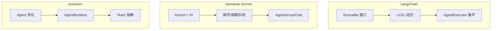

# Week 0D: 框架对比与 dawning-agents 设计决策

> Phase 0: 框架分析
> 将所学综合为 dawning-agents 的设计决策

---

## 概述

在分析了 LangChain、Semantic Kernel 和 AutoGen 之后，本文档综合这些学习成果，为 dawning-agents 建立设计原则。

---

## 第一部分：三框架对比

### 架构对比



### 功能矩阵

| 功能 | LangChain | Semantic Kernel | AutoGen | dawning-agents 目标 |
|------|-----------|-----------------|---------|---------------------|
| **语言** | Python 优先 | .NET 优先 | Python 优先 | **.NET 优先** |
| **组合** | `\|` 操作符 | DI + Invoke | 消息传递 | **Fluent + DI** |
| **Agent 循环** | AgentExecutor | Agent 类 | on_messages | **IAgent 接口** |
| **多 Agent** | 基础 | AgentGroupChat | Team + Handoff | **丰富模式** |
| **工具** | @tool 装饰器 | [KernelFunction] | Tool 类 | **[Tool] 属性** |
| **记忆** | BaseMemory | 基于插件 | 聊天历史 | **IMemory 接口** |
| **流式输出** | stream() 方法 | IAsyncEnumerable | on_messages_stream | **IAsyncEnumerable** |
| **人机协作** | 外部 | 外部 | 内置 | **内置** |
| **可观测性** | 回调 | 过滤器 | 事件 | **过滤器 + 事件** |

### 设计理念对比

| 方面 | LangChain | Semantic Kernel | AutoGen |
|------|-----------|-----------------|---------|
| **核心思想** | 一切都是 Runnable | Kernel 是中心枢纽 | Agent 通过消息通信 |
| **组合风格** | 操作符链接 | 服务注入 | Actor 模型 |
| **抽象级别** | 非常高 | 高 | 中等（两层） |
| **灵活性** | 非常灵活 | 企业结构化 | 研究导向 |
| **简洁性** | 魔法可能令人困惑 | 冗长但清晰 | 简单用例过于复杂 |

---

## 第二部分：关键学习

### 来自 LangChain

✅ **采用:**
- 带有 `invoke`、`stream`、`batch` 的 Runnable 接口很优雅
- 用于可观测性的回调/处理器
- 组合很强大

❌ **避免:**
- 太多魔法（难以调试）
- 频繁的破坏性变更
- Python 特定的模式

### 来自 Semantic Kernel

✅ **采用:**
- 原生 .NET，强类型
- DI 集成是必需的
- 过滤器/拦截器模式
- 基于属性的工具发现
- 干净的插件/函数模型

❌ **避免:**
- 简单用例过于冗长
- Agent 系统仍不成熟
- 某些抽象感觉牵强

### 来自 AutoGen

✅ **采用:**
- Agent 的 Actor 模型（消息传递）
- 两层架构（高级/底层）
- 用于 Agent 委托的交接模式
- 丰富的终止条件
- 人机协作是一等公民

❌ **避免:**
- 版本间的破坏性变更
- Python 特定的模式
- 简单用例过于复杂

---

## 第三部分：dawning-agents 设计原则

### 原则 1：.NET 优先与强类型

```csharp
// 所有接口都是强类型的
public interface IAgent<TInput, TOutput>
{
    Task<TOutput> InvokeAsync(TInput input, CancellationToken cancellationToken = default);
    IAsyncEnumerable<TOutput> StreamAsync(TInput input, CancellationToken cancellationToken = default);
}

// 用于类型安全的泛型约束
public interface IChatAgent : IAgent<ChatMessage, ChatResponse> { }
```

### 原则 2：依赖注入作为基础

```csharp
// 与 Microsoft.Extensions.DependencyInjection 集成
var services = new ServiceCollection();

services.AddDawningAgents(options =>
{
    options.AddOpenAI(config => 
    {
        config.ApiKey = "...";
        config.Model = "gpt-4";
    });
    
    options.AddAgent<ResearchAgent>();
    options.AddAgent<WriterAgent>();
    
    options.AddTool<WebSearchTool>();
    options.AddTool<FileSystemTool>();
});

var provider = services.BuildServiceProvider();
var agent = provider.GetRequiredService<ResearchAgent>();
```

### 原则 3：两层架构

```text
┌─────────────────────────────────────────────────────────────┐
│                      高级 API                                │
│  ┌──────────┐  ┌──────────┐  ┌──────────┐  ┌──────────────┐ │
│  │ChatAgent │  │TaskAgent │  │CodeAgent │  │ TeamBuilder  │ │
│  └──────────┘  └──────────┘  └──────────┘  └──────────────┘ │
├─────────────────────────────────────────────────────────────┤
│                      核心抽象                                │
│  ┌────────┐  ┌────────┐  ┌────────┐  ┌────────┐  ┌────────┐ │
│  │ IAgent │  │ ITool  │  │IMemory │  │IRuntime│  │IChannel│ │
│  └────────┘  └────────┘  └────────┘  └────────┘  └────────┘ │
└─────────────────────────────────────────────────────────────┘
```

### 原则 4：多 Agent 使用消息传递

```csharp
// Agent 通过消息通信（像 AutoGen）
public interface IAgentRuntime
{
    Task<TResponse> SendAsync<TMessage, TResponse>(
        AgentId recipient,
        TMessage message,
        CancellationToken cancellationToken = default);
    
    Task PublishAsync<TMessage>(
        TopicId topic,
        TMessage message,
        CancellationToken cancellationToken = default);
    
    Task<AgentId> RegisterAsync<TAgent>(
        string name,
        Func<TAgent> factory) where TAgent : IAgent;
}
```

### 原则 5：基于属性的发现

```csharp
// 像 Semantic Kernel 的方法
public class WebTools
{
    [Tool("在网上搜索")]
    public async Task<string> SearchAsync(
        [Description("搜索查询")] string query,
        [Description("最大结果数")] int maxResults = 10)
    {
        // 实现
    }
    
    [Tool("获取网页内容")]
    public async Task<string> FetchPageAsync(
        [Description("要获取的 URL")] string url)
    {
        // 实现
    }
}

// 自动发现
services.AddToolsFromAssembly(typeof(WebTools).Assembly);
```

### 原则 6：流畅的团队构建

```csharp
// 受 AutoGen 团队启发
var team = Team.Create()
    .WithAgent(researchAgent, role: "Researcher")
    .WithAgent(writerAgent, role: "Writer")
    .WithAgent(reviewerAgent, role: "Reviewer")
    .WithSelectionStrategy<RoundRobinSelection>()
    .WithTermination(conditions => conditions
        .MaxMessages(50)
        .Or()
        .TextContains("TASK_COMPLETE")
        .Or()
        .Handoff("Human"))
    .WithHumanInTheLoop(humanProxy)
    .Build();

var result = await team.RunAsync("写一篇关于 AI Agent 的文章");
```

### 原则 7：丰富的可观测性

```csharp
// 组合过滤器（像 SK）+ 事件（像 AutoGen）
public interface IAgentFilter
{
    Task OnAgentInvokingAsync(AgentInvocationContext context, Func<Task> next);
    Task OnAgentInvokedAsync(AgentInvocationContext context);
}

public interface IToolFilter
{
    Task OnToolInvokingAsync(ToolInvocationContext context, Func<Task> next);
    Task OnToolInvokedAsync(ToolInvocationContext context);
}

// 基于事件，供外部消费者使用
public interface IAgentEvents
{
    event EventHandler<AgentMessageEventArgs> MessageReceived;
    event EventHandler<ToolCallEventArgs> ToolCalled;
    event EventHandler<HandoffEventArgs> HandoffOccurred;
}
```

### 原则 8：一等公民的交接

```csharp
// 像 AutoGen 的交接模式
public class ResearchAgent : ChatAgent
{
    [Handoff("Writer", "研究完成后交接给写作者")]
    [Handoff("Human", "不确定时升级给人类")]
    public override async Task<ChatResponse> InvokeAsync(
        ChatMessage message,
        CancellationToken cancellationToken = default)
    {
        // Agent 可以通过工具调用触发交接
    }
}
```

---

## 第四部分：核心接口（草案）

### IAgent

```csharp
namespace DawningAgents.Core;

public interface IAgent
{
    string Id { get; }
    string Name { get; }
    string Description { get; }
    AgentMetadata Metadata { get; }
}

public interface IAgent<TInput, TOutput> : IAgent
{
    Task<TOutput> InvokeAsync(
        TInput input,
        AgentContext context,
        CancellationToken cancellationToken = default);
    
    IAsyncEnumerable<TOutput> StreamAsync(
        TInput input,
        AgentContext context,
        CancellationToken cancellationToken = default);
}

public interface IChatAgent : IAgent<IEnumerable<ChatMessage>, ChatResponse>
{
    IReadOnlyList<ITool> Tools { get; }
    IReadOnlyList<Handoff> Handoffs { get; }
}
```

### ITool

```csharp
namespace DawningAgents.Core;

public interface ITool
{
    string Name { get; }
    string Description { get; }
    ToolSchema Schema { get; }  // 参数的 JSON Schema
    
    Task<ToolResult> InvokeAsync(
        ToolInput input,
        CancellationToken cancellationToken = default);
}

// 用于轻松创建工具的属性
[AttributeUsage(AttributeTargets.Method)]
public class ToolAttribute : Attribute
{
    public string? Name { get; set; }
    public string? Description { get; set; }
}
```

### IMemory

```csharp
namespace DawningAgents.Core;

public interface IMemory
{
    Task SaveAsync(MemoryEntry entry, CancellationToken cancellationToken = default);
    
    Task<IEnumerable<MemoryEntry>> RecallAsync(
        string query,
        MemoryRecallOptions? options = null,
        CancellationToken cancellationToken = default);
    
    Task ClearAsync(CancellationToken cancellationToken = default);
}

public interface IChatMemory : IMemory
{
    Task AddMessageAsync(ChatMessage message, CancellationToken cancellationToken = default);
    Task<IEnumerable<ChatMessage>> GetHistoryAsync(int? limit = null, CancellationToken cancellationToken = default);
}
```

### IAgentRuntime

```csharp
namespace DawningAgents.Core;

public interface IAgentRuntime
{
    Task<AgentId> RegisterAsync<TAgent>(
        string type,
        Func<IServiceProvider, TAgent> factory,
        IEnumerable<Subscription>? subscriptions = null)
        where TAgent : IAgent;
    
    Task<TAgent> GetAgentAsync<TAgent>(AgentId id)
        where TAgent : IAgent;
    
    Task<TResponse> SendMessageAsync<TMessage, TResponse>(
        AgentId recipient,
        TMessage message,
        AgentId? sender = null,
        CancellationToken cancellationToken = default);
    
    Task PublishMessageAsync<TMessage>(
        TopicId topic,
        TMessage message,
        AgentId? sender = null,
        CancellationToken cancellationToken = default);
}
```

### ITeam

```csharp
namespace DawningAgents.Core;

public interface ITeam
{
    IReadOnlyList<IAgent> Participants { get; }
    ISelectionStrategy SelectionStrategy { get; }
    ITerminationCondition TerminationCondition { get; }
    
    Task<TeamResult> RunAsync(
        string task,
        CancellationToken cancellationToken = default);
    
    IAsyncEnumerable<TeamEvent> RunStreamAsync(
        string task,
        CancellationToken cancellationToken = default);
}

public interface ISelectionStrategy
{
    Task<IAgent?> SelectNextAsync(
        IReadOnlyList<IAgent> participants,
        IReadOnlyList<ChatMessage> history,
        CancellationToken cancellationToken = default);
}

public interface ITerminationCondition
{
    Task<bool> ShouldTerminateAsync(
        IReadOnlyList<ChatMessage> history,
        CancellationToken cancellationToken = default);
}
```

---

## 第五部分：项目结构（提议）

```text
dawning-agents/
├── src/
│   ├── DawningAgents.Abstractions/     # 核心接口
│   │   ├── IAgent.cs
│   │   ├── ITool.cs
│   │   ├── IMemory.cs
│   │   ├── IAgentRuntime.cs
│   │   └── ITeam.cs
│   │
│   ├── DawningAgents.Core/             # 核心实现
│   │   ├── Agents/
│   │   │   ├── ChatAgent.cs
│   │   │   └── TaskAgent.cs
│   │   ├── Runtime/
│   │   │   └── SingleThreadedRuntime.cs
│   │   ├── Teams/
│   │   │   ├── RoundRobinTeam.cs
│   │   │   └── SelectorTeam.cs
│   │   └── Memory/
│   │       ├── BufferMemory.cs
│   │       └── SummaryMemory.cs
│   │
│   ├── DawningAgents.OpenAI/           # OpenAI 集成
│   ├── DawningAgents.Anthropic/        # Anthropic 集成
│   ├── DawningAgents.Azure/            # Azure OpenAI 集成
│   └── DawningAgents.Tools/            # 内置工具
│
├── samples/
│   ├── SimpleChat/
│   ├── MultiAgent/
│   └── CodeGeneration/
│
├── tests/
│   ├── DawningAgents.Tests/
│   └── DawningAgents.IntegrationTests/
│
└── docs/
```

---

## 第六部分：实现路线图

### 阶段 1：基础（第 1-2 周）
- [ ] 核心接口（IAgent、ITool、IMemory）
- [ ] 单线程运行时
- [ ] OpenAI 集成
- [ ] 基础 ChatAgent

### 阶段 2：工具与记忆（第 3-4 周）
- [ ] 基于属性的工具发现
- [ ] 工具执行
- [ ] 缓冲记忆
- [ ] 摘要记忆

### 阶段 3：多 Agent（第 5-6 周）
- [ ] Team 抽象
- [ ] 选择策略
- [ ] 终止条件
- [ ] 交接支持

### 阶段 4：高级功能（第 7-8 周）
- [ ] 人机协作
- [ ] 流式输出支持
- [ ] 过滤器与可观测性
- [ ] 错误处理与重试

### 阶段 5：完善（第 9-10 周）
- [ ] 额外的 LLM 提供商
- [ ] 内置工具
- [ ] 全面测试
- [ ] 文档

---

## 总结

| 框架 | 关键收获 |
|------|----------|
| **LangChain** | 组合优雅，但避免魔法 |
| **Semantic Kernel** | .NET 模式、DI、过滤器、属性 |
| **AutoGen** | Actor 模型、团队、交接、终止 |

**dawning-agents** 将结合：
- 🎯 .NET 优先与强类型（来自 SK）
- 🔌 DI 集成和过滤器（来自 SK）
- 🔗 像 Runnable 一样的干净接口（受 LC 启发）
- 📬 多 Agent 的消息传递（来自 AutoGen）
- 👥 丰富的团队/交接模式（来自 AutoGen）
- 👁️ 一等公民的可观测性（来自全部三个）
