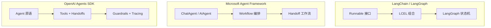

# Week 0D: 框架对比与 dawning-agents 设计决策

> Phase 0: 框架分析（2026年1月更新）
> 将所学综合为 dawning-agents 的设计决策

---

## 概述

本文档对比当前主流的三大 AI Agent 框架：
- **LangChain / LangGraph** - Python 生态系统的领导者
- **Microsoft Agent Framework** - 微软统一的 Agent 框架（整合了 Semantic Kernel 和 AutoGen）
- **OpenAI Agents SDK** - OpenAI 官方的轻量级 Agent SDK

> ⚠️ **重要更新（2025年11月）：** 微软已将 Semantic Kernel 和 AutoGen 整合为统一的 **Microsoft Agent Framework**，提供从 SK/AutoGen 的迁移指南。

---

## 第一部分：三框架对比

### 架构对比



### 功能矩阵

| 功能 | LangChain/LangGraph | MS Agent Framework | OpenAI Agents SDK | dawning-agents 目标 |
|------|---------------------|-------------------|-------------------|---------------------|
| **语言** | Python 优先 | Python + .NET | Python + TypeScript | **.NET 优先** |
| **安装** | `pip install langchain` | `pip install agent-framework` / `dotnet add Microsoft.Agents.AI` | `pip install openai-agents` | **NuGet 包** |
| **核心原语** | Runnable, Chain, Graph | Agent, Workflow, Executor | Agent, Tool, Handoff, Guardrail | **IAgent, ITool, IHandoff** |
| **多 Agent** | LangGraph 状态机 | HandoffBuilder, Workflow | Handoffs 委托 | **HandoffBuilder** |
| **工具** | @tool 装饰器 | ai_function 装饰器 | function_tool 装饰器 | **[Tool] 属性** |
| **交接** | 需自定义 | 内置 HandoffBuilder | 内置 Handoff 原语 | **内置** |
| **护栏** | 需自定义 | 通过中间件 | 内置 Guardrails | **内置 IGuardrail** |
| **可观测性** | LangSmith | ExecutorInvokedEvent | 内置 Tracing | **内置 Tracing** |
| **人机协作** | 通过节点 | human_in_loop 模式 | 通过 Guardrails | **内置** |
| **流式输出** | stream() | run_stream() | run_streamed() | **IAsyncEnumerable** |
| **会话管理** | 需自定义 | AgentThread | 内置 Sessions | **内置 ISession** |
| **LLM 支持** | 100+ 模型 | Azure OpenAI 优先 | 100+ via LiteLLM | **多模型支持** |

### 设计理念对比

| 方面 | LangChain/LangGraph | MS Agent Framework | OpenAI Agents SDK |
|------|---------------------|-------------------|-------------------|
| **核心思想** | 一切都是 Runnable，图即工作流 | Workflow 是编排核心 | 四个原语解决一切 |
| **抽象级别** | 高（LCEL）+ 中等（Graph） | 中等（两层架构） | 低（极简主义） |
| **灵活性** | 非常灵活 | 企业级结构化 | 简单直接 |
| **学习曲线** | 陡峭 | 中等 | 平缓 |
| **生产就绪** | LangGraph v1.0（2025） | Preview（2025年底） | 生产就绪（2025年3月） |
| **企业特性** | LangSmith 付费 | Azure 集成 | OpenAI 平台集成 |

---

## 第二部分：详细框架分析

### LangChain / LangGraph

**概述：** LangChain 是最成熟的 Agent 框架，2025年5月 LangGraph 达到 v1.0，提供长时间运行的有状态 Agent 编排。

**核心概念：**
```python
# LangGraph 状态机示例
from langgraph.graph import StateGraph, END

workflow = StateGraph(AgentState)
workflow.add_node("research", research_node)
workflow.add_node("write", write_node)
workflow.add_edge("research", "write")
workflow.add_edge("write", END)

app = workflow.compile()
result = await app.ainvoke({"task": "写一篇文章"})
```

**优点：**
- ✅ 最成熟的生态系统，社区活跃
- ✅ LangGraph 提供强大的状态机编排
- ✅ LangSmith 提供企业级可观测性
- ✅ 支持 100+ LLM 模型
- ✅ 丰富的文档和教程

**缺点：**
- ❌ 抽象层过多，调试困难
- ❌ 版本迭代频繁，破坏性变更多
- ❌ Python 优先，.NET 支持弱
- ❌ 简单任务过于复杂

---

### Microsoft Agent Framework

**概述：** 微软在 2025年11月发布统一的 Agent Framework，整合了 Semantic Kernel 和 AutoGen 的最佳特性，同时支持 Python 和 .NET。

**核心概念：**
```python
# Python 示例
from agent_framework import HandoffBuilder, ChatAgent
from agent_framework.azure import AzureOpenAIChatClient

client = AzureOpenAIChatClient(credential=AzureCliCredential())

# 创建 Agent
triage = client.create_agent(name="triage", instructions="...")
billing = client.create_agent(name="billing", instructions="...")
support = client.create_agent(name="support", instructions="...")

# 构建 Handoff 工作流
workflow = (
    HandoffBuilder(participants=[triage, billing, support])
    .with_start_agent(triage)
    .add_handoff(triage, [billing, support])
    .with_autonomous_mode(turn_limits={"billing": 10})
    .build()
)

# 运行
async for event in workflow.run_stream(messages):
    print(event)
```

```csharp
// .NET 示例
var workflow = AgentWorkflowBuilder
    .CreateHandoffBuilderWith(triageAgent)
    .WithHandoff(triageAgent, billingAgent, "处理账单问题")
    .WithHandoff(triageAgent, supportAgent, "处理技术支持")
    .Build();

await foreach (var update in workflow.RunStreamingAsync(messages))
{
    Console.WriteLine(update);
}
```

**优点：**
- ✅ 同时支持 Python 和 .NET（一等公民）
- ✅ 与 Azure AI Foundry 深度集成
- ✅ 内置 Handoff 工作流模式
- ✅ 支持 MCP、A2A 等开放标准
- ✅ 从 SK/AutoGen 有迁移指南

**缺点：**
- ❌ 还在 Preview 阶段
- ❌ 文档仍在完善中
- ❌ 生态系统还在建设

---

### OpenAI Agents SDK

**概述：** 2025年3月发布，是 Swarm 项目的生产就绪版本。采用极简主义设计，只有四个核心原语。

**四个核心原语：**

1. **Agent** - 配置了指令和工具的 LLM
2. **Tool** - Agent 可以调用的函数
3. **Handoff** - Agent 之间的任务委托
4. **Guardrail** - 输入/输出验证

```python
from agents import Agent, Runner, function_tool, handoff

@function_tool
def search_web(query: str) -> str:
    """在网上搜索信息"""
    return f"搜索结果: {query}"

research_agent = Agent(
    name="Researcher",
    instructions="你是一个研究助手",
    tools=[search_web],
)

writer_agent = Agent(
    name="Writer",
    instructions="你是一个写作助手",
    handoffs=[research_agent],  # 可以交接回研究员
)

triage_agent = Agent(
    name="Triage",
    instructions="分析用户需求并分配任务",
    handoffs=[research_agent, writer_agent],
)

# 运行
result = await Runner.run(triage_agent, "帮我写一篇关于 AI 的文章")
print(result.final_output)
```

**Guardrails 示例：**
```python
from agents import Agent, InputGuardrail, GuardrailFunctionOutput

async def content_filter(ctx, agent, input):
    # 检查输入是否包含敏感内容
    is_safe = check_content(input)
    return GuardrailFunctionOutput(
        output_info={"safe": is_safe},
        tripwire_triggered=not is_safe,
    )

agent = Agent(
    name="SafeAgent",
    instructions="...",
    input_guardrails=[InputGuardrail(guardrail_function=content_filter)],
)
```

**优点：**
- ✅ 极简设计，学习曲线平缓
- ✅ 内置 Tracing（OpenAI 仪表板可视化）
- ✅ 同时支持 Python 和 TypeScript
- ✅ 提供商无关（支持 100+ LLM）
- ✅ 生产就绪

**缺点：**
- ❌ 没有内置向量记忆/RAG
- ❌ 没有图/状态机工作流引擎
- ❌ 复杂编排需要自己实现
- ❌ 没有 .NET 支持

---

## 第三部分：关键学习

### 来自 LangChain/LangGraph

✅ **采用:**
- 状态机编排模式（LangGraph）→ 用于复杂流程控制
- 可组合的 Runnable 接口设计
- 完善的可观测性系统

❌ **避免:**
- 过多的抽象层
- 频繁的破坏性变更
- Python 特定的魔法语法

### 来自 Microsoft Agent Framework

✅ **采用:**
- 原生 .NET 支持，强类型
- HandoffBuilder 流畅 API
- Workflow 编排模式
- 两层架构（高级 API + 核心抽象）
- 与 Azure 服务集成

❌ **避免:**
- 过于依赖 Azure 生态
- Preview 阶段的不稳定 API

### 来自 OpenAI Agents SDK

✅ **采用:**
- 四个核心原语的极简设计
- 内置 Guardrails（输入/输出验证）
- 内置 Tracing（可观测性）
- Handoff 作为一等公民
- 会话管理

❌ **避免:**
- 缺少复杂工作流支持
- 没有向量记忆层

---

## 第四部分：dawning-agents 设计原则

### 原则 1：四个核心原语 + 双编排模式

受 OpenAI Agents SDK 启发，结合 LangGraph 和 MS Agent Framework 的编排能力：

```csharp
// 核心原语
public interface IAgent { }      // Agent - LLM + 指令 + 工具
public interface ITool { }       // Tool - 可调用的功能
public interface IHandoff { }    // Handoff - Agent 间委托
public interface IGuardrail { }  // Guardrail - 输入/输出验证

// 双编排模式
public interface IWorkflow { }   // Workflow 编排 - LLM 动态决策交接（受 MS Agent Framework 启发）
public interface IStateGraph { } // 状态机编排 - 开发者预定义流程（受 LangGraph 启发）
```

**两种编排模式的选择：**

| 场景 | 推荐模式 | 原因 |
|------|----------|------|
| 多 Agent 协作、客服分流 | Workflow（HandoffBuilder） | LLM 智能决策交接目标 |
| 审批流、数据管道、多轮迭代 | StateGraph | 需要确定性的流程控制 |
| 简单对话 | 直接使用 Agent | 无需编排 |

### 原则 2：.NET 优先与强类型

```csharp
// 所有接口都是强类型的
public interface IAgent<TContext>
{
    string Name { get; }
    string Instructions { get; }
    IReadOnlyList<ITool> Tools { get; }
    IReadOnlyList<IHandoff<TContext>> Handoffs { get; }
    IReadOnlyList<IGuardrail<TContext>> InputGuardrails { get; }
    IReadOnlyList<IGuardrail<TContext>> OutputGuardrails { get; }
    
    Task<AgentResult> RunAsync(
        string input,
        TContext? context = default,
        CancellationToken cancellationToken = default);
    
    IAsyncEnumerable<AgentEvent> RunStreamAsync(
        string input,
        TContext? context = default,
        CancellationToken cancellationToken = default);
}
```

### 原则 3：内置 Guardrails

```csharp
// 输入护栏
public interface IInputGuardrail<TContext>
{
    Task<GuardrailResult> ValidateAsync(
        string input,
        IAgent<TContext> agent,
        TContext context,
        CancellationToken cancellationToken = default);
}

// 输出护栏
public interface IOutputGuardrail<TContext>
{
    Task<GuardrailResult> ValidateAsync(
        object output,
        IAgent<TContext> agent,
        TContext context,
        CancellationToken cancellationToken = default);
}

// 使用示例
var agent = new AgentBuilder<MyContext>()
    .WithName("SafeAgent")
    .WithInstructions("...")
    .WithInputGuardrail(new ContentFilterGuardrail())
    .WithOutputGuardrail(new PiiFilterGuardrail())
    .Build();
```

### 原则 4：Handoff 流畅构建（受 MS Agent Framework 启发）

```csharp
// HandoffBuilder 流畅 API
var workflow = new HandoffBuilder<MyContext>()
    .WithParticipants(triageAgent, billingAgent, supportAgent)
    .WithStartAgent(triageAgent)
    .AddHandoff(triageAgent, billingAgent, "处理账单问题")
    .AddHandoff(triageAgent, supportAgent, "处理技术支持")
    .AddHandoff(billingAgent, triageAgent)  // 可以交接回
    .WithAutonomousMode(turnLimits: new() { ["billing"] = 10 })
    .WithTermination(cond => cond.MaxMessages(50).Or().Contains("完成"))
    .Build();

await foreach (var evt in workflow.RunStreamAsync("我的账单有问题"))
{
    Console.WriteLine(evt);
}
```

### 原则 5：内置 Tracing

```csharp
// 自动追踪
public interface ITracingProvider
{
    ISpan CreateAgentSpan(string agentName, IReadOnlyList<string> tools);
    ISpan CreateToolSpan(string toolName, object input);
    ISpan CreateHandoffSpan(string fromAgent, string toAgent);
    ISpan CreateGuardrailSpan(string name, bool triggered);
}

// 使用
var config = new RunConfig
{
    TracingEnabled = true,
    TraceIncludeSensitiveData = false,
};

var result = await Runner.RunAsync(agent, "你好", config);
// 自动生成追踪数据
```

### 原则 6：依赖注入集成

```csharp
// 与 Microsoft.Extensions.DependencyInjection 集成
var services = new ServiceCollection();

services.AddDawning.Agents(options =>
{
    options.AddOpenAI(config => 
    {
        config.ApiKey = "...";
        config.DefaultModel = "gpt-4o";
    });
    
    // 注册 Agent
    options.AddAgent<TriageAgent>();
    options.AddAgent<BillingAgent>();
    options.AddAgent<SupportAgent>();
    
    // 注册工具
    options.AddToolsFromAssembly(typeof(WebTools).Assembly);
    
    // 配置追踪
    options.ConfigureTracing(tracing =>
    {
        tracing.AddConsoleExporter();
        tracing.AddOpenTelemetryExporter();
    });
});

var provider = services.BuildServiceProvider();
var agent = provider.GetRequiredService<TriageAgent>();
```

### 原则 7：基于属性的工具发现

```csharp
public class WebTools
{
    [Tool("search_web", "在网上搜索信息")]
    public async Task<string> SearchAsync(
        [Description("搜索查询")] string query,
        [Description("最大结果数")] int maxResults = 10)
    {
        // 实现
    }
    
    [Tool("fetch_page", "获取网页内容")]
    public async Task<string> FetchPageAsync(
        [Description("要获取的 URL")] string url)
    {
        // 实现
    }
}

// 自动发现和注册
services.AddToolsFromAssembly(typeof(WebTools).Assembly);
```

---

## 第五部分：核心接口（草案）

### IAgent

```csharp
namespace Dawning.Agents.Core;

public interface IAgent
{
    string Name { get; }
    string? Description { get; }
    string? Instructions { get; }
}

public interface IAgent<TContext> : IAgent
{
    IReadOnlyList<ITool> Tools { get; }
    IReadOnlyList<IHandoff<TContext>> Handoffs { get; }
    IReadOnlyList<IInputGuardrail<TContext>> InputGuardrails { get; }
    IReadOnlyList<IOutputGuardrail<TContext>> OutputGuardrails { get; }
    
    Task<AgentResult> RunAsync(
        string input,
        RunConfig? config = null,
        TContext? context = default,
        CancellationToken cancellationToken = default);
    
    IAsyncEnumerable<AgentEvent> RunStreamAsync(
        string input,
        RunConfig? config = null,
        TContext? context = default,
        CancellationToken cancellationToken = default);
}
```

### ITool

```csharp
namespace Dawning.Agents.Core;

public interface ITool
{
    string Name { get; }
    string Description { get; }
    JsonSchema InputSchema { get; }
    
    Task<ToolResult> InvokeAsync(
        string inputJson,
        CancellationToken cancellationToken = default);
}

// 用于轻松创建工具的属性
[AttributeUsage(AttributeTargets.Method)]
public class ToolAttribute : Attribute
{
    public ToolAttribute(string name, string description);
}

[AttributeUsage(AttributeTargets.Parameter)]
public class DescriptionAttribute : Attribute
{
    public DescriptionAttribute(string description);
}
```

### IHandoff

```csharp
namespace Dawning.Agents.Core;

public interface IHandoff<TContext>
{
    string ToolName { get; }
    string ToolDescription { get; }
    IAgent<TContext> TargetAgent { get; }
    
    Task<IAgent<TContext>> InvokeAsync(
        RunContext<TContext> context,
        string? inputJson = null,
        CancellationToken cancellationToken = default);
}

// Handoff 输入数据
public record HandoffInputData(
    IReadOnlyList<ChatMessage> History,
    IReadOnlyList<ChatMessage> NewItems
);

// 输入过滤器
public delegate HandoffInputData HandoffInputFilter(HandoffInputData data);
```

### IGuardrail

```csharp
namespace Dawning.Agents.Core;

public record GuardrailResult(
    bool TripwireTriggered,
    object? OutputInfo = null
);

public interface IInputGuardrail<TContext>
{
    string Name { get; }
    
    Task<GuardrailResult> RunAsync(
        RunContext<TContext> context,
        IAgent<TContext> agent,
        string input,
        CancellationToken cancellationToken = default);
}

public interface IOutputGuardrail<TContext>
{
    string Name { get; }
    
    Task<GuardrailResult> RunAsync(
        RunContext<TContext> context,
        IAgent<TContext> agent,
        object output,
        CancellationToken cancellationToken = default);
}
```

### IWorkflow（Workflow 编排）

```csharp
namespace Dawning.Agents.Core;

public interface IWorkflow<TContext>
{
    string Name { get; }
    IReadOnlyList<IAgent<TContext>> Participants { get; }
    
    Task<WorkflowResult> RunAsync(
        string input,
        TContext? context = default,
        CancellationToken cancellationToken = default);
    
    IAsyncEnumerable<WorkflowEvent> RunStreamAsync(
        string input,
        TContext? context = default,
        CancellationToken cancellationToken = default);
}

// Handoff 工作流构建器
public class HandoffBuilder<TContext>
{
    public HandoffBuilder<TContext> WithParticipants(params IAgent<TContext>[] agents);
    public HandoffBuilder<TContext> WithStartAgent(IAgent<TContext> agent);
    public HandoffBuilder<TContext> AddHandoff(IAgent<TContext> from, IAgent<TContext> to, string? reason = null);
    public HandoffBuilder<TContext> WithAutonomousMode(Dictionary<string, int>? turnLimits = null);
    public HandoffBuilder<TContext> WithTermination(Func<TerminationBuilder, ITerminationCondition> configure);
    public IWorkflow<TContext> Build();
}
```

### IStateGraph（状态机编排）

```csharp
namespace Dawning.Agents.Core;

/// <summary>
/// 状态机编排 - 用于需要确定性流程控制的场景
/// 受 LangGraph 启发，但采用 .NET 强类型设计
/// </summary>
public interface IStateGraph<TState> where TState : class, new()
{
    string Name { get; }
    IReadOnlyList<string> Nodes { get; }
    
    Task<TState> RunAsync(
        TState initialState,
        CancellationToken cancellationToken = default);
    
    IAsyncEnumerable<StateGraphEvent<TState>> RunStreamAsync(
        TState initialState,
        CancellationToken cancellationToken = default);
}

// 状态机构建器
public class StateGraphBuilder<TState> where TState : class, new()
{
    public StateGraphBuilder<TState> AddNode(string name, Func<TState, Task<TState>> action);
    public StateGraphBuilder<TState> AddNode(string name, IAgent agent);
    public StateGraphBuilder<TState> AddEdge(string from, string to);
    public StateGraphBuilder<TState> AddConditionalEdge(
        string from, 
        Func<TState, string> condition);  // 返回下一个节点名
    public StateGraphBuilder<TState> SetEntryPoint(string nodeName);
    public StateGraphBuilder<TState> SetFinishPoint(string nodeName);
    public IStateGraph<TState> Build();
}

// 使用示例
public class ArticleState
{
    public string Topic { get; set; } = "";
    public string Research { get; set; } = "";
    public string Draft { get; set; } = "";
    public bool NeedsMoreResearch { get; set; }
}

var graph = new StateGraphBuilder<ArticleState>()
    .AddNode("research", researchAgent)
    .AddNode("write", writeAgent)
    .AddNode("review", reviewAgent)
    .SetEntryPoint("research")
    .AddConditionalEdge("research", state => 
        state.NeedsMoreResearch ? "research" : "write")
    .AddEdge("write", "review")
    .SetFinishPoint("review")
    .Build();

var result = await graph.RunAsync(new ArticleState { Topic = "AI Agents" });
```

---

## 第六部分：项目结构（提议）

```text
dawning-agents/
├── src/
│   ├── Dawning.Agents.Abstractions/     # 核心接口
│   │   ├── IAgent.cs
│   │   ├── ITool.cs
│   │   ├── IHandoff.cs
│   │   ├── IGuardrail.cs
│   │   ├── IWorkflow.cs
│   │   └── ITracing.cs
│   │
│   ├── Dawning.Agents.Core/             # 核心实现
│   │   ├── Agents/
│   │   │   ├── Agent.cs
│   │   │   └── AgentBuilder.cs
│   │   ├── Tools/
│   │   │   ├── FunctionTool.cs
│   │   │   └── ToolAttribute.cs
│   │   ├── Handoffs/
│   │   │   ├── Handoff.cs
│   │   │   └── HandoffBuilder.cs
│   │   ├── Guardrails/
│   │   │   ├── InputGuardrail.cs
│   │   │   └── OutputGuardrail.cs
│   │   ├── Workflows/
│   │   │   ├── HandoffWorkflow.cs
│   │   │   └── SequentialWorkflow.cs
│   │   ├── StateGraphs/
│   │   │   ├── StateGraph.cs
│   │   │   └── StateGraphBuilder.cs
│   │   ├── Tracing/
│   │   │   ├── Span.cs
│   │   │   └── TracingProvider.cs
│   │   └── Runner.cs
│   │
│   ├── Dawning.Agents.OpenAI/           # OpenAI 集成
│   ├── Dawning.Agents.Anthropic/        # Anthropic 集成
│   ├── Dawning.Agents.Azure/            # Azure OpenAI 集成
│   └── Dawning.Agents.Extensions/       # 扩展工具
│
├── samples/
│   ├── SimpleChat/
│   ├── HandoffWorkflow/
│   ├── GuardrailsDemo/
│   └── TracingDemo/
│
├── tests/
│   ├── Dawning.Agents.Tests/
│   └── Dawning.Agents.IntegrationTests/
│
└── docs/
```

---

## 第七部分：实现路线图

### 阶段 1：核心原语（第 1-2 周）
- [ ] IAgent 和 Agent 实现
- [ ] ITool 和 FunctionTool
- [ ] 工具属性发现
- [ ] OpenAI 集成
- [ ] 基础 Runner

### 阶段 2：Handoff 与 Guardrails（第 3-4 周）
- [ ] IHandoff 实现
- [ ] HandoffBuilder
- [ ] IGuardrail 接口
- [ ] 输入/输出护栏
- [ ] 护栏异常处理

### 阶段 3：双编排模式（第 5-6 周）
- [ ] HandoffWorkflow（Workflow 编排）
- [ ] 自主模式
- [ ] 终止条件
- [ ] StateGraph（状态机编排）
- [ ] 条件边和循环
- [ ] 人机协作

### 阶段 4：可观测性（第 7-8 周）
- [ ] Tracing 系统
- [ ] Span 类型（Agent, Tool, Handoff, Guardrail）
- [ ] 控制台导出器
- [ ] OpenTelemetry 集成

### 阶段 5：完善（第 9-10 周）
- [ ] 额外的 LLM 提供商
- [ ] Session 管理
- [ ] 全面测试
- [ ] 文档和示例

---

## 总结

| 框架 | 关键收获 |
|------|----------|
| **LangChain/LangGraph** | 状态机编排，可组合接口 |
| **MS Agent Framework** | .NET 支持，HandoffBuilder，Workflow 编排 |
| **OpenAI Agents SDK** | 四个核心原语，Guardrails，Tracing |

**dawning-agents** 将结合：
- 🎯 四个核心原语 + 双编排模式（来自 OpenAI + MS + LangGraph）
- 🔀 状态机编排 StateGraph（来自 LangGraph）
- 🔗 Workflow 编排 HandoffBuilder（来自 MS Agent Framework）
- 🛡️ 内置 Guardrails（来自 OpenAI）
- 👁️ 内置 Tracing（来自 OpenAI）
- 🔌 DI 集成（.NET 最佳实践）
- ⚡ .NET 优先与强类型
- 📦 基于属性的工具发现
